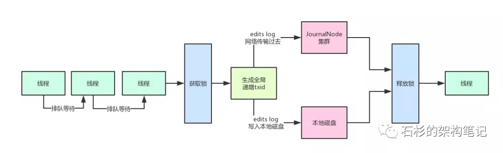
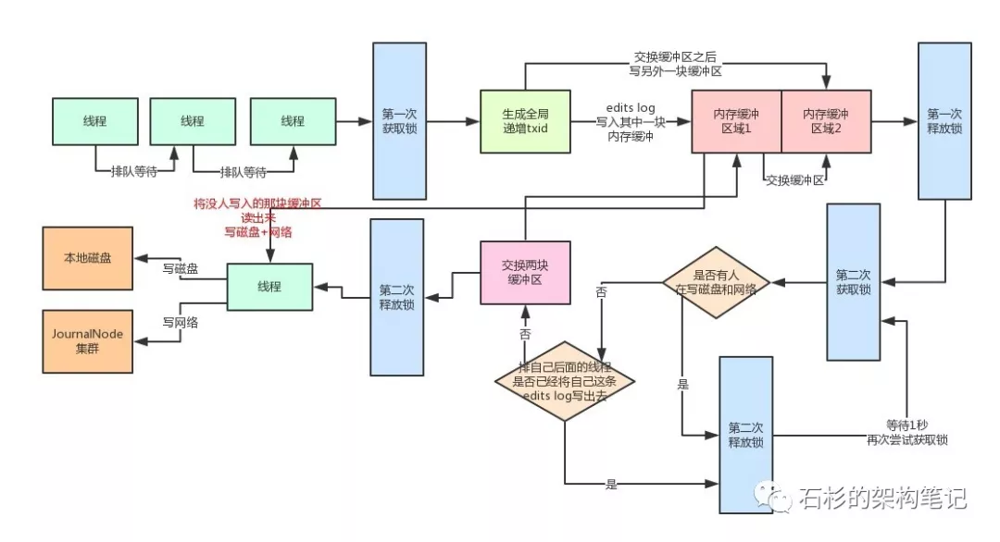

# 一、写在前面

上篇文章我们已经初步给大家解释了Hadoop HDFS的整体架构原理，相信大家都有了一定的认识和了解。

如果没看过上篇文章的同学可以看一下：《兄弟，用大白话告诉你小白都能听懂的Hadoop架构原理》这篇文章。

本文我们来看看，如果大量客户端对NameNode发起高并发（比如每秒上千次）访问来修改元数据，此时NameNode该如何抗住？

# 二、问题源起

我们先来分析一下，高并发请求NameNode会遇到什么样的问题。

大家现在都知道了，每次请求NameNode修改一条元数据（比如说申请上传一个文件，那么就需要在内存目录树中加入一个文件），都要写一条edits log，包括两个步骤：

* 写入本地磁盘。

* 通过网络传输给JournalNodes集群。

但是如果对Java有一定了解的同学都该知道多线程并发安全问题吧？

NameNode在写edits log时的第一条原则：

必须保证每条edits log都有一个全局顺序递增的transactionId（简称为txid），这样才可以标识出来一条一条的edits log的先后顺序。

那么如果要保证每条edits log的txid都是递增的，就必须得加锁。

每个线程修改了元数据，要写一条edits log的时候，都必须按顺序排队获取锁后，才能生成一个递增的txid，代表这次要写的edits log的序号。

好的，那么问题来了，大家看看下面的图。

如果每次都是在一个加锁的代码块里，生成txid，然后写磁盘文件edits log，网络请求写入journalnodes一条edits log，会咋样？

不用说，这个绝对完蛋了！

NameNode本身用多线程接收多个客户端发送过来的并发的请求，结果多个线程居然修改完内存中的元数据之后，排着队写edits log！

而且你要知道，写本地磁盘 + 网络传输给journalnodes，都是很耗时的啊！性能两大杀手：磁盘写 + 网络写！

如果HDFS的架构真要是这么设计的话，基本上NameNode能承载的每秒的并发数量就很少了，可能就每秒处理几十个并发请求处理撑死了！

# 三、HDFS优雅的解决方案

所以说，针对这个问题，人家HDFS是做了不少的优化的！

首先大家想一下，既然咱们不希望每个线程写edits log的时候，串行化排队生成txid + 写磁盘 + 写JournalNode，那么是不是可以搞一个内存缓冲？

也就是说，多个线程可以快速的获取锁，生成txid，然后快速的将edits log写入内存缓冲。

接着就快速的释放锁，让下一个线程继续获取锁后，生成id + 写edits log进入内存缓冲。

然后接下来有一个线程可以将内存中的edits log刷入磁盘，但是在这个过程中，还是继续允许其他线程将edits log写入内存缓冲中。

但是这里又有一个问题了，如果针对同一块内存缓冲，同时有人写入，还同时有人读取后写磁盘，那也有问题，因为不能并发读写一块共享内存数据！

所以HDFS在这里采取了double-buffer双缓冲机制来处理！将一块内存缓冲分成两个部分：

* 其中一个部分可以写入

* 另外一个部分用于读取后写入磁盘和JournalNodes。

大家可能感觉文字叙述不太直观，老规矩，咱们来一张图，按顺序给大家阐述一下。

### （1）分段加锁机制 + 内存双缓冲机制
 
首先各个线程依次第一次获取锁，生成顺序递增的txid，然后将edits log写入内存双缓冲的区域1，接着就立马第一次释放锁了。

趁着这个空隙，后面的线程就可以再次立马第一次获取锁，然后立即写自己的edits log到内存缓冲。

写内存那么快，可能才耗时几十微妙，接着就立马第一次释放锁了。所以这个并发优化绝对是有效果的，大家有没有感受到？

接着各个线程竞争第二次获取锁，有线程获取到锁之后，就看看，有没有谁在写磁盘和网络？

如果没有，好，那么这个线程是个幸运儿！直接交换双缓冲的区域1和区域2，接着第二次释放锁。这个过程相当快速，内存里判断几个条件，耗时不了几微秒。

好，到这一步为止，内存缓冲已经被交换了，后面的线程可以立马快速的依次获取锁，然后将edits log写入内存缓冲的区域2，区域1中的数据被锁定了，不能写。

怎么样，是不是又感受到了一点点多线程并发的优化？

###（2）多线程并发吞吐量的百倍优化

接着，之前那个幸运儿线程，将内存缓冲的区域1中的数据读取出来（此时没人写区域1了，都在写区域2），将里面的edtis log都写入磁盘文件，以及通过网络写入JournalNodes集群。

这个过程可是很耗时的！但是没关系啊，人家做过优化了，在写磁盘和网络的过程中，是不持有锁的！

因此后面的线程可以噼里啪啦的快速的第一次获取锁后，立马写入内存缓冲的区域2，然后释放锁。

这个时候大量的线程都可以快速的写入内存，没有阻塞和卡顿！

怎么样？并发优化的感觉感受到了没有！

###（3）缓冲数据批量刷磁盘 + 网络的优化

那么在幸运儿线程吭哧吭哧把数据写磁盘和网络的过程中，排在后面的大量线程，快速的第一次获取锁，写内存缓冲区域2，释放锁，之后，这些线程第二次获取到锁后会干嘛？

他们会发现有人在写磁盘啊，兄弟们！所以会立即休眠1秒，释放锁。

此时大量的线程并发过来的话，都会在这里快速的第二次获取锁，然后发现有人在写磁盘和网络，快速的释放锁，休眠。

怎么样，这个过程没有人长时间的阻塞其他人吧！因为都会快速的释放锁，所以后面的线程还是可以迅速的第一次获取锁后写内存缓冲！

again！并发优化的感觉感受到了没有？

而且这时，一定会有很多线程发现，好像之前那个幸运儿线程的txid是排在自己之后的，那么肯定就把自己的edits log从缓冲里写入磁盘和网络了。

这些线程甚至都不会休眠等待，直接就会返回后去干别的事情了，压根儿不会卡在这里。这里又感受到并发的优化没有？

然后那个幸运儿线程写完磁盘和网络之后，就会唤醒之前休眠的那些线程。

那些线程会依次排队再第二次获取锁后进入判断，咦！发现没有人在写磁盘和网络了！

然后就会再判断，有没有排在自己之后的线程已经将自己的edtis log写入磁盘和网络了。

如果有的话，就直接返回了。

没有的话，那么就成为第二个幸运儿线程，交换两块缓冲区，区域1和区域2交换一下。

然后释放锁，自己开始吭哧吭哧的将区域2的数据写入磁盘和网络。

但是这个时候没有关系啊，后面的线程如果要写edits log的，还是可以第一次获取锁后立马写内存缓冲再释放锁。以此类推。

### 四、总结

其实这套机制还是挺复杂的，涉及到了分段加锁以及内存双缓冲两个机制。

通过这套机制，NameNode保证了多个线程在高并发的修改元数据之后写edits log的时候，不会说一个线程一个线程的写磁盘和网络，那样性能实在太差，并发能力太弱了！

所以通过上述那套复杂的机制，尽最大的努力保证，一个线程可以批量的将一个缓冲中的多条edits log刷入磁盘和网络。

在这个漫长的吭哧吭哧的过程中，其他的线程可以快速的高并发写入edits log到内存缓冲里，不会阻塞其他的线程写edits log。

所以，正是依靠以上机制，最大限度优化了NameNode处理高并发访问修改元数据的能力！