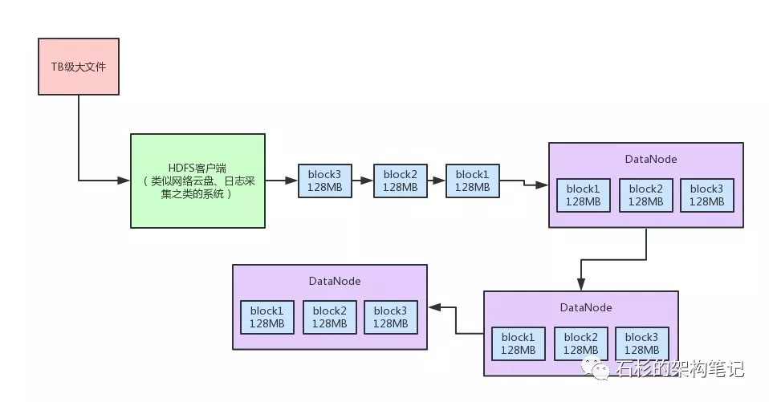
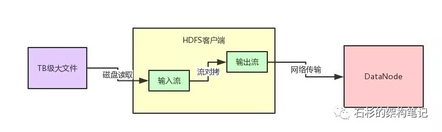
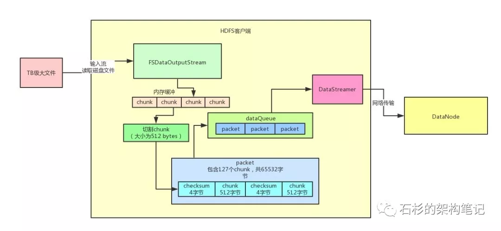

## 一、写在前面

上一篇文章，我们聊了一下Hadoop中的NameNode里的edits log写机制。

主要分析了edits log写入磁盘和网络的时候，是如何通过分段加锁以及双缓冲的机制，大幅度提升了多线程并发写edits log的吞吐量，从而支持高并发的访问。

如果没看那篇文章的同学，可以回看一下：《大规模集群下Hadoop NameNode如何承载高并发访问》。

这篇文章，我们来看看，Hadoop的HDFS分布式文件系统的文件上传的性能优化。

首先，我们还是通过一张图来回顾一下文件上传的大概的原理。

由上图所示，文件上传的原理，其实说出来也简单。

比如有个TB级的大文件，太大了，HDFS客户端会给拆成很多block，一个block就是128MB。

这个HDFS客户端你可以理解为是云盘系统、日志采集系统之类的东西。

比如有人上传一个1TB的大文件到网盘，或者是上传个1TB的大日志文件。

然后，HDFS客户端把一个一个的block上传到第一个DataNode

第一个DataNode会把这个block复制一份，做一个副本发送给第二个DataNode。

第二个DataNode发送一个block副本到第三个DataNode。

所以你会发现，一个block有3个副本，分布在三台机器上。任何一台机器宕机，数据是不会丢失的。

最后，一个TB级大文件就被拆散成了N多个MB级的小文件存放在很多台机器上了，这不就是分布式存储么？

### 二、原始的文件上传方案

今天要讨论的问题，就是那个HDFS客户端上传TB级大文件的时候，到底是怎么上传呢？

我们先来考虑一下，如果用一个比较原始的方式来上传，应该怎么做？

大概能想到的是下面这个图里的样子。

很多java的初学者，估计都知道这样来上传文件，其实无非就是不停的从本地磁盘文件用输入流读取数据，读到一点，就立马通过网络的输出流写到DataNode里去。

上面这种流程图的代码，估计刚毕业的同学都可以立马写出来。因为对文件的输入流最多就是个FileInputStream。

而对DataNode的输出流，最多就是个Socket返回的OutputStream。

然后中间找一个小的内存byte[]数组，进行流对拷就行了，从本地文件读一点数据，就给DataNode发一点数据。

但是如果你要这么弄，那性能真是极其的低下了，网络通信讲究的是适当频率，每次batch批量发送，你得读一大批数据，通过网络通信发一批数据。

不能说读一点点数据，就立马来一次网络通信，就发出去这一点点的数据。

如果按照上面这种原始的方式，绝对会导致网络通信效率极其低下，大文件上传性能很差。

为什么这么说呢？

相当于你可能刚读出来几百个字节的数据，立马就写网络，卡顿个比如几百毫秒。

然后再读下一批几百个字节的数据，再写网络卡顿个几百毫秒，这个性能很差，在工业级的大规模分布式系统中，是无法容忍的。

三、HDFS对大文件上传的性能优化

好，看完了原始的文件上传，那么我们来看看，Hadoop中的大文件上传是如何优化性能的呢？一起来看看下面那张图。

首先你需要自己创建一个针对本地TB级磁盘文件的输入流。

然后读到数据之后立马写入HDFS提供的FSDataOutputStream输出流。

这个FSDataOutputStream输出流在干啥？

大家觉得他会天真的立马把数据通过网络传输写给DataNode吗？

答案当然是否定的了！这么干的话，不就跟之前的那种方式一样了！

### 1.Chunk缓冲机制

首先，数据会被写入一个chunk缓冲数组，这个chunk是一个512字节大小的数据片段，你可以这么来理解。

然后这个缓冲数组可以容纳多个chunk大小的数据在里面缓冲。

光是这个缓冲，首先就可以让客户端快速的写入数据了，不至于说几百字节就要进行一次网络传输，想一想，是不是这样？

### 2.Packet数据包机制

接着，当chunk缓冲数组都写满了之后，就会把这个chunk缓冲数组进行一下chunk切割，切割为一个一个的chunk，一个chunk是一个数据片段。

然后多个chunk会直接一次性写入另外一个内存缓冲数据结构，就是Packet数据包。

一个Packet数据包，设计为可以容纳127个chunk，大小大致为64mb。所以说大量的chunk会不断的写入Packet数据包的内存缓冲中。

通过这个Packet数据包机制的设计，又可以在内存中容纳大量的数据，进一步避免了频繁的网络传输影响性能。

### 3.内存队列异步发送机制

当一个Packet被塞满了chunk之后，就会将这个Packet放入一个内存队列来进行排队。

然后有一个DataStreamer线程会不断的获取队列中的Packet数据包，通过网络传输直接写一个Packet数据包给DataNode。

如果一个Block默认是128mb的话，那么一个Block默认会对应两个Packet数据包，每个Packet数据包是64MB。

也就是说，传送两个Packet数据包给DataNode之后，就会发一个通知说，一个Block的数据都传输完毕。

这样DataNode就知道自己收到一个Block了，里面包含了人家发送过来的两个Packet数据包。

## 四、总结

OK，大家看完了上面的那个图以及Hadoop采取的大文件上传机制，是不是感觉设计的很巧妙？

说白了，工业级的大规模分布式系统，都不会采取特别简单的代码和模式，那样性能很低下。

这里都有大量的并发优化、网络IO优化、内存优化、磁盘读写优化的架构设计、生产方案在里面。

所以大家观察上面那个图，HDFS客户端可以快速的将tb级大文件的数据读出来，然后快速的交给HDFS的输出流写入内存。

基于内存里的chunk缓冲机制、packet数据包机制、内存队列异步发送机制。绝对不会有任何网络传输的卡顿，导致大文件的上传速度变慢。

反而通过上述几种机制，可以上百倍的提升一个TB级大文件的上传性能。