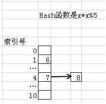

我在面试Java初级开发的时候，经常会问：你有没有重写过hashcode方法？

不少候选人直接说没写过。

我就想，或许真的没写过，于是就再通过一个问题确认：你在用HashMap的时候，键（Key）部分，有没有放过自定义对象？

而这个时候，候选人说放过，于是两个问题的回答就自相矛盾了。

最近问下来，这个问题普遍回答不大好，于是在本文里，就干脆从hash表讲起，讲述HashMap的存数据规则，由此大家就自然清楚上述问题的答案了。

1. 通过Hash算法来了解HashMap对象的高效性

我们先复习数据结构里的一个知识点：在一个长度为n（假设是10000）的线性表（假设是ArrayList）里，存放着无序的数字；如果我们要找一个指定的数字，就不得不通过从头到尾依次遍历来查找，这样的平均查找次数是n除以2（这里是5000）。

我们再来观察Hash表（这里的Hash表纯粹是数据结构上的概念，和Java无关）。它的平均查找次数接近于1，代价相当小，关键是在Hash表里，存放在其中的数据和它的存储位置是用Hash函数关联的。

我们假设一个Hash函数是x*x%5。当然实际情况里不可能用这么简单的Hash函数，我们这里纯粹为了说明方便，而Hash表是一个长度是11的线性表。如果我们要把6放入其中，那么我们首先会对6用Hash函数计算一下，结果是1，所以我们就把6放入到索引号是1这个位置。同样如果我们要放数字7，经过Hash函数计算，7的结果是4，那么它将被放入索引是4的这个位置。这个效果如下图所示。


这样做的好处非常明显。比如我们要从中找6这个元素，我们可以先通过Hash函数计算6的索引位置，然后直接从1号索引里找到它了。

不过我们会遇到“Hash值冲突”这个问题。比如经过Hash函数计算后，7和8会有相同的Hash值，对此Java的HashMap对象采用的是”链地址法“的解决方案。效果如下图所示。


 
具体的做法是，为所有Hash值是i的对象建立一个同义词链表。假设我们在放入8的时候，发现4号位置已经被占，那么就会新建一个链表结点放入8。同样，如果我们要找8，那么发现4号索引里不是8，那会沿着链表依次查找。

虽然我们还是无法彻底避免Hash值冲突的问题，但是Hash函数设计合理，仍能保证同义词链表的长度被控制在一个合理的范围里。这里讲的理论知识并非无的放矢，大家能在后文里清晰地了解到重写hashCode方法的重要性。

2. 为什么要重写equals和hashCode方法

当我们用HashMap存入自定义的类时，如果不重写这个自定义类的equals和hashCode方法，得到的结果会和我们预期的不一样。我们来看WithoutHashCode.java这个例子。

在其中的第2到第18行，我们定义了一个Key类；在其中的第3行定义了唯一的一个属性id。当前我们先注释掉第9行的equals方法和第16行的hashCode方法。

```  
import java.util.HashMap;

class Key {
    private Integer id;

    public Key(Integer id) {
        this.id = id;
    }

    public Integer getId() {
        return id;
    }

    //故意先注释掉equals和hashCode方法
    // public boolean equals(Object o) {
    // if (o == null || !(o instanceof Key))
    // { return false; }
    // else
    // { return this.getId().equals(((Key) o).getId());}
    // }

    // public int hashCode()
    // { return id.hashCode(); }
}


public class WithoutHashCode {
    public static void main(String[] args) {
        Key k1 = new Key(1);
        Key k2 = new Key(1);
        HashMap<Key, String> hm = new HashMap<Key, String>();
        hm.put(k1, "Key with id is 1");
        System.out.println(hm.get(k2));
    }
}
```  

在main函数里的第22和23行，我们定义了两个Key对象，它们的id都是1，就好比它们是两把相同的都能打开同一扇门的钥匙。

在第24行里，我们通过泛型创建了一个HashMap对象。它的键部分可以存放Key类型的对象，值部分可以存储String类型的对象。

在第25行里，我们通过put方法把k1和一串字符放入到hm里；而在第26行，我们想用k2去从HashMap里得到值；这就好比我们想用k1这把钥匙来锁门，用k2来开门。这是符合逻辑的，但从当前结果看，26行的返回结果不是我们想象中的那个字符串，而是null。

原因有两个—没有重写。第一是没有重写hashCode方法，第二是没有重写equals方法。

当我们往HashMap里放k1时，首先会调用Key这个类的hashCode方法计算它的hash值，随后把k1放入hash值所指引的内存位置。

关键是我们没有在Key里定义hashCode方法。这里调用的仍是Object类的hashCode方法（所有的类都是Object的子类），而Object类的hashCode方法返回的hash值其实是k1对象的内存地址（假设是1000）。

如果我们随后是调用hm.get(k1)，那么我们会再次调用hashCode方法（还是返回k1的地址1000），随后根据得到的hash值，能很快地找到k1。

但我们这里的代码是hm.get(k2)，当我们调用Object类的hashCode方法（因为Key里没定义）计算k2的hash值时，其实得到的是k2的内存地址（假设是2000）。

由于k1和k2是两个不同的对象，所以它们的内存地址一定不会相同，也就是说它们的hash值一定不同，这就是我们无法用k2的hash值去拿k1的原因。

当我们把第16和17行的hashCode方法的注释去掉后，会发现它是返回id属性的hashCode值，这里k1和k2的id都是1,所以它们的hash值是相等的。

我们再来更正一下存k1和取k2的动作。存k1时，是根据它id的hash值，假设这里是100，把k1对象放入到对应的位置。而取k2时，是先计算它的hash值（由于k2的id也是1，这个值也是100），随后到这个位置去找。

但结果会出乎我们意料：明明100号位置已经有k1，但第26行的输出结果依然是null。其原因就是没有重写Key对象的equals方法。

HashMap是用链地址法来处理冲突，也就是说，在100号位置上，有可能存在着多个用链表形式存储的对象。它们通过hashCode方法返回的hash值都是100。

当我们通过k2的hashCode到100号位置查找时，确实会得到k1。但k1有可能仅仅是和k2具有相同的hash值，但未必和k2相等（k1和k2两把钥匙未必能开同一扇门），这个时候，就需要调用Key对象的equals方法来判断两者是否相等了。

由于我们在Key对象里没有定义equals方法，系统就不得不调用Object类的equals方法。由于Object的固有方法是根据两个对象的内存地址来判断，所以k1和k2一定不会相等，这就是为什么依然在26行通过hm.get(k2)依然得到null的原因。

为了解决这个问题，我们需要打开第9到14行equals方法的注释。在这个方法里，只要两个对象都是Key类型，而且它们的id相等，它们就相等。

3. 对面试问题的说明

由于在项目里经常会用到HashMap，所以我在面试的时候一定会问这个问题∶你有没有重写过hashCode方法？你在使用HashMap时有没有重写hashCode和equals方法？你是怎么写的？

根据问下来的结果，我发现初级程序员对这个知识点普遍没掌握好。重申一下，如果大家要在HashMap的“键”部分存放自定义的对象，一定要在这个对象里用自己的equals和hashCode方法来覆盖Object里的同名方法。