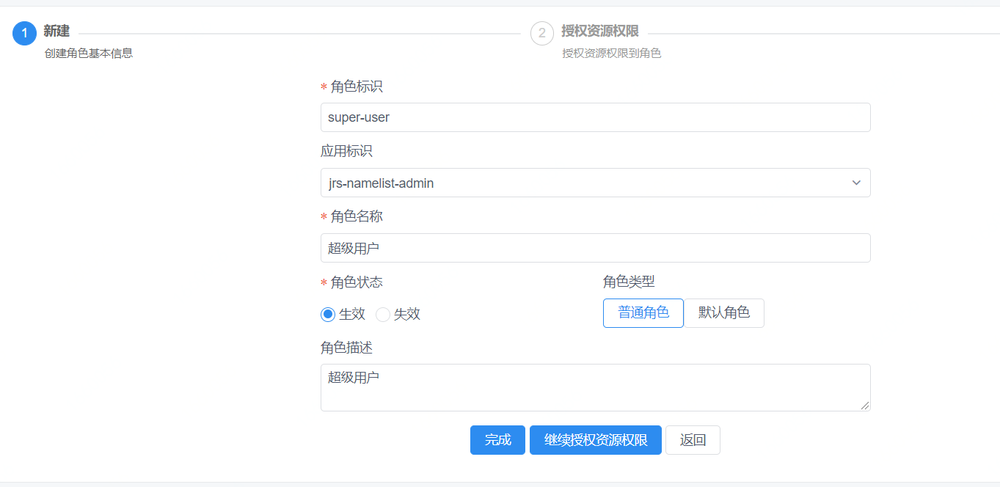
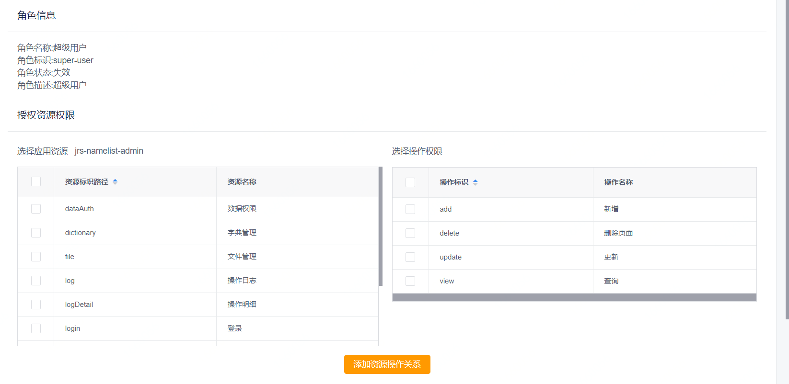

##  权限管理系统

### 功能模块

#### 信息维护

*  用户管理(登录账号，性别，电话，邮箱，用户状态等基本信息)
*  接入应用-已接入应用（应用英文名称，应用中文名称，产品栏展示名称-用于展示，密钥，应用分组-方便管理，是否有效，主页地址，详情介绍等）
*  应用管理-所有应用信息
*  分组管理（分组标识，分组名称）

#### 权限管理

* 角色管理（角色标识，角色名称，应用标识，角色类型，角色描述，角色状态-是否生效）
* 角色管理-新建角色（可授权资源到当前角色，资源+操作类型）



* 资源管理（资源树-对应每个系统，所有controller路径）
* 操作管理（操作标识-add,view,delete,update等，操作名称，应用名称，操作描述，是否生效，操作可设置启用禁用）


### 授权中心


uas 获取权限数据
```  
{
  "resource": {
    "roles": [
      "admin",
      "developer",
      "user"
    ],
    "stringPermissions": [
      "logDetail:view",
      "tableConstruct:view",
      "tableConstruct:delete",
      "tableConstruct:update",
      "nameData:update",
      "logDetail:add",
      "nameData:add",
      "dictionary:delete",
      "log:update",
      "logDetail:update",
      "login:delete",
      "nameData:delete",
      "login:view",
      "file:update",
      "dictionary:update",
      "dataAuth:view",
      "nameData:view",
      "login:update",
      "nameList:view",
      "file:view",
      "dataAuth:update",
      "log:view",
      "dictionary:view",
      "login:add",
      "file:delete",
      "dataAuth:delete",
      "log:delete",
      "logDetail:delete",
      "tableConstruct:add",
      "nameList:add",
      "dictionary:add",
      "dataAuth:add",
      "nameList:delete",
      "log:add",
      "nameList:update",
      "file:add"
    ]
  },
  "account": {
    "accountType": "companyChild",
    "apps": [
      "finance-gateway-manager",
      "jrs-namelist-api",
      "jrs-namelist-admin",
      "jdflow-manager",
      "finance-gateway-runtime",
      "sgy-carrier-presure",
      "jdflow-runtime",
      "risk_heaven_book"
    ],
    "companyId": "jdjr",
    "dataSource": "local",
    "displayName": "张文超",
    "email": "zhangwenchao19@jd.com",
    "erpName": "zhangwenchao19",
    "loginName": "zhangwenchao19",
    "organizationFullName": "京东集团-京东数字科技-风险管理中心-风险研发部-决策平台研发组",
    "phone": "18649041578",
    "state": "1",
    "userType": "erp"
  }
}
```  

* roles 角色类型
* stringPermissions 菜单权限
* account 用户信息
* account.apps 当前用户拥有系统权限

