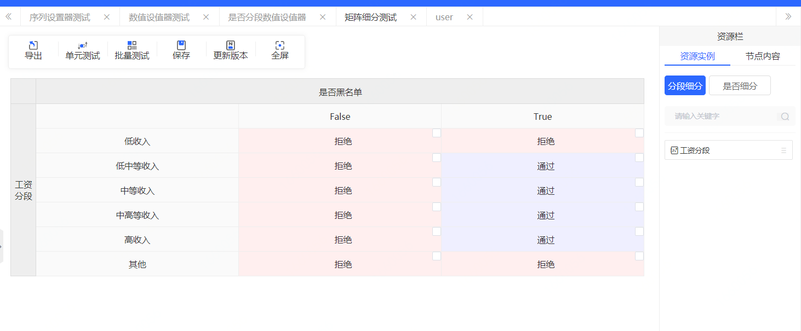
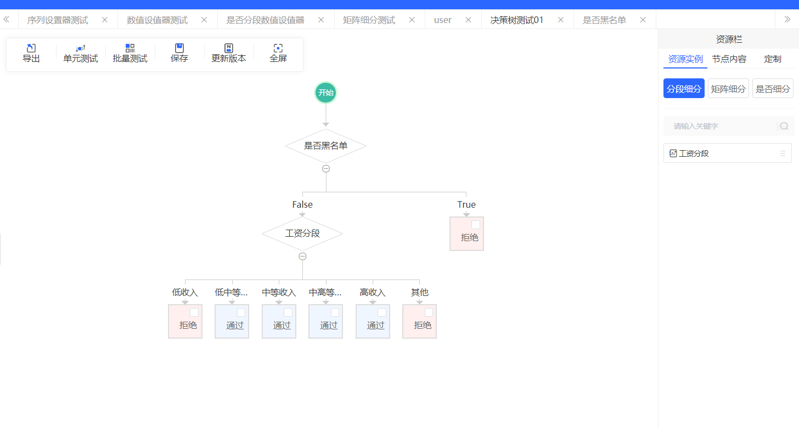
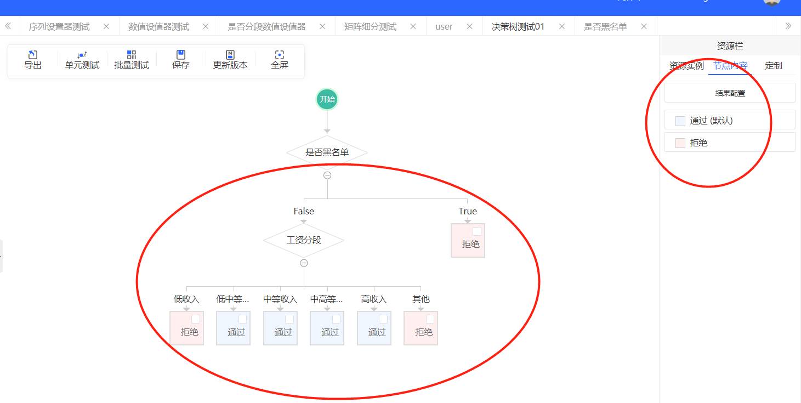

### 组件介绍
#### 1.分段细分
功能说明：支持对一个变量进行分段，可进行多个离散值的枚举，也可支持对连续型变量的范围控制。

#### 2.是否细分

功能说明：可支持对逻辑表达式的判断，且输出结果真或假

##### 2.1 脚本-操作符

  

##### 2.2 脚本-函数

#### 3.序列设值器

功能说明：支持根据多个条件判断给多个变量进行赋值操作，可复用变量分段组件

#### 4.矩阵细分

功能说明：通过二维矩阵的形式支持利用两个变量进行分段

#### 5.决策树

功能说明：支持树结构分布，可支持灵活定义条件及结果内容，分段结果可读性强

结果配置

