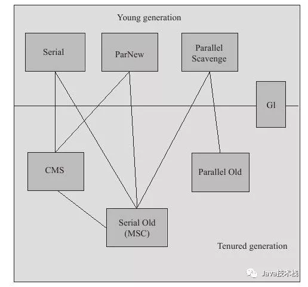
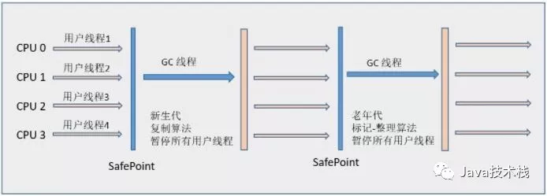
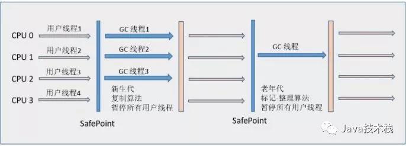
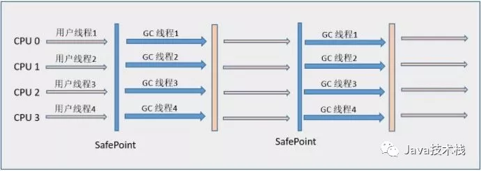
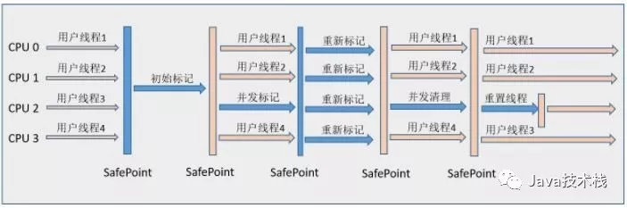

**如果说收集算法是内存回收的方法论，那么垃圾收集器就是内存回收的具体实现。**

Java虚拟机规范中对垃圾收集器应该如何实现并没有任何规定，因此不同的厂商、版本的虚拟机所提供的垃圾收集器都可能会有很大差别，并且一般都会提供参数供用户根据自己的应用特点和要求组合出各个年代所使用的收集器。

接下来讨论的收集器基于JDK1.7 Update 14 之后的HotSpot虚拟机（在此版本中正式提供了商用的G1收集器，之前G1仍处于实验状态），该虚拟机包含的所有收集器如下图所示：

上图展示了7种作用于不同分代的收集器，如果两个收集器之间存在连线，就说明它们可以搭配使用。

虚拟机所处的区域，则表示它是属于新生代收集器还是老年代收集器。Hotspot实现了如此多的收集器，正是因为目前并无完美的收集器出现，只是选择对具体应用最适合的收集器。

##  相关概念

### 并行和并发

* 并行（Parallel）：指多条垃圾收集线程并行工作，但此时用户线程仍然处于等待状态。

* 并发（Concurrent）：指用户线程与垃圾收集线程同时执行（但不一定是并行的，可能会交替执行），用户程序在继续运行。而垃圾收集程序运行在另一个CPU上。

### 吞吐量（Throughput）

吞吐量就是CPU用于运行用户代码的时间与CPU总消耗时间的比值，即

吞吐量 = 运行用户代码时间 /（运行用户代码时间 + 垃圾收集时间）。

假设虚拟机总共运行了100分钟，其中垃圾收集花掉1分钟，那吞吐量就是99%。

###  Minor GC 和 Full GC

* 新生代GC（Minor GC）：指发生在新生代的垃圾收集动作，因为Java对象大多都具备朝生夕灭的特性，所以Minor GC非常频繁，一般回收速度也比较快。具体原理见上一篇文章。

* 老年代GC（Major GC / Full GC）：指发生在老年代的GC，出现了Major GC，经常会伴随至少一次的Minor GC（但非绝对的，在Parallel Scavenge收集器的收集策略里就有直接进行Major GC的策略选择过程）。Major GC的速度一般会比Minor GC慢10倍以上。

## 新生代收集器

### Serial收集器

Serial（串行）收集器是最基本、发展历史最悠久的收集器，它是采用复制算法的新生代收集器，曾经（JDK 1.3.1之前）是虚拟机新生代收集的唯一选择。

它是一个单线程收集器，只会使用一个CPU或一条收集线程去完成垃圾收集工作，更重要的是它在进行垃圾收集时，必须暂停其他所有的工作线程，直至Serial收集器收集结束为止（“Stop The World”）。

这项工作是由虚拟机在后台自动发起和自动完成的，在用户不可见的情况下把用户正常工作的线程全部停掉，这对很多应用来说是难以接收的。图解 Java 垃圾回收机制，这篇推荐看下。

下图展示了Serial 收集器（老年代采用Serial Old收集器）的运行过程：

为了消除或减少工作线程因内存回收而导致的停顿，HotSpot虚拟机开发团队在JDK 1.3之后的Java发展历程中研发出了各种其他的优秀收集器，这些将在稍后介绍。

但是这些收集器的诞生并不意味着Serial收集器已经“老而无用”，实际上到现在为止，它依然是HotSpot虚拟机运行在Client模式下的默认的新生代收集器。

它也有着优于其他收集器的地方：

简单而高效（与其他收集器的单线程相比），对于限定单个CPU的环境来说，Serial收集器由于没有线程交互的开销，专心做垃圾收集自然可以获得更高的单线程收集效率。

在用户的桌面应用场景中，分配给虚拟机管理的内存一般不会很大，收集几十兆甚至一两百兆的新生代（仅仅是新生代使用的内存，桌面应用基本不会再大了），停顿时间完全可以控制在几十毫秒最多一百毫秒以内，只要不频繁发生，这点停顿时间可以接收。

所以，Serial收集器对于运行在Client模式下的虚拟机来说是一个很好的选择。

### ParNew 收集器

ParNew收集器就是Serial收集器的多线程版本，它也是一个新生代收集器。除了使用多线程进行垃圾收集外，其余行为包括Serial收集器可用的所有控制参数、收集算法（复制算法）、Stop The World、对象分配规则、回收策略等与Serial收集器完全相同，两者共用了相当多的代码。

ParNew收集器的工作过程如下图（老年代采用Serial Old收集器）：

ParNew收集器除了使用多线程收集外，其他与Serial收集器相比并无太多创新之处，但它却是许多运行在Server模式下的虚拟机中首选的新生代收集器，

其中有一个与性能无关的重要原因是，**除了Serial收集器外，目前只有它能和CMS收集器（Concurrent Mark Sweep）配合工作**，CMS收集器是JDK 1.5推出的一个具有划时代意义的收集器，具体内容将在稍后进行介绍。

ParNew 收集器在单CPU的环境中绝对不会有比Serial收集器有更好的效果，甚至由于存在线程交互的开销，该收集器在通过超线程技术实现的两个CPU的环境中都不能百分之百地保证可以超越。

在多CPU环境下，随着CPU的数量增加，它对于GC时系统资源的有效利用是很有好处的。它默认开启的收集线程数与CPU的数量相同，在CPU非常多的情况下可使用-XX:ParallerGCThreads参数设置。

### Parallel Scavenge 收集器

Parallel Scavenge收集器也是一个并行的多线程新生代收集器，它也使用复制算法。

Parallel Scavenge收集器的特点是它的关注点与其他收集器不同，CMS等收集器的**关注点是尽可能缩短垃圾收集时用户线程的停顿时间**，

而Parallel Scavenge收集器的目标是达到一个可控制的吞吐量（Throughput）。

停顿时间越短就越适合需要与用户交互的程序，良好的响应速度能提升用户体验。而高吞吐量则可以高效率地利用CPU时间，尽快完成程序的运算任务，主要适合在后台运算而不需要太多交互的任务。

Parallel Scavenge收集器除了会显而易见地提供可以精确控制吞吐量的参数，还提供了一个参数-XX:+UseAdaptiveSizePolicy，这是一个开关参数，打开参数后，就不需要手工指定新生代的大小（-Xmn）、Eden和Survivor区的比例（-XX:SurvivorRatio）、晋升老年代对象年龄（-XX:PretenureSizeThreshold）等细节参数了。

虚拟机会根据当前系统的运行情况收集性能监控信息，动态调整这些参数以提供最合适的停顿时间或者最大的吞吐量，这种方式称为GC自适应的调节策略（GC Ergonomics）。

自适应调节策略也是Parallel Scavenge收集器与ParNew收集器的一个重要区别。

另外值得注意的一点是，Parallel Scavenge收集器无法与CMS收集器配合使用，所以在JDK 1.6推出Parallel Old之前，如果新生代选择Parallel Scavenge收集器，老年代只有Serial Old收集器能与之配合使用。

[46张PPT弄懂JVM、GC算法和性能调优，这篇我必须推荐给你](https://mp.weixin.qq.com/s?__biz=MzI3ODcxMzQzMw==&mid=2247489332&idx=2&sn=65de5886e13b98116c8432d7d10ae4bc&chksm=eb539202dc241b14010f70edf89dc37c7629b5e2b7add50fd3f58070ecf2c14260196bf147d8&scene=21#wechat_redirect)  

## 老年代收集器

### Serial Old收集器

Serial Old 是 Serial收集器的老年代版本，它同样是一个单线程收集器，使用“标记-整理”（Mark-Compact）算法。

此收集器的主要意义也是在于给Client模式下的虚拟机使用。如果在Server模式下，它还有两大用途：

* 在JDK1.5 以及之前版本（Parallel Old诞生以前）中与Parallel Scavenge收集器搭配使用。

* 作为CMS收集器的后备预案，在并发收集发生Concurrent Mode Failure时使用。

它的工作流程与Serial收集器相同，这里再次给出Serial/Serial Old配合使用的工作流程图：

### Parallel Old收集器

Parallel Old收集器是Parallel Scavenge收集器的老年代版本，使用多线程和“标记-整理”算法。

前面已经提到过，这个收集器是在JDK 1.6中才开始提供的，在此之前，如果新生代选择了Parallel Scavenge收集器。

老年代除了Serial Old以外别无选择，所以在Parallel Old诞生以后，“吞吐量优先”收集器终于有了比较名副其实的应用组合，在注重吞吐量以及CPU资源敏感的场合，都可以优先考虑Parallel Scavenge加Parallel Old收集器。

Parallel Old收集器的工作流程与Parallel Scavenge相同，这里给出Parallel Scavenge/Parallel Old收集器配合使用的流程图：

### CMS收集器

CMS（Concurrent Mark Sweep）收集器是一种以获取最短回收停顿时间为目标的收集器，它非常符合那些集中在互联网站或者B/S系统的服务端上的Java应用，这些应用都非常重视服务的响应速度。从名字上（“Mark Sweep”）就可以看出它是基于“标记-清除”算法实现的。

CMS收集器工作的整个流程分为以下4个步骤：

* 初始标记（CMS initial mark）：仅仅只是标记一下GC Roots能直接关联到的对象，速度很快，需要“Stop The World”。
* 并发标记（CMS concurrent mark）：进行GC Roots Tracing的过程，在整个过程中耗时最长。
* 重新标记（CMS remark）：为了修正并发标记期间因用户程序继续运作而导致标记产生变动的那一部分对象的标记记录，这个阶段的停顿时间一般会比初始标记阶段稍长一些，但远比并发标记的时间短。此阶段也需要“Stop The World”。
* 并发清除（CMS concurrent sweep）

由于整个过程中耗时最长的并发标记和并发清除过程收集器线程都可以与用户线程一起工作。
所以，从总体上来说，CMS收集器的内存回收过程是与用户线程一起并发执行的。通过下图可以比较清楚地看到CMS收集器的运作步骤中并发和需要停顿的时间：

