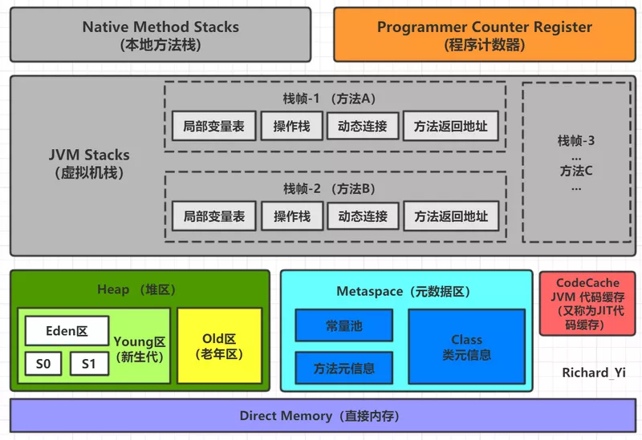
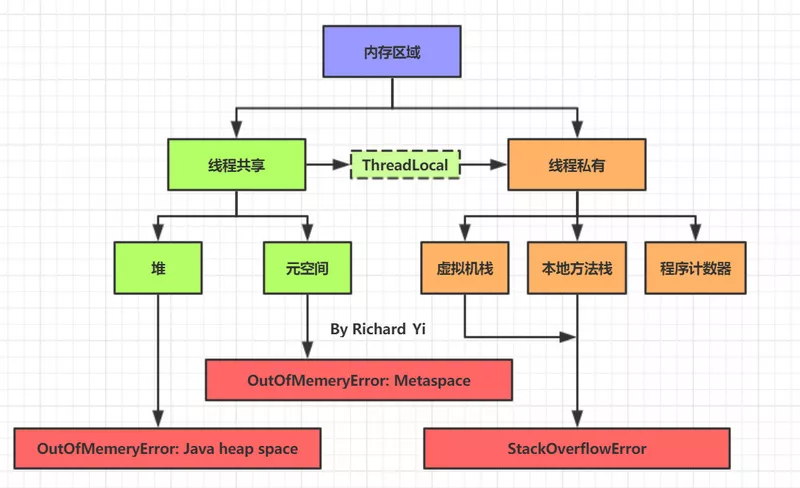

本 JVM 系列属于本人学习过程当中总结的一些知识点，目的是想让读者更快地掌握 JVM 相关的知识要点，难免会有所侧重，若想要更加系统更加详细的学习 JVM 知识，还是需要去阅读专业的书籍和文档。

本文主题内容：

* JVM 内存区域概览
* 堆区的空间分配是怎么样？堆溢出的演示
* 创建一个新对象内存是怎么分配的？
* 方法区 到 Metaspace 元空间
* 栈帧是什么？栈帧里有什么？怎么理解？
* 本地方法栈
* 程序计数器
Code Cache 是什么？

**注：请区分 JVM 内存结构（内存布局）和 JMM（Java 内存模型）这两个不同的概念！**

## 概念

内存是非常重要的系统资源，是硬盘和 CPU 的中间仓库及桥梁，承载着操作系统和应用程序的实时运行。
JVM 内存布局规定了 Java 在运行过程中内存申请、分配、管理的策略，保证了 JVM 的高效稳定运行。

上图描述了当前比较经典的 JVM 内存布局。（堆区画小了 2333，按理来说应该是最大的区域）

如果按照线程是否共享来分类的话，如下图所示：

