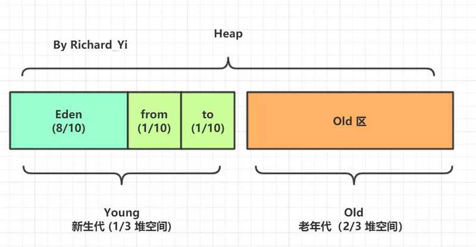
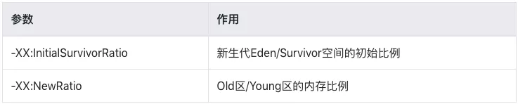
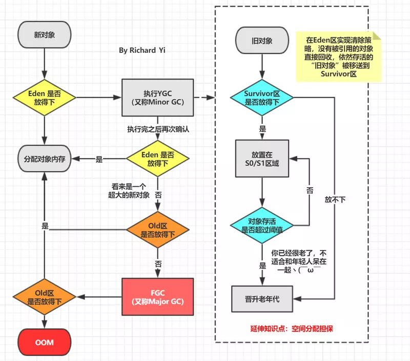
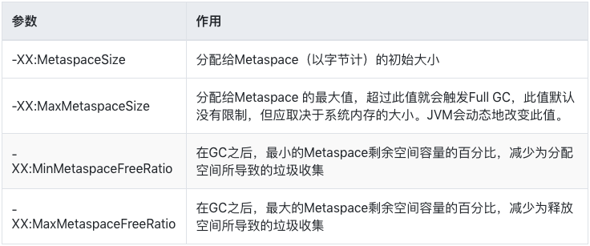
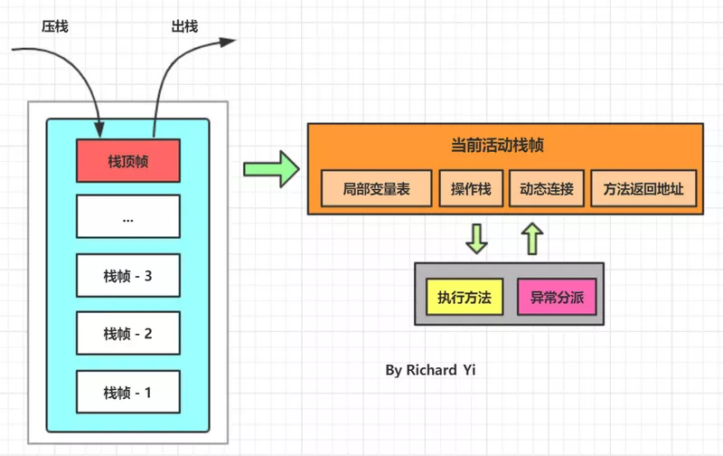

本 JVM 系列属于本人学习过程当中总结的一些知识点，目的是想让读者更快地掌握 JVM 相关的知识要点，难免会有所侧重，若想要更加系统更加详细的学习 JVM 知识，还是需要去阅读专业的书籍和文档。

本文主题内容：

* JVM 内存区域概览
* 堆区的空间分配是怎么样？堆溢出的演示
* 创建一个新对象内存是怎么分配的？
* 方法区 到 Metaspace 元空间
* 栈帧是什么？栈帧里有什么？怎么理解？
* 本地方法栈
* 程序计数器
Code Cache 是什么？

**注：请区分 JVM 内存结构（内存布局）和 JMM（Java 内存模型）这两个不同的概念！**

## 概念

内存是非常重要的系统资源，是硬盘和 CPU 的中间仓库及桥梁，承载着操作系统和应用程序的实时运行。
JVM 内存布局规定了 Java 在运行过程中内存申请、分配、管理的策略，保证了 JVM 的高效稳定运行。


上图描述了当前比较经典的 JVM 内存布局。（堆区画小了 2333，按理来说应该是最大的区域）

如果按照线程是否共享来分类的话，如下图所示：


PS：线程是否共享这点，实际上理解了每块区域的实际用处之后，就很自然而然的就记住了。不需要死记硬背。

下面让我们来了解下各个区域。

## Heap (堆区）

### 1. 堆区的介绍

我们先来说堆。堆是 OOM 故障最主要的发生区域。它是内存区域中最大的一块区域，被所有线程共享，
存储着几乎所有的实例对象、数组。所有的对象实例以及数组都要在堆上分配，但是随着 JIT 编译器的发展与逃逸分析技术逐渐成熟，
栈上分配、标量替换优化技术将会导致一些微妙的变化发生，所有的对象都分配在堆上也渐渐变得不是那么“绝对”了。

延伸知识点：JIT 编译优化中的一部分内容 - 逃逸分析。
推荐阅读：面试问我 Java 逃逸分析，瞬间被秒杀了。

Java 堆是垃圾收集器管理的主要区域，因此很多时候也被称做“GC 堆”。从内存回收的角度来看，由于现在收集器基本都采用分代收集算法，
所以 Java 堆中还可以细分为：新生代和老年代。再细致一点的有 Eden 空间、From Survivor 空间、To Survivor 空间等。从内存分配的角度来看，
线程共享的 Java 堆中可能划分出多个线程私有的分配缓冲区（Thread Local Allocation Buffer,TLAB）。不过无论如何划分，
都与存放内容无关，无论哪个区域，存储的都仍然是对象实例，进一步划分的目的是为了更好地回收内存，或者更快地分配内存。

### 2. 堆区的调整

根据 Java 虚拟机规范的规定，Java 堆可以处于物理上不连续的内存空间中，只要逻辑上是连续的即可，就像我们的磁盘空间一样。在实现时，既可以实现成固定大小的，也可以在运行时动态地调整。

如何调整呢？

通过设置如下参数，可以设定堆区的初始值和最大值，比如 -Xms256M -Xmx 1024M，其中 -X 这个字母代表它是 JVM 运行时参数，ms 是 memory start 的简称，中文意思就是内存初始值，mx 是 memory max 的简称，意思就是最大内存。

值得注意的是，在通常情况下，服务器在运行过程中，堆空间不断地扩容与回缩，会形成不必要的系统压力所以在线上生产环境中 JVM 的 Xms 和 Xmx 会设置成同样大小，避免在 GC 后调整堆大小时带来的额外压力。

3. 堆的默认空间分配

另外，再强调一下堆空间内存分配的大体情况。



这里可能就会有人来问了，你从哪里知道的呢？如果我想配置这个比例，要怎么修改呢？

我先来告诉你怎么看虚拟机的默认配置。命令行上执行如下命令，就可以查看当前 JDK 版本所有默认的 JVM 参数。

java -XX:+PrintFlagsFinal -version
输出

对应的输出应该有几百行，我们这里去看和堆内存分配相关的两个参数
 
java -XX:+PrintFlagsFinal -version
```  
[Global flags]
    ...
    uintx InitialSurvivorRatio                      = 8
    uintx NewRatio                                  = 2
    ...
java version "1.8.0_131"
Java(TM) SE Runtime Environment (build 1.8.0_131-b11)
Java HotSpot(TM) 64-Bit Server VM (build 25.131-b11, mixed mode)
```  
参数解释



因为新生代是由 Eden + S0 + S1 组成的，所以按照上述默认比例，如果 eden 区内存大小是 40M，那么两个 survivor 区就是 5M，整个 young 区就是 50M，
然后可以算出 Old 区内存大小是 100M，堆区总大小就是 150M。

### 4. 堆溢出演示
``` 
/**
 * VM Args：-Xms10m -Xmx10m -XX:+HeapDumpOnOutOfMemoryError
 * @author Richard_Yi
 */
public class HeapOOMTest {

    public static final int _1MB = 1024 * 1024;

    public static void main(String[] args) {
        List<byte[]> byteList = new ArrayList<>(10);
        for (int i = 0; i < 10; i++) {
            byte[] bytes = new byte[2 * _1MB];
            byteList.add(bytes);
        }
    }
}
``` 
输出
``` 
java.lang.OutOfMemoryError: Java heap space
Dumping heap to java_pid32372.hprof ...
Heap dump file created [7774077 bytes in 0.009 secs]
Exception in thread "main" java.lang.OutOfMemoryError: Java heap space
    at jvm.HeapOOMTest.main(HeapOOMTest.java:18)
-XX:+HeapDumpOnOutOfMemoryError 可以让 JVM 在遇到 OOM 异常时，输出堆内信息，
``` 

## 创建一个新对象内存分配流程
看完上面对堆的介绍，我们趁热打铁再学习一下 JVM 创建一个新对象的内存分配流程。



绝大部分对象在 Eden 区生成，当 Eden 区装填满的时候，会触发 Young Garbage Collection，即 YGC。垃圾回收的时候，在 Eden 区实现清除策略，没有被引用的对象则直接回收。
依然存活的对象会被移送到 Survivor 区。Survivor 区分为 so 和 s1 两块内存空间。每次 YGC 的时候，它们将存活的对象复制到未使用的那块空间，然后将当前正在使用的空间完全清除，交换两块空间的使用状态。
如果 YGC 要移送的对象大于 Survivor 区容量的上限，则直接移交给老年代。一个对象也不可能永远呆在新生代，就像人到了 18 岁就会成年一样，在 JVM 中 －XX:MaxTenuringThreshold 参数就是来配置一个对象从新生代晋升到老年代的阈值。默认值是 15，可以在 Survivor 区交换 14 次之后，晋升至老年代。

上述涉及到一部分垃圾回收的名词，不熟悉的读者可以查阅资料或者看下本系列的垃圾回收章节。46张PPT弄懂JVM、GC算法和性能调优，分享给大家。

###  Metaspace 元空间

在 HotSpot JVM 中，永久代（ ≈ 方法区）中用于存放类和方法的元数据以及常量池，比如 Class 和 Method。每当一个类初次被加载的时候，它的元数据都会放到永久代中。

永久代是有大小限制的，因此如果加载的类太多，很有可能导致永久代内存溢出，即万恶的 java.lang.OutOfMemoryError: PermGen，为此我们不得不对虚拟机做调优。

那么，Java 8 中 PermGen 为什么被移出 HotSpot JVM 了？（详见：JEP 122: Remove the Permanent Generation）：

* 1. 由于 PermGen 内存经常会溢出，引发恼人的 java.lang.OutOfMemoryError: PermGen，因此 JVM 的开发者希望这一块内存可以更灵活地被管理，不要再经常出现这样的 OOM
* 2. 移除 PermGen 可以促进 HotSpot JVM 与 JRockit VM 的融合，因为 JRockit 没有永久代。

根据上面的各种原因，PermGen 最终被移除，方法区移至 Metaspace，字符串常量池移至堆区。

准确来说，Perm 区中的字符串常量池被移到了堆内存中是在 Java7 之后，Java 8 时，PermGen 被元空间代替，其他内容比如类元信息、字段、静态属性、方法、常量等都移动到元空间区。比如 java/lang/Object 类元信息、静态属性 System.out、整形常量 100000 等。

元空间的本质和永久代类似，都是对 JVM 规范中方法区的实现。
**不过元空间与永久代之间最大的区别在于：元空间并不在虚拟机中，而是使用本地内存。因此，默认情况下，元空间的大小仅受本地内存限制。（和后面提到的直接内存一样，都是使用本地内存）**

In JDK 8, classes metadata is now stored in the native heap and this space is called Metaspace.

对应的 JVM 调参：



## Java 虚拟机栈

对于每一个线程，JVM 都会在线程被创建的时候，创建一个单独的栈。也就是说虚拟机栈的生命周期和线程是一致，并且是线程私有的。除了 Native 方法以外，Java 方法都是通过 Java 虚拟机栈来实现调用和执行过程的（需要程序技术器、堆、元空间内数据的配合）。

所以 Java 虚拟机栈是虚拟机执行引擎的核心之一。而 Java 虚拟机栈中出栈入栈的元素就称为「栈帧」。

栈帧(Stack Frame)是用于支持虚拟机进行方法调用和方法执行的数据结构。栈帧存储了方法的局部变量表、操作数栈、动态连接和方法返回地址等信息。每一个方法从调用至执行完成的过程，都对应着一个栈帧在虚拟机栈里从入栈到出栈的过程。

栈对应线程，栈帧对应方法

在活动线程中， 只有位于栈顶的帧才是有效的， 称为当前栈帧。正在执行的方法称为当前方法。在执行引擎运行时， 所有指令都只能针对当前栈帧进行操作。而 StackOverflowError 表示请求的栈溢出， 导致内存耗尽， 通常出现在递归方法中。

虚拟机栈通过 pop 和 push 的方式，对每个方法对应的活动栈帧进行运算处理，方法正常执行结束，肯定会跳转到另一个栈帧上。在执行的过程中，如果出现了异常，会进行异常回溯，返回地址通过异常处理表确定。

可以看出栈帧在整个 JVM 体系中的地位颇高。下面也具体介绍一下栈帧中的存储信息


