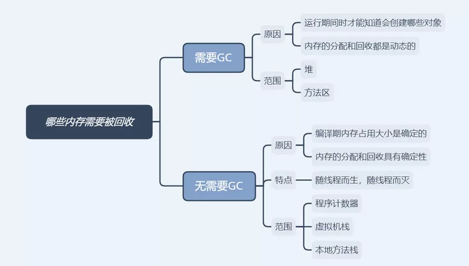
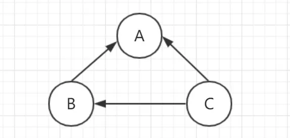
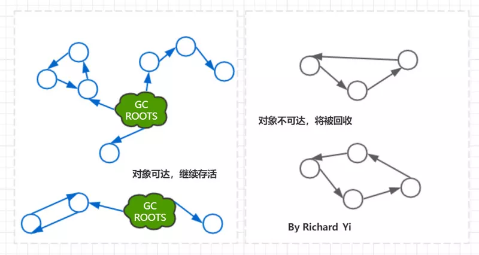
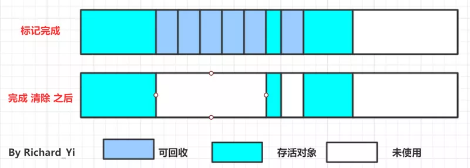
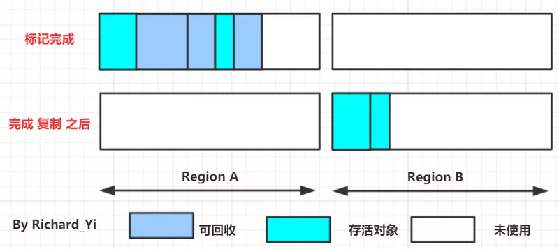
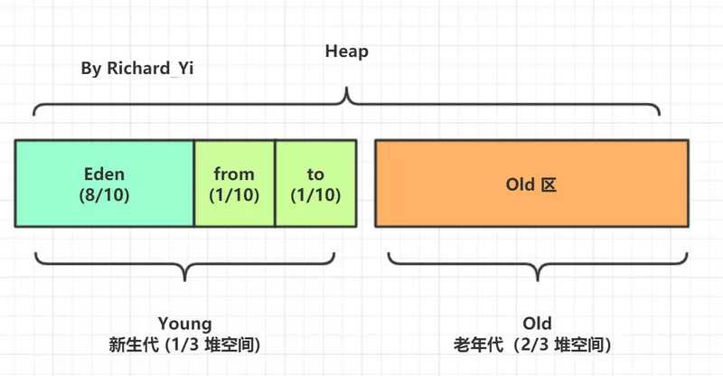
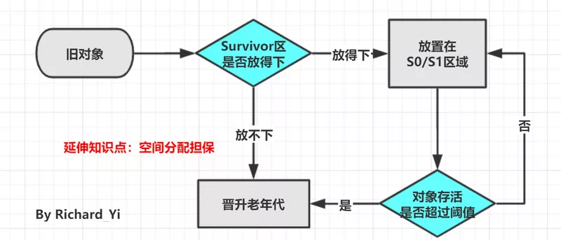
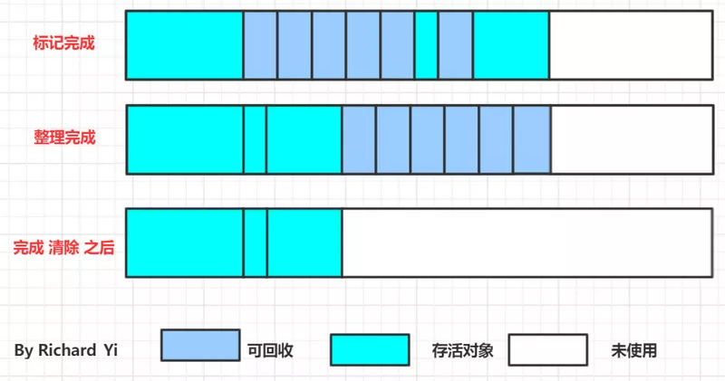
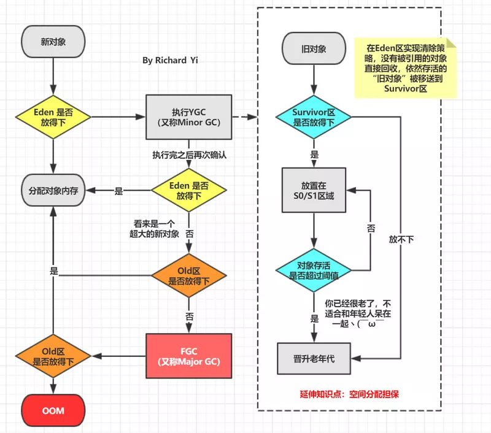
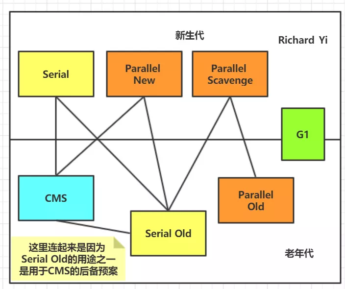

垃圾回收（ Garbage Collection 以下简称 GC）诞生于1960年 MIT 的 Lisp 语言，有半个多世纪的历史。

在Java 中，JVM 会对内存进行自动分配与回收，其中 GC 的主要作用就是清楚不再使用的对象，自动释放内存。

GC 相关的研究者们主要是思考这3件事情。

* 哪些内存需要回收？
* 什么时候回收？
* 如何回收？

本文也大致按照这个思路，为大家描述垃圾回收的相关知识。因为会有很多内存区域相关的知识，希望读者先学习完《精美图文带你掌握 JVM 内存布局》再来阅读本文。
本文的主要内容如下（建议大家在阅读和学习的时候，也大致按照以下的思路来思考和学习）：

* 哪些内存需要回收？即GC 发生的内存区域？

* 如何判断这个对象需要回收？即GC 的存活标准？

这里又能够引出以下的知识概念：

* 引用计数法

* 可达性分析法

* 引用的种类和特点、区别 （强引用、软引用、弱引用、虚引用）

延伸知识：(WeakHashMap) (引用队列)

有了对象的存活标准之后，我们就需要知道GC 的相关算法（思想）

* 标记-清除（Mark-Sweep）算法
* 复制（Copying）算法
* 标记-整理（Mark-Compact）算法

在下一步学习之前，还需要知道一些GC的术语，防止对一些概念描述出现混淆，知道了算法之后，自然而然我们到了JVM中对这些算法的实现和应用，即各种垃圾收集器（Garbage Collector）

* 串行收集器

* 并行收集器

* CMS 收集器

* G1 收集器

## 一、GC 的 目标区域

一句话：GC 主要关注 堆和方法区

在精美图文带你掌握 JVM 内存布局一文中，理解介绍了Java 运行时内存的分布区域和特点。

其中我们知道了程序计数器、虚拟机栈、本地方法栈3个区域是随线程而生，随线程而灭的。

栈中的栈帧随着方法的进入和退出而有条不紊地执行着出栈和入栈操作。

每一个栈帧中分配多少内存基本上是在类结构确定下来时就已知的（尽管在运行期会由JIT编译器进行一些优化，但在本章基于概念模型的讨论中，大体上可以认为是编译期可知的），

因此这几个区域的内存分配和回收都具备确定性，在这几个区域内就不需要过多考虑回收的问题，因为方法结束或者线程结束时，内存自然就跟随着回收了。

而堆和方法区则不一样，一个接口中的多个实现类需要的内存可能不一样，一个方法中的多个分支需要的内存也可能不一样，我们只有在程序处于运行期间时才能知道会创建哪些对象，这部分内存的分配和回收都是动态的。GC 关注的也就是这部分的内存区域。



## 二、GC 的存活标准

知道哪些区域的内存需要被回收之后，我们自然而然地想到了，如何去判断一个对象需要被回收呢？
对于如何判断对象是否可以回收，有两种比较经典的判断策略。

* 引用计数算法
* 可达性分析算法

### 1. 引用计数法
在对象头维护着一个 counter 计数器，对象被引用一次则计数器 +1；若引用失效则计数器 -1。当计数器为 0 时，就认为该对象无效了。

主流的Java虚拟机里面没有选用引用计数算法来管理内存，其中最主要的原因是它很难解决对象之间相互循环引用的问题。发生循环引用的对象的引用计数永远不会为0，结果这些对象就永远不会被释放。



### 2. 可达性分析算法 

从GC Roots 为起点开始向下搜索，搜索所走过的路径称为引用链。当一个对象到GC Roots 没有任何引用链相连时，则证明此对象是不可用的。不可达对象。
Java 中，GC Roots 是指：

* Java 虚拟机栈（栈帧中的本地变量表）中引用的对象
* 本地方法栈中引用的对象
* 方法区中常量引用的对象
* 方法区中类静态属性引用的对象



### 3. Java 中的引用 

Java对引用的概念进行了扩充，将引用分为强引用（Strong Reference）、软引用（Soft Reference）、弱引用（Weak Reference）、虚引用（Phantom Reference）4种，这4种引用强度依次逐渐减弱。
这样子设计的原因主要是为了描述这样一类对象：当内存空间还足够时，则能保留在内存之中；如果内存空间在进行垃圾收集后还是非常紧张，则可以抛弃这些对象。很多系统的缓存功能都符合这样的应用场景。
也就是说，对不同的引用类型，JVM 在进行GC 时会有着不同的执行策略。所以我们也需要去了解一下。

##### A. 强引用（Strong Reference）

```    
MyClass obj = new MyClass(); // 强引用

obj = null // 此时‘obj’引用被设为null了，前面创建的'MyClass'对象就可以被回收了
```    

只要强引用存在，垃圾收集器永远不会回收被引用的对象，只有当引用被设为null的时候，对象才会被回收。但是，如果我们错误地保持了强引用，

比如：赋值给了 static 变量，那么对象在很长一段时间内不会被回收，会产生内存泄漏。

##### B. 软引用（Soft Reference）
软引用是一种相对强引用弱化一些的引用，可以让对象豁免一些垃圾收集，只有当 JVM 认为内存不足时，才会去试图回收软引用指向的对象。

JVM 会确保在抛出 OutOfMemoryError 之前，清理软引用指向的对象。软引用通常用来实现内存敏感的缓存，如果还有空闲内存，就可以暂时保留缓存，

当内存不足时清理掉，这样就保证了使用缓存的同时，不会耗尽内存。
```   
SoftReference<MyClass> softReference = new SoftReference<>(new MyClass());
```   

##### C. 弱引用（Weak Reference）

弱引用的强度比软引用更弱一些。当 JVM 进行垃圾回收时，无论内存是否充足，都会回收只被弱引用关联的对象。
```  
WeakReference<MyClass> 
weakReference = new WeakReference<>(new MyClass());
```  
弱引用可以引申出来一个知识点， WeakHashMap&ReferenceQueue
ReferenceQueue 是GC回调的知识点。这里因为篇幅原因就不细讲了，推荐引申阅读：ReferenceQueue的使用

##### D. 幻象引用/虚引用（Phantom References）

虚引用也称为幽灵引用或者幻影引用，它是最弱的一种引用关系。一个对象是否有虚引用的存在，完全不会对其生存时间构成影响，也无法通过虚引用来取得一个对象实例。

为一个对象设置虚引用关联的唯一目的就是能在这个对象被收集器回收时收到一个系统通知。
```  
PhantomReference<MyClass> 
phantomReference = new PhantomReference<>(new MyClass(), new ReferenceQueue<>());
```  

## 三、GC 算法 

有了判断对象是否存活的标准之后，我们再来了解一下GC的相关算法。

* 标记-清除（Mark-Sweep）算法
* 复制（Copying）算法
* 标记-整理（Mark-Compact）算法

### 1. 标记-清除（Mark-Sweep）算法

标记-清除算法在概念上是最简单最基础的垃圾处理算法。

该方法简单快速，但是缺点也很明显，一个是效率问题，标记和清除两个过程的效率都不高；

另一个是空间问题，标记清除之后会产生大量不连续的内存碎片，空间碎片太多可能会导致以后在程序运行过程中需要分配较大对象时，无法找到足够的连续内存而不得不提前触发另一次垃圾收集动作。



### 2. 复制（Copying）算法

复制算法改进了标记-清除算法的效率问题。

它将可用内存按容量划分为大小相等的两块，每次只使用其中的一块。当这一块的内存用完了，

就将还存活着的对象复制到另外一块上面，然后再把已使用过的内存空间一次清理掉。



这样使得每次都是对整个半区进行内存回收，内存分配时也就不用考虑内存碎片等复杂情况，只要移动堆顶指针，按顺序分配内存即可，实现简单，运行高效。

缺点也是明显的，可用内存缩小到了原先的一半。

现在的商业虚拟机都采用这种收集算法来回收新生代，IBM公司的专门研究表明，新生代中的对象98%是“朝生夕死”的，所以并不需要按照1:1的比例来划分内存空间，

而是将内存分为一块较大的Eden空间和两块较小的Survivor空间，每次使用Eden和其中一块Survivor。

在前面的文章中我们提到过，HotSpot默认的Eden:survivor1:survivor2=8:1:1，如下图所示。



延伸知识点：内存分配担保

当然，98%的对象可回收只是一般场景下的数据，我们没有办法保证每次回收都只有不多于10%的对象存活，

当Survivor空间不够用时，需要依赖其他内存（这里指老年代）进行分配担保（Handle Promotion）。

内存的分配担保就好比我们去银行借款，如果我们信誉很好，在98%的情况下都能按时偿还，于是银行可能会默认我们下一次也能按时按量地偿还贷款，

只需要有一个担保人能保证如果我不能还款时，可以从他的账户扣钱，那银行就认为没有风险了。内存的分配担保也一样，如果另外一块Survivor空间没有足够空间存放上一次新生代收集下来的存活对象时，这些对象将直接通过分配担保机制进入老年代。



### 3. 标记-整理算法

前面说了复制算法主要用于回收新生代的对象，但是这个算法并不适用于老年代。因为老年代的对象存活率都较高（毕竟大多数都是经历了一次次GC千辛万苦熬过来的，身子骨很硬朗😎）

根据老年代的特点，提出了另外一种标记-整理（Mark-Compact）算法，标记过程仍然与“标记-清除”算法一样，

但后续步骤不是直接对可回收对象进行清理，而是让所有存活的对象都向一端移动，然后直接清理掉端边界以外的内存。



### 4. 分代收集算法

有没有注意到了，我们前面的表述当中就引入了新生代、老年代的概念。准确来说，是先有了分代收集算法的这种思想，才会将Java堆分为新生代和老年代。这两个概念之间存在着一个先后因果关系。

这个算法很简单，就是根据对象存活周期的不同，将内存分块。在Java 堆中，内存区域被分为了新生代和老年代，这样就可以根据各个年代的特点采用最适当的收集算法。

就如我们在介绍上面的算法时描述的，在新生代中，每次垃圾收集时都发现有大批对象死去，只有少量存活，那就选用复制算法，只需要付出少量存活对象的复制成本就可以完成收集。而老年代中因为对象存活率高、没有额外空间对它进行分配担保，就必须使用 “标记—清理” 或者 “标记—整理” 算法 来进行回收。

* 新生代：复制算法
* 老年代：标记-清除算法、标记-整理算法

### 5. 重新回顾 创建对象时触发GC的流程



## 四、GC 术语 

在学习垃圾收集器知识点之前，需要向读者们科普一些GC的术语，方便你们后面理解。

### 部分收集（Partial GC）：指目标不是完整收集整个Java堆的垃圾收集，其中又分为：

* 新生代收集（Minor GC/Young GC）：指目标只是新生代的垃圾收集。
* 老年代收集（Major GC/Old GC）：指目标只是老年代的垃圾收集。目前只有CMS收集器会有单独收集老年代的行为。另外请注意“Major GC”这个说法现在有点混淆，在不同资料上常有不同所指，读者需按上下文区分到底是指老年代的收集还是整堆收集。
* 混合收集（Mixed GC）：指目标是收集整个新生代以及部分老年代的垃圾收集。目前只有G1收集器会有这种行为。

### 整堆收集（Full GC）：收集整个Java堆和方法区的垃圾收集。
### 并行（Parallel） ：在JVM运行时，同时存在应用程序线程和垃圾收集器线程。并行阶段是由多个GC 线程执行，即GC 工作在它们之间分配。
### 串行（Serial）：串行阶段仅在单个GC 线程上执行。
### STW ：Stop The World 阶段，应用程序线程被暂停，以便GC线程 执行其工作。当应用程序因为GC 暂停时，这通常是由于Stop The World 阶段。
### 并发（Concurrent）：用户线程与垃圾收集器线程同时执行，不一定是并行执行，可能是交替执行（竞争）
### 增量：如果一个阶段是增量的，那么它可以运行一段时间之后由于某些条件提前终止，例如需要执行更高优先级的GC 阶段，同时仍然完成生产性工作。增量阶段与需要完全完成的阶段形成鲜明对比。

## 五、垃圾收集器 

知道了算法之后，自然而然我们到了JVM中对这些算法的实现和应用，即各种垃圾收集器（Garbage Collector）。

首先要认识到的一个重要方面是，对于大多数JVM，需要两种不同的GC算法，一种用于清理新生代，另一种用于清理老年代。
意思就是说，在JVM中你通常会看到两种收集器组合使用。下图是JVM 中所有的收集器（Java 8 ），其中有连线的就是可以组合的。



为了减小复杂性，快速记忆，我这边直接给出比较常用的几种组合。其他的要么是已经废弃了要么就是在现实情况下不实用的。

