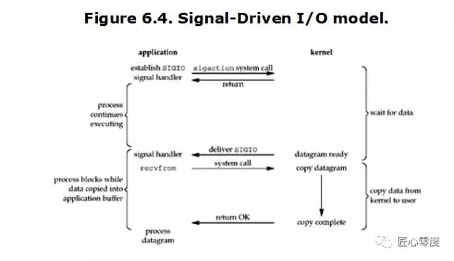
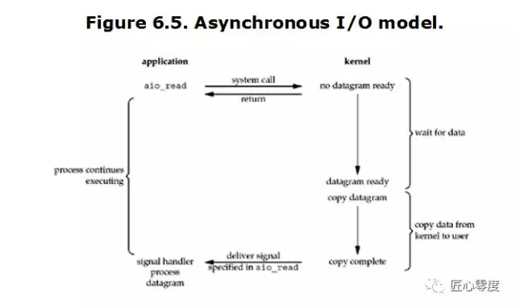
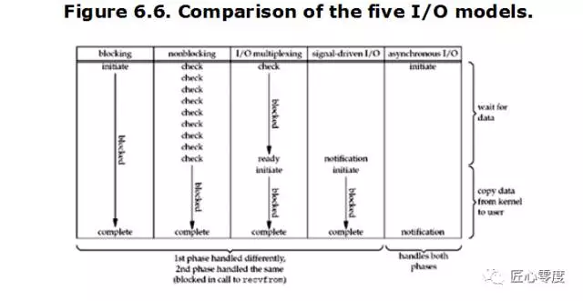
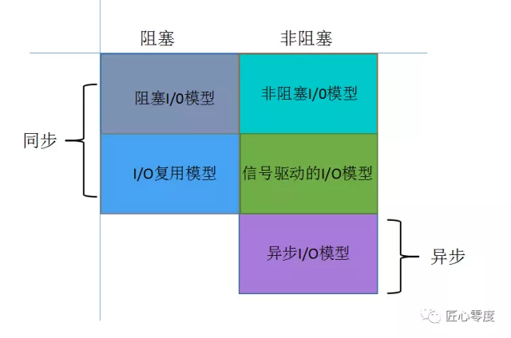

## 用户空间以及内核空间概念

我们知道现在操作系统都是采用虚拟存储器，那么对32位操作系统而言，它的寻址空间（虚拟存储空间）为4G（2的32次方）。

**操心系统的核心是内核，独立于普通的应用程序，可以访问受保护的内存空间，也有访问底层硬件设备的所有权限。**

为了保证用户进程不能直接操作内核，保证内核的安全，操心系统将虚拟空间划分为两部分，

* 一部分为内核空间，
* 一部分为用户空间。

针对linux操作系统而言，

* 将最高的1G字节（从虚拟地址0xC0000000到0xFFFFFFFF），供内核使用，称为内核空间，

* 而将较低的3G字节（从虚拟地址0x00000000到0xBFFFFFFF），供各个进程使用，称为用户空间。

每个进程可以通过系统调用进入内核，因此，Linux内核由系统内的所有进程共享。于是，从具体进程的角度来看，

每个进程可以拥有4G字节的虚拟空间。空间分配如下图所示：


有了用户空间和内核空间，整个linux内部结构可以分为三部分，从最底层到最上层依次是：硬件-->内核空间-->用户空间。


需要注意的细节问题，从上图可以看出内核的组成:

* 1.内核空间中存放的是内核代码和数据，而进程的用户空间中存放的是用户程序的代码和数据。不管是内核空间还是用户空间，它们都处于虚拟空间中。

* 2.Linux使用两级保护机制：0级供内核使用，3级供用户程序使用。
```
理论上：32位=2^32B = 4 * 2^30B = 4GB，这是 32 位下单进程内存上限

目前（2015年5月），Intel的32位架构下，可使用的地址线是36个，可使用的最大物理地址是2^36B，折合64GB，可用的地址空间是4GB。

64位架构下，地址线是46个，所以最大的物理地址是2^46B，折合64TB，可用地址空间也是这么大（目前为止）
```
## Linux 网络 I/O模型

我们都知道，为了OS的安全性等的考虑，进程是无法直接操作I/O设备的，其必须通过系统调用请求内核来协助完成I/O动作，

而内核会为每个I/O设备维护一个buffer。

如下图所示：


整个请求过程为： 

* 用户进程发起请求，内核接受到请求后，从I/O设备中获取数据到buffer中，

* 再将buffer中的数据copy到用户进程的地址空间，

* 该用户进程获取到数据后再响应客户端。

在整个请求过程中，数据输入至buffer需要时间，而从buffer复制数据至进程也需要时间。

因此根据在这两段时间内等待方式的不同，I/O动作可以分为以下五种模式：

* 阻塞I/O (Blocking I/O)

* 非阻塞I/O (Non-Blocking I/O)

* I/O复用（I/O Multiplexing)

* 信号驱动的I/O (Signal Driven I/O)

* 异步I/O (Asynchrnous I/O) 

### 记住这两点很重要

* 1 等待数据准备 (Waiting for the data to be ready)
* 2 将数据从内核拷贝到进程中 (Copying the data from the kernel to the process)

### 阻塞I/O (Blocking I/O)

在linux中，默认情况下所有的socket都是blocking，一个典型的读操作流程大概是这样：


当用户进程调用了recvfrom这个系统调用，

* 内核就开始了IO的第一个阶段：等待数据准备。对于network io来说，

  很多时候数据在一开始还没有到达（比如，还没有收到一个完整的UDP包），这个时候内核就要等待足够的数据到来。

  而在用户进程这边，整个进程会被阻塞。

* 当内核一直等到数据准备好了，它就会将数据从内核中拷贝到用户内存，

  然后内核返回结果，用户进程才解除block的状态，重新运行起来。

**所以，blocking IO的特点就是在IO执行的两个阶段都被block了。**

### 非阻塞I/O (Non-Blocking I/O)

linux下，可以通过设置socket使其变为non-blocking。当对一个non-blocking socket执行读操作时，流程是这个样子：


当用户进程调用recvfrom时，系统不会阻塞用户进程，而是立刻返回一个ewouldblock错误，从用户进程角度讲 ，并不需要等待，

而是马上就得到了一个结果。用户进程判断标志是ewouldblock时，就知道数据还没准备好，于是它就可以去做其他的事了，

于是它可以再次发送recvfrom，一旦内核中的数据准备好了。并且又再次收到了用户进程的system call，那么它马上就将数据拷贝到了用户内存，然后返回。

当一个应用程序在一个循环里对一个非阻塞调用recvfrom，我们称为轮询。应用程序不断轮询内核，看看是否已经准备好了某些操作。

这通常是浪费CPU时间，但这种模式偶尔会遇到。

### I/O复用（I/O Multiplexing)

IO multiplexing这个词可能有点陌生，但是如果我说select，epoll，大概就都能明白了。有些地方也称这种IO方式为event driven IO。我们都知道，

select/epoll的好处就在于单个process就可以同时处理多个网络连接的IO。它的基本原理就是select/epoll这个function会不断的轮询所负责的所有socket，

当某个socket有数据到达了，就通知用户进程。它的流程如图：


* 当用户进程调用了select，那么整个进程会被block，而同时，内核会“监视”所有select负责的socket，当任何一个socket中的数据准备好了，
  select就会返回。
* 这个时候用户进程再调用read操作，将数据从内核拷贝到用户进程。

这个图和blocking IO的图其实并没有太大的不同，事实上，还更差一些。

因为这里需要使用两个system call (select 和 recvfrom)，

而blocking IO只调用了一个system call (recvfrom)。

但是，用select的优势在于它可以同时处理多个connection。

```
（多说一句。所以，如果处理的连接数不是很高的话，使用select/epoll的web server不一定比使用multi-threading + blocking IO

 的web server性能更好，可能延迟还更大。select/epoll的优势并不是对于单个连接能处理得更快，而是在于能处理更多的连接。）
```
在IO multiplexing Model中，实际中，对于每一个socket，一般都设置成为non-blocking，

但是，如上图所示，整个用户的process其实是一直被block的。只不过process是被select这个函数block，而不是被socket IO给block。

#### 文件描述符fd

Linux的内核将所有外部设备都可以看做一个文件来操作。那么我们对与外部设备的操作都可以看做对文件进行操作。

我们对一个文件的读写，都通过调用内核提供的系统调用；内核给我们返回一个filede scriptor（fd,文件描述符）。

而对一个socket的读写也会有相应的描述符，称为socketfd(socket描述符）。描述符就是一个数字，

指向内核中一个结构体（文件路径，数据区，等一些属性）。那么我们的应用程序对文件的读写就通过对描述符的读写完成。

#### select

基本原理：select 函数监视的文件描述符分3类，分别是writefds、readfds、和exceptfds。调用后select函数会阻塞，

直到有描述符就绪（有数据 可读、可写、或者有except），或者超时（timeout指定等待时间，如果立即返回设为null即可），

函数返回。当select函数返回后，可以通过遍历fdset，来找到就绪的描述符。

#### 缺点:
* 1、select最大的缺陷就是单个进程所打开的FD是有一定限制的，它由FDSETSIZE设置，32位机默认是1024个，64位机默认是2048。
   一般来说这个数目和系统内存关系很大，”具体数目可以cat /proc/sys/fs/file-max察看”。32位机默认是1024个。64位机默认是2048.
* 2、对socket进行扫描时是线性扫描，即采用轮询的方法，效率较低。
   当套接字比较多的时候，每次select()都要通过遍历FDSETSIZE个Socket来完成调度，不管哪个Socket是活跃的，都遍历一遍。这会浪费很多CPU时间。”如果能给套接字注册某个回调函数，当他们活跃时，自动完成相关操作，那就避免了轮询”，这正是epoll与kqueue做的。
* 3、需要维护一个用来存放大量fd的数据结构，这样会使得用户空间和内核空间在传递该结构时复制开销大。

### poll

#### 基本原理：

 poll本质上和select没有区别，它将用户传入的数组拷贝到内核空间，然后查询每个fd对应的设备状态，
 
 如果设备就绪则在设备等待队列中加入一项并继续遍历，如果遍历完所有fd后没有发现就绪设备，则挂起当前进程，

 直到设备就绪或者主动超时，被唤醒后它又要再次遍历fd。这个过程经历了多次无谓的遍历。

**它没有最大连接数的限制**，原因是它是基于链表来存储的，但是同样有一个缺点：

* 1、大量的fd的数组被整体复制于用户态和内核地址空间之间，而不管这样的复制是不是有意义。
* 2 、poll还有一个特点是“水平触发”，如果报告了fd后，没有被处理，那么下次poll时会再次报告该fd。

**注意**：从上面看，select和poll都需要在返回后，通过遍历文件描述符来获取已经就绪的socket。

事实上，同时连接的大量客户端在一时刻可能只有很少的处于就绪状态，因此随着监视的描述符数量的增长，其效率也会线性下降。

### epoll

epoll是在2.6内核中提出的，是之前的select和poll的增强版本。相对于select和poll来说，epoll更加灵活，没有描述符限制。

epoll使用一个文件描述符管理多个描述符，将用户关系的文件描述符的事件存放到内核的一个事件表中，这样在用户空间和内核空间的copy只需一次。

**基本原理**：epoll支持水平触发和边缘触发，最大的特点在于边缘触发，它只告诉进程哪些fd刚刚变为就绪态，并且只会通知一次。

还有一个特点是，epoll使用“事件”的就绪通知方式，通过epollctl注册fd，一旦该fd就绪，内核就会采用类似callback的回调机制来激活该fd，

epollwait便可以收到通知。

#### epoll的优点：

* 1、没有最大并发连接的限制，能打开的FD的上限远大于1024（1G的内存上能监听约10万个端口）。
* 2、效率提升，不是轮询的方式，不会随着FD数目的增加效率下降。
   只有活跃可用的FD才会调用callback函数；即Epoll最大的优点就在于它只管你“活跃”的连接，而跟连接总数无关，因此在实际的网络环境中，Epoll的效率就会远远高于select和poll。
* 3、内存拷贝，利用mmap()文件映射内存加速与内核空间的消息传递；即epoll使用mmap减少复制开销。

JDK1.5_update10版本使用epoll替代了传统的select/poll，极大的提升了NIO通信的性能。
```
备注：JDK NIO的BUG，例如臭名昭著的epoll bug，它会导致Selector空轮询，最终导致CPU 100%。
官方声称在JDK1.6版本的update18修复了该问题，但是直到JDK1.7版本该问题仍旧存在，只不过该BUG发生概率降低了一些而已，
它并没有被根本解决。这个可以在后续netty系列里面进行说明下。
```

### 信号驱动的I/O (Signal Driven I/O)

**由于signal driven IO在实际中并不常用，所以简单提下。**



很明显可以看出用户进程不是阻塞的。

* 首先用户进程建立SIGIO信号处理程序，并通过系统调用sigaction执行一个信号处理函数，

* 这时用户进程便可以做其他的事了，

* 一旦数据准备好，系统便为该进程生成一个SIGIO信号，去通知它数据已经准备好了，

* 于是用户进程便调用recvfrom把数据从内核拷贝出来，并返回结果。

### 异步I/O

一般来说，这些函数通过告诉内核启动操作并在整个操作（包括内核的数据到缓冲区的副本）完成时通知我们。

这个模型和前面的信号驱动I/O模型的主要区别是，

在信号驱动的I/O中，内核告诉我们何时可以启动I/O操作，但是异步I/O时，内核告诉我们何时I/O操作完成。



* 当用户进程向内核发起某个操作后，会立刻得到返回，并把所有的任务都交给内核去完成（包括将数据从内核拷贝到用户自己的缓冲区），

* 内核完成之后，只需返回一个信号告诉用户进程已经完成就可以了。

### 5种I/O模型的对比



结果表明：前四个模型之间的主要区别是第一阶段，四个模型的第二阶段是一样的：过程受阻在调用recvfrom当数据从内核拷贝到用户缓冲区。

然而，异步I/O处理两个阶段，与前四个不同。

从同步、异步，以及阻塞、非阻塞两个维度来划分来看：


