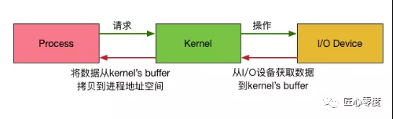

## 用户空间以及内核空间概念

我们知道现在操作系统都是采用虚拟存储器，那么对32位操作系统而言，它的寻址空间（虚拟存储空间）为4G（2的32次方）。

操心系统的核心是内核，独立于普通的应用程序，可以访问受保护的内存空间，也有访问底层硬件设备的所有权限。

为了保证用户进程不能直接操作内核，保证内核的安全，操心系统将虚拟空间划分为两部分，

一部分为内核空间，一部分为用户空间。针对linux操作系统而言，将最高的1G字节（从虚拟地址0xC0000000到0xFFFFFFFF），

供内核使用，称为内核空间，而将较低的3G字节（从虚拟地址0x00000000到0xBFFFFFFF），供各个进程使用，称为用户空间。

每个进程可以通过系统调用进入内核，因此，Linux内核由系统内的所有进程共享。于是，从具体进程的角度来看，

每个进程可以拥有4G字节的虚拟空间。空间分配如下图所示：

有了用户空间和内核空间，整个linux内部结构可以分为三部分，从最底层到最上层依次是：硬件-->内核空间-->用户空间。

需要注意的细节问题，从上图可以看出内核的组成:

* 1.内核空间中存放的是内核代码和数据，而进程的用户空间中存放的是用户程序的代码和数据。不管是内核空间还是用户空间，它们都处于虚拟空间中。

* 2.Linux使用两级保护机制：0级供内核使用，3级供用户程序使用。

**理论上：32位=2^32B = 4 * 2^30B = 4GB，这是 32 位下单进程内存上限**

**目前（2015年5月），Intel的32位架构下，可使用的地址线是36个，可使用的最大物理地址是2^36B，折合64GB，可用的地址空间是4GB。**

**64位架构下，地址线是46个，所以最大的物理地址是2^46B，折合64TB，可用地址空间也是这么大（目前为止）**

## Linux 网络 I/O模型

我们都知道，为了OS的安全性等的考虑，进程是无法直接操作I/O设备的，其必须通过系统调用请求内核来协助完成I/O动作，

而内核会为每个I/O设备维护一个buffer。

如下图所示：

整个请求过程为： 用户进程发起请求，内核接受到请求后，从I/O设备中获取数据到buffer中，再将buffer中的数据copy到用户进程的地址空间，

该用户进程获取到数据后再响应客户端。在整个请求过程中，数据输入至buffer需要时间，而从buffer复制数据至进程也需要时间。

因此根据在这两段时间内等待方式的不同，I/O动作可以分为以下五种模式：

* 阻塞I/O (Blocking I/O)

* 非阻塞I/O (Non-Blocking I/O)

* I/O复用（I/O Multiplexing)

* 信号驱动的I/O (Signal Driven I/O)

* 异步I/O (Asynchrnous I/O) 

### 记住这两点很重要

* 1 等待数据准备 (Waiting for the data to be ready)
* 2 将数据从内核拷贝到进程中 (Copying the data from the kernel to the process)

### 阻塞I/O (Blocking I/O)

在linux中，默认情况下所有的socket都是blocking，一个典型的读操作流程大概是这样：

当用户进程调用了recvfrom这个系统调用，

* 内核就开始了IO的第一个阶段：等待数据准备。对于network io来说，

  很多时候数据在一开始还没有到达（比如，还没有收到一个完整的UDP包），这个时候内核就要等待足够的数据到来。

  而在用户进程这边，整个进程会被阻塞。

* 当内核一直等到数据准备好了，它就会将数据从内核中拷贝到用户内存，

  然后内核返回结果，用户进程才解除block的状态，重新运行起来。

**所以，blocking IO的特点就是在IO执行的两个阶段都被block了。**

