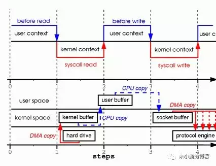
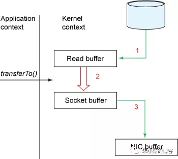
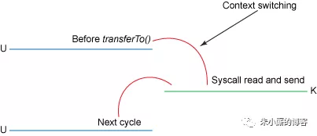

## 概述
考虑这样一种常用的情形：你需要将静态内容（类似图片、文件）展示给用户。
那么这个情形就意味着你需要先将静态内容从磁盘中拷贝出来放到一个内存buf中，
然后将这个buf通过socket传输给用户，进而用户或者静态内容的展示。
这看起来再正常不过了，但是实际上这是很低效的流程，我们把上面的这种情形抽象成下面的过程：
```  
read(file, tmp_buf, len);
write(socket, tmp_buf, len);
```  
首先调用read将静态内容，这里假设为文件A，读取到tmp_buf, 然后调用write将tmp_buf写入到socket中，如图：



在这个过程中文件A的经历了4次copy的过程：

* 1.首先，调用read时，文件A拷贝到了kernel模式；

* 2.之后，CPU控制将kernel模式数据copy到user模式下；

* 3.调用write时，先将user模式下的内容copy到kernel模式下的socket的buffer中；

* 4.最后将kernel模式下的socket buffer的数据copy到网卡设备中传送；

从上面的过程可以看出，数据白白从kernel模式到user模式走了一圈，浪费了2次copy(
* 第一次，从kernel模式拷贝到user模式；
* 第二次从user模式再拷贝回kernel模式，即上面4次过程的第2和3步骤。

)。而且上面的过程中kernel和user模式的上下文的切换也是4次。

幸运的是，你可以用一种叫做Zero-Copy的技术来去掉这些无谓的copy。

应用程序用Zero-Copy来请求kernel直接把disk的data传输给socket，而不是通过应用程序传输。

Zero-Copy大大提高了应用程序的性能，并且减少了kernel和user模式上下文的切换。

## 详述

Zero-Copy技术省去了将操作系统的read buffer拷贝到程序的buffer，以及从程序buffer拷贝到socket buffer的步骤，

直接将read buffer拷贝到socket buffer. Java NIO中的FileChannal.transferTo()方法就是这样的实现，这个实现是依赖于操作系统底层的sendFile()实现的。
```  
public void transferTo(long position, long count, WritableByteChannel target);
```  
他底层的调用时系统调用sendFile()方法：

```  
#include <sys/socket.h>
ssize_t sendfile(int out_fd, int in_fd, off_t *offset, size_t count);
```  

下图展示了在transferTo()之后的数据流向：



下图展示了在使用transferTo()之后的上下文切换：


