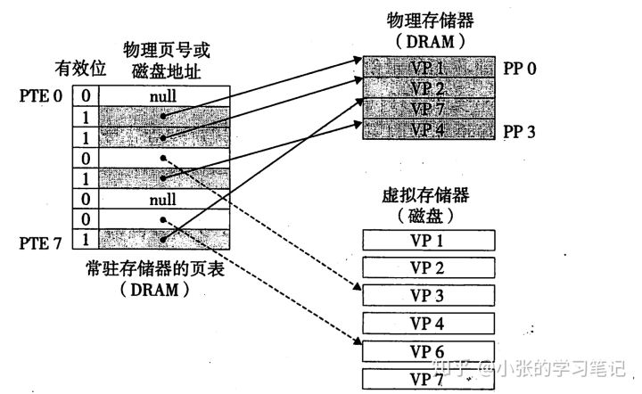

## 如何理解虚拟内存
```
虚拟内存是计算机系统内存管理的一种技术。它使得应用程序认为它拥有连续可用的内存（一个连续完整的地址空间），

而实际上，它通常是被分隔成多个物理内存碎片，还有部分暂时存储在外部磁盘存储器上，在需要时进行数据交换。

现代所有用于一般应用的操作系统都对普通的应用程序使用虚拟内存技术，老一些的操作系统，如DOS和1980年代的Windows，

或者那些1960年代的大型机，一般都没有虚拟内存的功能

——维基百科
```
读完上面的信息，我们可以得知，虚拟内存这个概念是后来才提出的，一开始并没有虚拟内存。那个时候的计算机，

程序指令所访问的内存地址就是物理内存地址. 也就是不得不把程序的全部装进内存当中，然后运行。

物理内存其实就是插在计算机主板内存槽上的实际物理内存，CPU可以直接进行寻址.。物理内存的容量是固定的，

但是寻址空间却取决于cpu地址线条数，如32位机，则寻址空间为2^32 = 4G，所以最大支只持4G的寻址空间，

即使插了8G的内存条也只能使用4G内存

在这种直接使用物理内存的状态下就会产生一些问题：

### 1.内存空间利用率的问题

各个进程对内存的使用会导致内存碎片化，当要用malloc分配一块很大的内存空间时，可能会出现虽然有足够多的空闲物理内存，却没有足够大的连续空闲内存这种情况，东一块西一块的内存碎片就被浪费掉了

### 2. 读写内存的安全性问题

物理内存本身是不限制访问的，任何地址都可以读写，而现代操作系统需要实现不同的页面具有不同的访问权限，例如只读的数据等等

### 3. 进程间的安全问题

各个进程之间没有独立的地址空间，一个进程由于执行错误指令或是恶意代码都可以直接修改其它进程的数据，甚至修改内核地址空间的数据，这是操作系统所不愿看到的

### 4. 内存读写的效率问题

当多个进程同时运行，需要分配给进程的内存总和大于实际可用的物理内存时，需要将其他程序暂时拷贝到硬盘当中，然后将新的程序装入内存运行。由于大量的数据频繁装入装出，内存的使用效率会非常低

### 5. 等等

正因为有上面这些问题，大佬们设计了“虚拟内存”和相关的概念

## 什么是虚拟内存

关于虚拟内存内部的结构可以参考进程虚拟地址空间的区域划分

每个进程创建加载的时候，会被分配一个大小为4G的连续的虚拟地址空间，虚拟的意思就是，其实这个地址空间时不存在的，

仅仅是每个进程“认为”自己拥有4G的内存，而实际上，它用了多少空间，操作系统就在磁盘上划出多少空间给它，

等到进程真正运行的时候，需要某些数据并且数据不在物理内存中，才会触发缺页异常，进行数据拷贝

更准确一点的说，系统将虚拟内存分割为称为虚拟页(Virtual Page,VP)的大小固定的块，每个虚拟页的大小为P = 2^p字节，

类似地，物理内存被分割为物理页(Physical Page,PP)，大小也为P字节（物理页也称为页帧(page frame)）。

**在任意时刻，虚拟页面都分为互不相交的三种：**

* 未分配的：系统还未分配（或者创建）的页。未分配的块没有任何数据和它们相关联，因此也就不占用任何磁盘空间

* 未缓存的：没有缓存在物理存储器中的已分配页

* 缓存的：当前缓存在物理存储器中的已分配页

下图是一个示例：


这个示例展示了一个有8个虚拟页的小虚拟存储器，虚拟页0和3还没有被分配，因此在磁盘上还不存在。虚拟页1、4和6被缓存在物理存储器中。

页2、5和7已经被分配了，但是当前并未缓存在主存中

操作系统向进程描述了一个完整的连续的虚拟地址空间供进程使用，但是在物理内存中进程数据的存储采用离散式存储(提高内存利用率)，

但是其实虚拟内存和物理内存之间的关系并不像上图中那样直接，其中还需要使用页表映射虚拟地址与物理地址的映射关系，并且通过页表实现内存访问控制。这个页表又是何方神圣？

## 什么是页表

页表是一种特殊的数据结构，存放着各个虚拟页的状态，是否映射，是否缓存.。进程要知道哪些内存地址上的数据在物理内存上，哪些不在，

还有在物理内存上的哪里，这就需要用页表来记录。页表的每一个表项分为两部分，

* 第一部分记录此页是否在物理内存上，
* 第二部分记录物理内存页的地址(如果在的话)。

当进程访问某个虚拟地址，就会先去看页表，如果发现对应的数据不在物理内存中，则发生缺页异常。

缺页异常的事等下再说，先体会一下虚拟内存究竟是如何通过页表与物理内存联系起来的，再看一个示例



### 图中展示了一个页表的基本组织结构，

页表就是一个页表条目(Page Table Entry,PTE)的数组，每个PTE由一个有效位(valid bit)和一个地址组成，有效位表明了该虚拟页当前是否存在于物理内存中，

* 如果有效位是1，该PTE中就会存储物理内存中相应的物理页的起始地址。

* 如果有效位是0，且PTE中的地址为null，这表示这个虚拟页还未被分配，

* 而如果有效位是0且PTE中有地址，那么这个地址指向该虚拟页在磁盘上的起始位置

### 上图的示例展示了一个有8个虚拟页和4个物理页的系统的页表，四个虚拟页（VP1、VP2、VP4和VP7）当前存储于物理内存中，

两个页（VP0和VP5）还未被分配（也就是什么都没存的虚拟内存，在磁盘和物理内存中都不存在这个空间），

而剩下的页（VP3和VP6）已经被分配了，但是还未缓存进物理内存（也就是存在于磁盘上）


### 在上面的过程中，CPU读包含在VP1中的一个数据时，地址翻译硬件将虚拟地址作为一个索引找到页表中的PTE 2，

然后再从PTE 2中保存的物理地址从真正的物理内存中读到这个数据，在有效位为1的PTE中成功找到对应的物理页就称之为页命中

而当试图访问一个有效位为0，但PTE中又保存了地址的虚拟内存中的数据时（也就是VP3和VP6的情况，数据保存在磁盘中），

就是DRAM缓存不命中，一般将这种状况称为缺页异常(page fault)。触发缺页异常后，系统会调用内核中的缺页异常处理程序，

该程序会选择一个牺牲页(牺牲页的选择有具体的算法，在这里不做讨论)，在此例中就是存放在PP3中的VP4，内核将修改后的VP4重新拷贝回磁盘，

并且修改VP4中的页表条目，将有效位改成0，反映出VP4不再存在于物理内存中这一事实。接下来，内核从磁盘拷贝VP3到存储器中的PP3，更新PTE3，

随后返回。当异常处理程序返回时，它会重新启动导致缺页的指令，再次从试图访问该虚拟地址开始，这时有效位是1，于是正常页命中，

从物理地址中读取内存

其实页表的工作原理也就是虚拟内存的工作原理了，接下来我们再总结一下

## 虚拟内存的工作原理

当一个进程试图访问虚拟地址空间中的某个数据时，会经历下面两种情况的过程：

* 1.CPU想访问某个虚拟内存地址，找到进程对应的页表中的条目，判断有效位， 如果有效位为1，说明在页表条目中的物理内存地址不为空，
  根据物理内存地址，访问物理内存中的内容，返回
* 2.CPU想访问某个虚拟内存地址，找到进程对应的页表中的条目，判断有效位，如果有效位为0，
   但页表条目中还有地址，这个地址是磁盘空间的地址，这时触发缺页异常，系统把物理内存中的一些数据拷贝到磁盘上，
   腾出所需的空间，并且更新页表。此时重新执行访问之前虚拟内存的指令，就会发现变成了情况1.

## 总结

虚拟存储器的工作原理是有一些复杂，即使上文中描述的也并不全是最真实的计算机中的工作方式，比如PTE由一个有效位和一个地址字段组成其实是为了便于理解而假设出来的。

但是这种方式成功的解决了上文中提到的直接使用物理内存会出现的问题，比如物理内存中离散式存储，虚拟内存中连续存储解决了物理内存碎片化资源利用率过低的问题；每个进程只能访问自己独立的用户空间而内核空间是共用的解决了进程间的安全问题；缺页异常和选择牺牲页的算法提高了内存读写的效率......

我们应该对虚拟存储器的工作原理有深层次的理解，可以更好的帮助我们理解系统是如何工作的，也可以帮助我们避免在使用malloc这类的管理虚拟存储器的分配程序时遇到的一些错误


