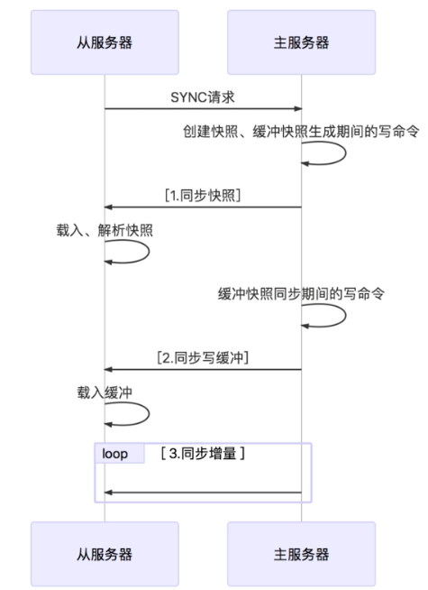

## 1.持久化功能
通过持久化功能，Redis保证了即使在服务器重启的情况下也不会损失（或少量损失）数据，因为持久化会把内存中数据保存到硬盘上，重启会从硬盘上加载数据。
但是由于数据是存储在一台服务器上的，如果这台服务器出现硬盘故障等问题，也会导致数据丢失。为了避免单点故障，通常的做法是将数据库复制多个副本以部署在不同的服务器上，这样即使有一台服务器出现故障，其他服务器依然可以继续提供服务。为此， Redis 提供了复制（replication）功能，可以实现当一台数据库中的数据更新后，自动将更新的数据同步到其他数据库上。

## 2.主从数据库的复制
在复制的概念中，数据库分为两类，一类是主数据库（master），另一类是从数据库(slave）。
* 主数据库可以进行读写操作，当写操作导致数据变化时会自动将数据同步给从数据库。
* 从数据库一般是只读的，并接受主数据库同步过来的数据。
* 一个主数据库可以拥有多个从数据库，而一个从数据库只能拥有一个主数据库。

## 3.主从数据库的配置
主数据库不用配置，从redis的conf文件中可以加载从数据库的信息，也可以在启动时，使用 redis-server --port 6380 --slaveof 127.0.0.1 6379
从数据库一般是只读，可以改为可写，但写入的数据很容易被主同步没，所以还是只读就可以。
也可以在运行时使用slaveof ip port命令，停止原来的主，切换成刚刚设置的主 slaveof no one会把自己变成主

## 4.复制原理

* 从服务器连接主服务器，发送SYNC命令； 
* 主服务器接收到SYNC命名后，开始执行BGSAVE命令生成RDB文件并使用缓冲区记录此后执行的所有写命令； 
* 主服务器BGSAVE执行完后，向所有从服务器发送快照文件，并在发送期间继续记录被执行的写命令； 
* 从服务器收到快照文件后丢弃所有旧数据，载入收到的快照； 
* 主服务器快照发送完毕后开始向从服务器发送缓冲区中的写命令； 
* 从服务器完成对快照的载入，开始接收命令请求，并执行来自主服务器缓冲区的写命令；（从服务器初始化完成）
* 主服务器每执行一个写命令就会向从服务器发送相同的写命令，从服务器接收并执行收到的写命令（从服务器初始化完成后的操作）

## 5.主从复制优缺点：
* 优点：
支持主从复制，主机会自动将数据同步到从机，可以进行读写分离
为了分载Master的读操作压力，Slave服务器可以为客户端提供只读操作的服务，写服务仍然必须由Master来完成
Slave同样可以接受其它Slaves的连接和同步请求，这样可以有效的分载Master的同步压力。
Master Server是以非阻塞的方式为Slaves提供服务。所以在Master-Slave同步期间，客户端仍然可以提交查询或修改请求。
Slave Server同样是以非阻塞的方式完成数据同步。在同步期间，如果有客户端提交查询请求，Redis则返回同步之前的数据
* 缺点：
Redis不具备自动容错和恢复功能，主机从机的宕机都会导致前端部分读写请求失败，需要等待机器重启或者手动切换前端的IP才能恢复。
主机宕机，宕机前有部分数据未能及时同步到从机，切换IP后还会引入数据不一致的问题，降低了系统的可用性。
Redis较难支持在线扩容，在集群容量达到上限时在线扩容会变得很复杂。
主从复制是乐观复制，当客户端发送写执行给主，主执行完立即将结果返回客户端，并异步的把命令发送给从，从而不影响性能。也可以设置至少同步给多少个从主才可写。
无硬盘复制:如果硬盘效率低将会影响复制性能，2.8之后可以设置无硬盘复制，repl-diskless-sync yes

