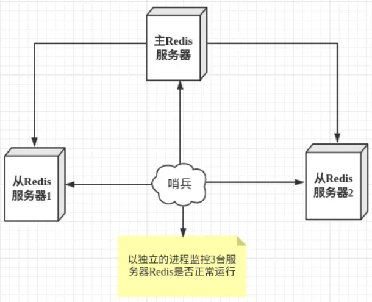
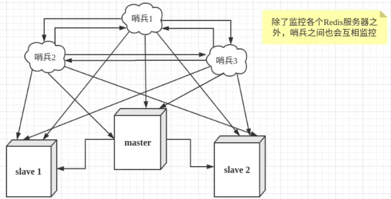

当主数据库遇到异常中断服务后，开发者可以通过手动的方式选择一个从数据库来升格为主数据库，以使得系统能够继续提供服务。然而整个过程相对麻烦且需要人工介入，难以实现自动化。 为此，Redis 2.8中提供了哨兵工具来实现自动化的系统监控和故障恢复功能。
哨兵的作用就是监控redis主、从数据库是否正常运行，主出现故障自动将从数据库转换为主数据库。
例子：
1主2从1哨兵
```
redis-server --port 6379 
redis-server --port 6380 --slaveof 192.168.0.167 6379 
redis-server --port 6381 --slaveof 192.168.0.167 6379
哨兵配置文件 sentinel.conf 
 sentinel monitor mymaster 192.168.0.167 6379  1
这里的1代表1个哨兵
```
## 哨兵的工作方式：





* 每个Sentinel（哨兵）进程以每秒钟一次的频率向整个集群中的Master主服务器，Slave从服务器以及其他Sentinel（哨兵）进程发送一个 PING 命令。
* 如果一个实例（instance）距离最后一次有效回复 PING 命令的时间超过 down-after-milliseconds 选项所指定的值， 则这个实例会被 Sentinel（哨兵）进程标记为主观下线（SDOWN）
* 如果一个Master主服务器被标记为主观下线（SDOWN），则正在监视这个Master主服务器的所有 Sentinel（哨兵）进程要以每秒一次的频率确认Master主服务器的确进入了主观下线状态
* 当有足够数量的 Sentinel（哨兵）进程（大于等于配置文件指定的值）在指定的时间范围内确认Master主服务器进入了主观下线状态（SDOWN）， 则Master主服务器会被标记为客观下线（ODOWN）
* 在一般情况下， 每个 Sentinel（哨兵）进程会以每 10 秒一次的频率向集群中的所有Master主服务器、Slave从服务器发送 INFO 命令。
* 当Master主服务器被 Sentinel（哨兵）进程标记为客观下线（ODOWN）时，Sentinel（哨兵）进程向下线的 Master主服务器的所有 Slave从服务器发送 INFO 命令的频率会从 10 秒一次改为每秒一次。
* 若没有足够数量的 Sentinel（哨兵）进程同意 Master主服务器下线， Master主服务器的客观下线状态就会被移除。若 Master主服务器重新向 Sentinel（哨兵）进程发送 PING 命令返回有效回复，Master主服务器的主观下线状态就会被移除。

## 哨兵模式的优缺点

* 优点：
哨兵模式是基于主从模式的，所有主从的优点，哨兵模式都具有。
主从可以自动切换，系统更健壮，可用性更高。
* 缺点：
Redis较难支持在线扩容，在集群容量达到上限时在线扩容会变得很复杂。
注：
配置哨兵监控一个系统时，只需要配置其监控主数据库即可，哨兵会自动发现所有复制该主数据库的从数据库
这样哨兵就能监控主6379和从6380、6381，一旦6379挂掉，哨兵就会在2个从中选择一个作为主，根据优先级选，如果一样就选个id小的，当6379再起来就作为从存在。