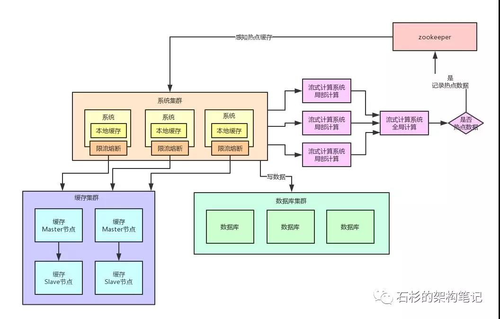

##（1）为什么要用缓存集群

这篇文章，咱们来聊聊热点缓存的架构优化问题。

其实使用缓存集群的时候，最怕的就是热key、大value这两种情况，那啥叫热key大value呢？

简单来说，热key，就是你的缓存集群中的某个key瞬间被数万甚至十万的并发请求打爆。

大value，就是你的某个key对应的value可能有GB级的大小，导致查询value的时候导致网络相关的故障问题。

这篇文章，我们就来聊聊热key问题。先来看看下面的一幅图。

简单来说，假设你手头有个系统，他本身是集群部署的，然后后面有一套缓存集群，这个集群不管你用redis cluster，还是memcached，或者是公司自研缓存集群，都可以。

那么，这套系统用缓存集群干什么呢？

很简单了，在缓存里放一些平时不怎么变动的数据，然后用户在查询大量的平时不怎么变动的数据的时候，不就可以直接从缓存里走了吗？

缓存集群的并发能力是很强的，而且读缓存的性能是很高的。

举个例子，假设你每秒有2万请求，但是其中90%都是读请求，那么每秒1.8万请求都是在读一些不太变化的数据，而不是写数据。

那此时你把数据都放在数据库里，然后每秒发送2万请求到数据库上读写数据，你觉得合适吗？

当然不太合适了，如果你要用数据库承载每秒2万请求的话，那么不好意思，你很可能就得搞分库分表 + 读写分离。

比如你得分3个主库，承载每秒2000的写入请求，然后每个主库挂3个从库，一共9个从库承载每秒1.8万的读请求。

这样的话，你可能就需要一共是12台高配置的数据库服务器，这是很耗费钱的，成本非常高，而且很不合适。

大家看看下面的图，来体会下这种情况。

所以，此时你完全就可以把平时不太变化的数据放在缓存集群里，缓存集群可以采用2主2从，主节点用来写入缓存，从节点用来读缓存。

以缓存集群的性能，2个从节点完全可以用来承载每秒1.8万的大量读了，然后3个数据库主库就是承载每秒2000的写请求和少量其他读请求就可以了。

大家看看下面的图，你耗费的机器瞬间变成了4台缓存机器 + 3台数据库机器 = 7台机器，是不是比之前的12台机器减少了很大的资源开销？

没错，缓存其实在系统架构里是非常重要的组成部分。很多时候，对于那些很少变化但是大量高并发读的数据，通过缓存集群来抗高并发读，是非常合适的。

这里所有的机器数量、并发请求量都是一个示例，大家主要是体会一下这个意思就好，其目的主要是给一些不太熟悉缓存相关技术的同学一点背景性的阐述，让这些同学能够理解在系统里用缓存集群承载读请求是什么意思。

##（2）20万用户同时访问一个热点缓存的问题

好了，背景是已经给大家解释清楚了，那么现在就可以给大家说说今天重点要讨论的问题：热点缓存。

我们来做一个假设，你现在有10个缓存节点来抗大量的读请求。正常情况下，读请求应该是均匀的落在10个缓存节点上的，对吧！

这10个缓存节点，每秒承载1万请求是差不多的。

然后我们再做一个假设，你一个节点承载2万请求是极限，所以一般你就限制一个节点正常承载1万请求就ok了，稍微留一点buffer出来。

好，所谓的热点缓存问题是什么意思呢？

很简单，就是突然因为莫名的原因，出现大量的用户访问同一条缓存数据。

举个例子，某个明星突然宣布跟某某结婚，这个时候是不是会引发可能短时间内每秒都是数十万的用户去查看这个明星跟某某结婚的那条新闻？

那么假设那条新闻就是一个缓存，然后对应就是一个缓存key，就存在一台缓存机器上，此时瞬时假设有20万请求奔向那一台机器上的一个key。

此时会如何？我们看看下面的图，来体会一下这种绝望的感受。

这个时候很明显了，我们刚才假设的是一个缓存Slave节点最多每秒就是2万的请求，当然实际缓存单机承载5万~10万读请求也是可能的，我们这里就是一个假设。

结果此时，每秒突然奔过来20万请求到这台机器上，会怎么样？

很简单，上面图里那台被20万请求指向的缓存机器会过度操劳而宕机的。

那么如果缓存集群开始出现机器的宕机，此时会如何？

接着，读请求发现读不到数据，会从数据库里提取原始数据，然后放入剩余的其他缓存机器里去。但是接踵而来的每秒20万请求，会再次压垮其他的缓存机器。

以此类推，最终导致缓存集群全盘崩溃，引发系统整体宕机。

咱们看看下面的图，再感受一下这个恐怖的现场。

##（3）基于流式计算技术的缓存热点自动发现

其实这里关键的一点，就是对于这种热点缓存，你的系统需要能够在热点缓存突然发生的时候，直接发现他，然后瞬间立马实现毫秒级的自动负载均衡。

那么我们就先来说说，你如何自动发现热点缓存问题？

首先你要知道，一般出现缓存热点的时候，你的每秒并发肯定是很高的，可能每秒都几十万甚至上百万的请求量过来，这都是有可能的。

所以，此时完全可以基于大数据领域的流式计算技术来进行实时数据访问次数的统计，比如storm、spark streaming、flink，这些技术都是可以的。

然后一旦在实时数据访问次数统计的过程中，比如发现一秒之内，某条数据突然访问次数超过了1000，就直接立马把这条数据判定为是热点数据，可以将这个发现出来的热点数据写入比如zookeeper中。

当然，你的系统如何判定热点数据，可以根据自己的业务还有经验值来就可以了。

大家看看下面这张图，看看整个流程是如何进行的。

当然肯定有人会问，那你的流式计算系统在进行数据访问次数统计的时候，会不会也存在说单台机器被请求每秒几十万次的问题呢？

答案是否，因为流式计算技术，尤其是storm这种系统，他可以做到同一条数据的请求过来，先分散在很多机器里进行本地计算，最后再汇总局部计算结果到一台机器进行全局汇总。

所以几十万请求可以先分散在比如100台机器上，每台机器统计了这条数据的几千次请求。

然后100条局部计算好的结果汇总到一台机器做全局计算即可，所以基于流式计算技术来进行统计是不会有热点问题的。

##（4）热点缓存自动加载为JVM本地缓存

我们自己的系统可以对zookeeper指定的热点缓存对应的znode进行监听，如果有变化他立马就可以感知到了。

此时系统层就可以立马把相关的缓存数据从数据库加载出来，然后直接放在自己系统内部的本地缓存里即可。

这个本地缓存，你用ehcache、hashmap，其实都可以，一切都看自己的业务需求，主要说的就是将缓存集群里的集中式缓存，直接变成每个系统自己本地实现缓存即可，每个系统自己本地是无法缓存过多数据的。

因为一般这种普通系统单实例部署机器可能就一个4核8G的机器，留给本地缓存的空间是很少的，所以用来放这种热点数据的本地缓存是最合适的，刚刚好。

假设你的系统层集群部署了100台机器，那么好了，此时你100台机器瞬间在本地都会有一份热点缓存的副本。

然后接下来对热点缓存的读操作，直接系统本地缓存读出来就给返回了，不用再走缓存集群了。

这样的话，也不可能允许每秒20万的读请求到达缓存机器的一台机器上读一个热点缓存了，而是变成100台机器每台机器承载数千请求，那么那数千请求就直接从机器本地缓存返回数据了，这是没有问题的。

我们再来画一幅图，一起来看看这个过程：

##（5）限流熔断保护

除此之外，在每个系统内部，其实还应该专门加一个对热点数据访问的限流熔断保护措施。

每个系统实例内部，都可以加一个熔断保护机制，假设缓存集群最多每秒承载4万读请求，那么你一共有100个系统实例。

你自己就该限制好，每个系统实例每秒最多请求缓存集群读操作不超过400次，一超过就可以熔断掉，不让请求缓存集群，直接返回一个空白信息，然后用户稍后会自行再次重新刷新页面之类的。

通过系统层自己直接加限流熔断保护措施，可以很好的保护后面的缓存集群、数据库集群之类的不要被打死，我们来看看下面的图。

##（6）本文总结

具体要不要在系统里实现这种复杂的缓存热点优化架构呢？这个还要看你们自己的系统有没有这种场景了。

如果你的系统有热点缓存问题，那么就要实现类似本文的复杂热点缓存支撑架构。

但是如果没有的话，那么也别过度设计，其实你的系统可能根本不需要这么复杂的架构。

如果是后者，那么大伙儿就权当看看本文，来了解一下对应的架构思想好了^_^