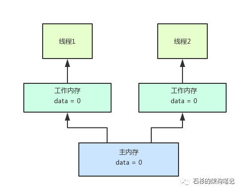
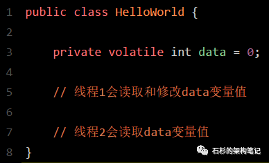
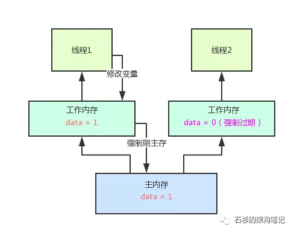
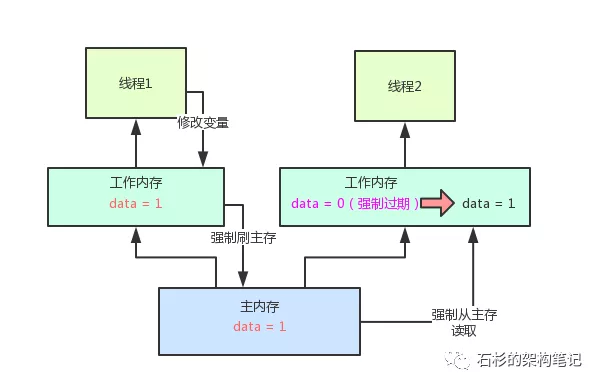

## 一、写在前面

前段时间把几年前带过的一个项目架构演进的过程整理了一个系列出来，参见（《亿级流量架构系列专栏总结》）。

不过很多同学看了之后，后台反馈说文章太烧脑，看的云里雾里。其实这个也正常，文章承载的信息毕竟有限，而架构的东西细节太多，想要仅仅通过文章看懂一个系统架构的设计和落地，确实难度不小。

所以接下来用大白话跟大家聊点轻松的话题，比较易于理解，而且对大家工作和面试都很有帮助。

## 二、场景引入，问题初现

很多同学出去面试，都会被问到一个常见的问题：说说你对volatile的理解？

不少初出茅庐的同学可能会有点措手不及，因为可能就是之前没关注过这个。但是网上百度一下呢，不少文章写的很好，但是理论扎的太深，文字太多，图太少，让人有点难以理解。

基于上述痛点，这篇文章尝试站在年轻同学的角度，用最简单的大白话，加上多张图给大家说一下，volatile到底是什么？

当然本文不会把理论扎的太深，因为一下子扎深了文字太多，很多同学还是会不好理解。

本文仅仅是定位在用大白话的语言将volatile这个东西解释清楚，而涉及到特别底层的一些原理和技术问题，以后有机会开文再写。

首先，给大家上一张图，咱们来一起看看：

如上图，这张图说的是java内存模型中，每个线程有自己的工作内存，同时还有一个共享的主内存。

举个例子，比如说有两个线程，他们的代码里都需要读取data这个变量的值，那么他们都会从主内存里加载data变量的值到自己的工作内存，然后才可以使用那个值。

好了，现在大家从图里看到，每个线程都把data这个变量的副本加载到了自己的工作内存里了，所以每个线程都可以读到data = 0这个值。

这样，在线程代码运行的过程中，对data的值都可以直接从工作内存里加载了，不需要再从主内存里加载了。

那问题来了，为啥一定要让每个线程用一个工作内存来存放变量的副本以供读取呢？我直接让线程每次都从主内存加载变量的值不行吗？

很简单！因为线程运行的代码对应的是一些指令，是由CPU执行的！但是CPU每次执行指令运算的时候，也就是执行我们写的那一大坨代码的时候，要是每次需要一个变量的值，都从主内存加载，性能会比较差！

所以说后来想了一个办法，就是线程有工作内存的概念，类似于一个高速的本地缓存。

这样一来，线程的代码在执行过程中，就可以直接从自己本地缓存里加载变量副本，不需要从主内存加载变量值，性能可以提升很多！

但是大家思考一下，这样会有什么问题？

我们来设想一下，假如说线程1修改了data变量的值为1，然后将这个修改写入自己的本地工作内存。那么此时，线程1的工作内存里的data值为1。

然而，主内存里的data值还是为0！线程2的工作内存里的data值还是0啊？！

这可尴尬了，那接下来，在线程1的代码运行过程中，他可以直接读到data最新的值是1，但是线程2的代码运行过程中读到的data的值还是0！

这就导致，线程1和线程2其实都是在操作一个变量data，但是线程1修改了data变量的值之后，线程2是看不到的，一直都是看到自己本地工作内存中的一个旧的副本的值！

这就是所谓的java并发编程中的可见性问题：

多个线程并发读写一个共享变量的时候，有可能某个线程修改了变量的值，但是其他线程看不到！也就是对其他线程不可见！

三、volatile的作用及背后的原理

那如果要解决这个问题怎么办呢？这时就轮到volatile闪亮登场了！你只要给data这个变量在定义的时候加一个volatile，就直接可以完美的解决这个可见性的问题。

比如下面的这样的代码，在加了volatile之后，会有啥作用呢？

完整的作用就不给大家解释了，因为我们定位就是大白话，要是把底层涉及的各种内存屏障、指令重排等概念在这里带出来，不少同学又要蒙圈了！

我们这里，就说说他最关键的几个作用是啥？

### 1
第一，一旦data变量定义的时候前面加了volatile来修饰的话，那么线程1只要修改data变量的值，就会在修改完自己本地工作内存的data变量值之后，强制将这个data变量最新的值刷回主内存，必须让主内存里的data变量值立马变成最新的值！
整个过程，如下图所示：

### 2
第二，如果此时别的线程的工作内存中有这个data变量的本地缓存，也就是一个变量副本的话，那么会强制让其他线程的工作内存中的data变量缓存直接失效过期，不允许再次读取和使用了！

整个过程，如下图所示：

### 3

第三，如果线程2在代码运行过程中再次需要读取data变量的值，此时尝试从本地工作内存中读取，就会发现这个data = 0已经过期了！

此时，他就必须重新从主内存中加载data变量最新的值！那么不就可以读取到data = 1这个最新的值了！整个过程，参见下图：

bingo！好了，volatile完美解决了java并发中可见性的问题！

对一个变量加了volatile关键字修饰之后，只要一个线程修改了这个变量的值，立马强制刷回主内存。

接着强制过期其他线程的本地工作内存中的缓存，最后其他线程读取变量值的时候，强制重新从主内存来加载最新的值！

这样就保证，任何一个线程修改了变量值，其他线程立马就可以看见了！这就是所谓的volatile保证了可见性的工作原理！

四、总结 & 提醒

最后给大家提一嘴，volatile主要作用是保证可见性以及有序性。

有序性涉及到较为复杂的指令重排、内存屏障等概念，本文没提及，但是volatile是不能保证原子性的！

也就是说，volatile主要解决的是一个线程修改变量值之后，其他线程立马可以读到最新的值，是解决这个问题的，也就是可见性！

但是如果是多个线程同时修改一个变量的值，那还是可能出现多线程并发的安全问题，导致数据值修改错乱，volatile是不负责解决这个问题的，也就是不负责解决原子性问题！

原子性问题，得依赖synchronized、ReentrantLock等加锁机制来解决。