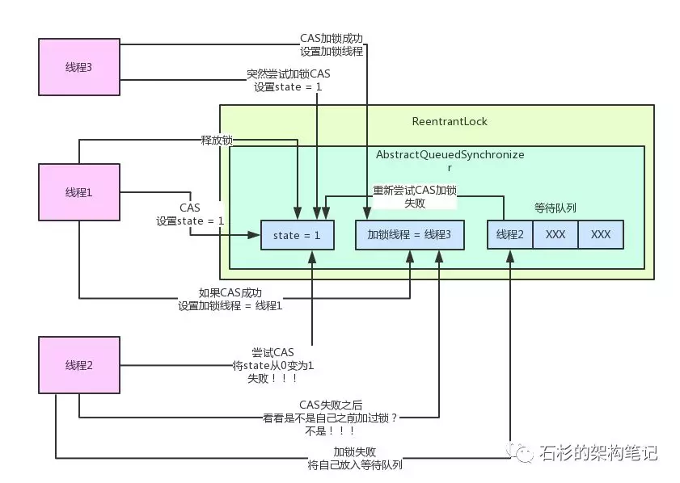
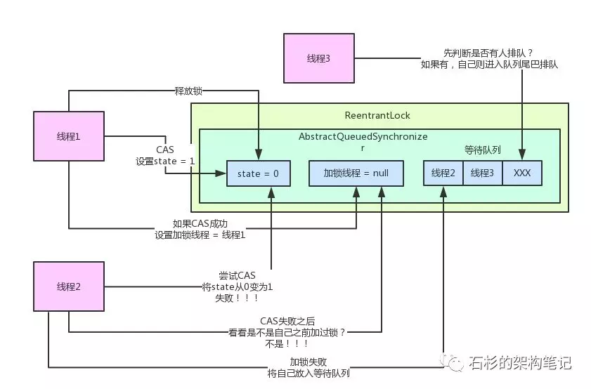
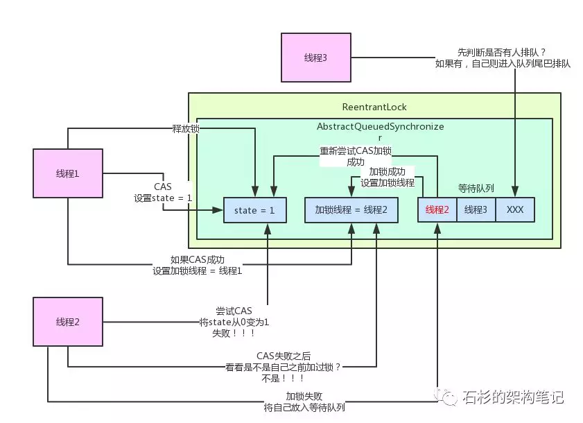

一、写在前面

上篇文章（《大白话聊聊Java并发面试问题之谈谈你对AQS的理解？》）聊了一下java并发包中的AQS的工作原理，也间接说明了ReentrantLock的工作原理。

这篇文章接着来聊一个话题，java并发包中的公平锁与非公平锁有啥区别？

二、什么是非公平锁？

先来聊聊非公平锁是啥，现在大家先回过头来看下面这张图。

如上图，现在线程1加了锁，然后线程2尝试加锁，失败后进入了等待队列，处于阻塞中。然后线程1释放了锁，准备来唤醒线程2重新尝试加锁。

注意一点，此时线程2可还停留在等待队列里啊，还没开始尝试重新加锁呢！

然而，不幸的事情发生了，这时半路杀出个程咬金，来了一个线程3！线程3突然尝试对ReentrantLock发起加锁操作，此时会发生什么事情？

很简单！线程2还没来得及重新尝试加锁呢。也就是说，还没来得及尝试重新执行CAS操作将state的值从0变为1呢！线程3冲上来直接一个CAS操作，尝试将state的值从0变为1，结果还成功了！

一旦CAS操作成功，线程3就会将“加锁线程”这个变量设置为他自己。给大家来一张图，看看这整个过程：

明明人家线程2规规矩矩的排队领锁呢，结果你线程3不守规矩，线程1刚释放锁，不分青红皂白，直接就跑过来抢先加锁了。

这就导致线程2被唤醒过后，重新尝试加锁执行CAS操作，结果毫无疑问，失败！

原因很简单啊！因为加锁CAS操作，是要尝试将state从0变为1，结果此时state已经是1了，所以CAS操作一定会失败！

一旦加锁失败，就会导致线程2继续留在等待队列里不断的等着，等着线程3释放锁之后，再来唤醒自己，真是可怜！先来的线程2居然加不到锁！

同样给大家来一张图，体会一下线程2这无助的过程：

上述的锁策略，就是所谓的非公平锁！

如果你用默认的构造函数来创建ReentrantLock对象，默认的锁策略就是非公平的。

在非公平锁策略之下，不一定说先来排队的线程就就先会得到机会加锁，而是出现各种线程随意抢占的情况。

那如果要实现公平锁的策略该怎么办呢？也很简单，在构造ReentrantLock对象的时候传入一个true即可：

ReentrantLock lock = new ReentrantLock(true)

此时就是说让他使用公平锁的策略，那么公平锁具体是什么意思呢？

三、什么是公平锁？

咱们重新回到第一张图，就是线程1刚刚释放锁之后，线程2还没来得及重新加锁的那个状态。

同样，这时假设来了一个线程3，突然杀出来，想要加锁。

如果是公平锁的策略，那么此时线程3不会跟个愣头青一样盲目的直接加锁。

他会先判断一下：咦？AQS的等待队列里，有没有人在排队啊？如果有人在排队的话，说明我前面有兄弟正想要加锁啊！

如果AQS的队列里真的有线程排着队，那我线程3就不能跟个二愣子一样直接抢占加锁了。

因为现在咱们是公平策略，得按照先来后到的顺序依次排队，谁先入队，谁就先从队列里出来加锁！

所以，线程3此时一判断，发现队列里有人排队，自己就会乖乖的排到队列后面去，而不会贸然加锁！

同样，整个过程我们用下面这张图给大家直观的展示一下：

上面的等待队列中，线程3会按照公平原则直接进入队列尾部进行排队。

接着，线程2不是被唤醒了么？他就会重新尝试进行CAS加锁，此时没人跟他抢，他当然可以加锁成功了。

然后呢，线程2就会将state值变为1，同时设置“加锁线程”是自己。最后，线程2自己从等待队列里出队。

整个过程，参见下图：

这个就是公平锁的策略，过来加锁的线程全部是按照先来后到的顺序，依次进入等待队列中排队的，不会盲目的胡乱抢占加锁，非常的公平。

四、小结

好了，通过画图和文字分析，相信大家都明白什么是公平锁，什么是非公平锁了！

不过要知道java并发包里很多锁默认的策略都是非公平的，也就是可能后来的线程先加锁，先来的线程后加锁。

而一般情况下，非公平的策略都没什么大问题，但是大家要对这个策略做到心里有数，在开发的时候，需要自己来考虑和权衡是要用公平策略还是非公平策略。