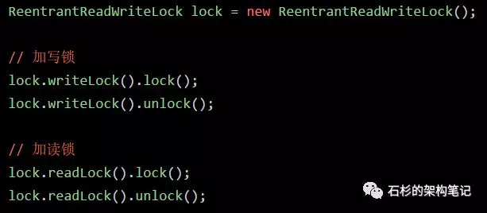
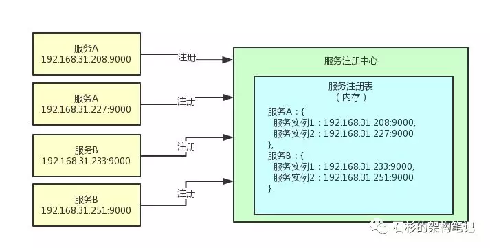
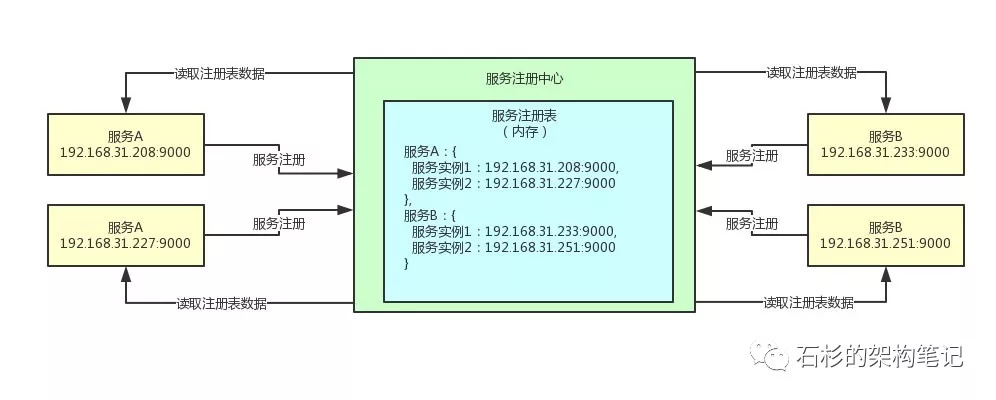
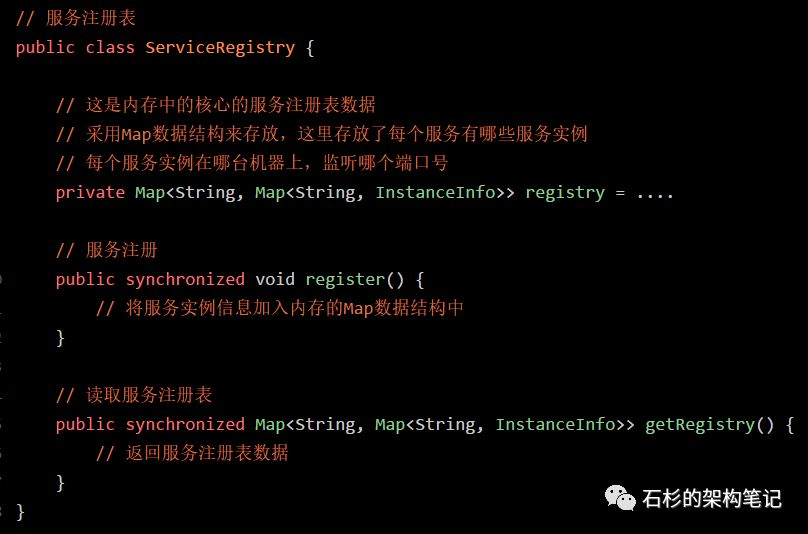
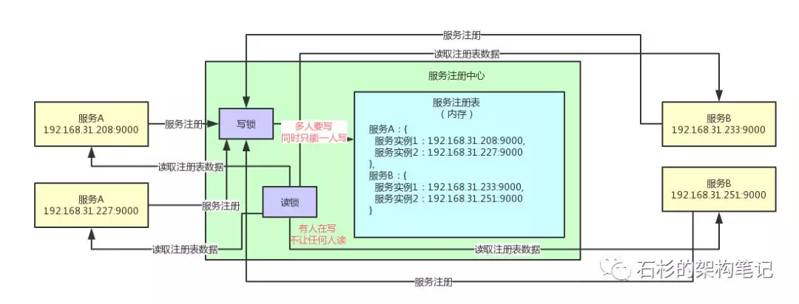
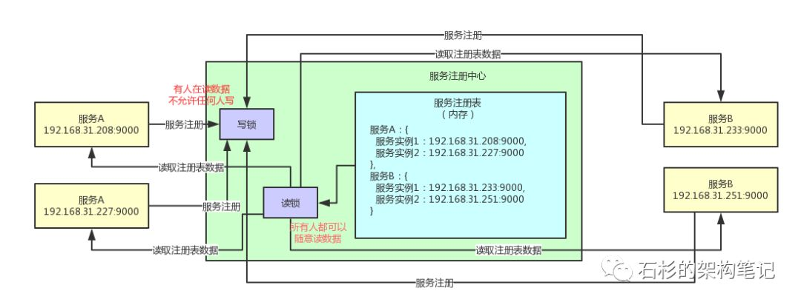
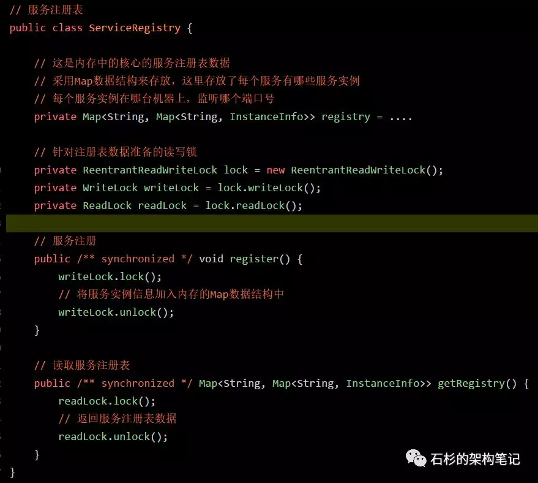

一、读写锁的介绍

上一篇文章《大白话聊聊Java并发面试问题之公平锁与非公平锁是啥？》，聊了一下java并发包的公平锁和非公平锁。

这篇文章来聊一下读写锁。所谓的读写锁，就是将一个锁拆分为读锁和写锁两个锁，然后你加锁的时候，可以加写锁，也可以加读锁。如下面代码所示：

如果有一个线程加了写锁，那么其他线程就不能加写锁了，同一时间只能允许一个线程加写锁。因为加了写锁就意味着有人要写一个共享数据，那同时就不能让其他人来写这个数据了。

同时如果有线程加了写锁，其他线程就不能加读锁了，因为既然都有人在写数据了，你其他人当然不能来读数据了！

如果有一个线程加了读锁，别的线程是可以随意同时加读锁的，因为只是有线程在读数据而已，此时别的线程也是可以来读数据的！

同理，如果一个线程加了读锁，此时其他线程是不可以加写锁的，因为既然有人在读数据，那就不能让你随意来写数据了！

好了！这个就是初步介绍一下读写锁的使用方法，相信很多同学应该之前都知道了，因为这个是java开发中非常基础的一块知识。

二、微服务注册中心的读写锁优化

现在进入主题，我们主要聊一下微服务注册中心里面的读写锁优化。

为什么要聊一下这个问题呢？

因为如果你出去面试，很可能被问到读写锁的问题，此时你可以自然而然的带出来，你之前了解过Spring Cloud微服务技术架构，同时对里面的微服务注册中心的注册表读写锁优化有一些自己的感悟和看法。

这样的话，相比于你简单的给面试官聊聊读写锁的基本概念和使用方法，要增色不少！

首先，大家需要了解一点微服务的整体架构知识，可以参考之前写过的一篇文章拜托，面试请不要再问我Spring Cloud底层原理！。

同时还需要了解一下Spring Cloud Eureka（即微服务注册中心）的核心原理。这个可以参考之前写过的一篇文章【双11狂欢的背后】微服务注册中心是如何承载大型系统千万级访问的。

好，了解了这些前置知识之后，我们正式开始。

先来看看下面的图，现在我们知道一个微服务注册中心（可以是Eureka或者Consul或者你自己写的一个微服务注册中心），他肯定会在内存中有一个服务注册表的概念。

这个服务注册表中就是存放了各个微服务注册时发送过来的自己的地址信息，里面保存了每个服务有多少个服务实例，每个服务实例部署在哪台机器上监听哪个端口号，主要是这样的一些信息。

OK，那现在问题来了，这个服务注册表的数据，其实是有人读也有人写的。

举个例子，比如有的服务启动的时候会来注册，此时就会修改服务注册表的数据，这个就是写的过程。

接着，别的服务也会来读这个服务注册表的数据，因为每个服务都需要感知到其他服务在哪些机器上部署。

所以，这个内存里的服务注册表数据，天然就是有读写并发问题的！可能会有多个线程来写，也可能会有多个线程来读！

如果你对同一份内存中的注册表数据不加任何保护措施，那么可能会有多线程并发修改共享数据的问题，可能导致数据错乱，对吧？

上述过程，大家看看下面的图，就明白了。

此时，如果对服务注册表的服务注册和读取服务注册表的方法，都加一个synchronized关键字，是不是就可以了呢？

或许你会想，加上synchronized，直接让所有线程对服务注册表的读写操作，全部串行化。那不就可以保证内存中的服务注册表数据安全了吗？

下面是一段伪代码，大家来感受一下：

在上面的代码中直接给写（服务注册）和读（读取服务注册表）两个方法，都暴力的加上了synchronized关键字，确实是可以保证服务注册表的数据不错乱，但是这样肯定是不太合适的。

因为这么搞的话，相当于是所有的线程读写服务注册表数据，全部串行化了。

大家思考一下，我们想要的效果是什么？其实不就是在有人往服务注册表里写数据的时候，就不让其他人写了，同时也不让其他人读！

然后，有人在读服务注册表的数据的时候，其他人都可以随便同时读，但是此时不允许别人写服务注册表数据了！

对吧，我们想要的，其实不就是这个效果吗？

想清楚了这点，我们就不应该暴力的加一个synchronized，让所有读写线程全部串行化，那样会导致并发性非常的低。

大家看看下面的图，我们想要的第一个效果：一旦有人在写服务注册表数据，我们加个写锁，此时别人不能写，也不能读。

那么如果有人在读数据呢？此时就可以让别人都可以读，但是不允许任何人写。大家看下面的图。

关键点来了，这样做有什么好处呢？其实大部分时候都是读操作，所以使用读锁可以让大量的线程同时来读数据，不需要阻塞不需要排队，保证高并发读的性能是比较高的。

然后少量的时候是有服务上线要注册数据，写数据的场景是比较少的，此时写数据的时候，只能一个一个的加写锁然后写数据，同时写数据的时候就不允许别人来读数据了。

所以读写锁是非常适合这种读多写少的场景的。

另外，我们能不能尽量在写数据的期间还保证可以继续读数据呢？大量加读锁的时候，会阻塞人家写数据加写锁过长时间，这种情况能否避免呢？

可以的，采用多级缓存的机制，具体可以参加之前的一篇文章：【双11狂欢的背后】微服务注册中心是如何承载大型系统千万级访问的》、。里面分析了Spring Cloud Eureka微服务注册中心里的多级缓存机制。

最后看下上面那段伪代码如果用读写锁来优化是怎么样的？

