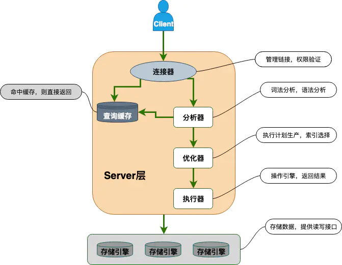

## MySQL的基础架构
* 我们通过一条查询语句来看看MySQL是如何执行的，同时通过这条语句的执行，了解MySQL的整体架构体系。
```
mysql> select * from T where ID=1；
```

这是一条非常简单的语句，我们知道输入一条语句，返回一个结果，却不知道这条语句在MySQL内部的执行过程。

下图是MySQL的基本架构图：（大体来说，MySQL可以分为Server层和存储引擎层两部分。）



架构示意图，可以理解出SQL语句在MySQL的各个功能模块中的执行过程。

* Server层：
  包括连接器、查询缓存、分析器、优化器、执行器等，涵盖MySQL的大多数核心服务功能，
  以及所有的内置函数（如日期、时间、数学和加密函数等），所有跨存储引擎的功能都在这一层实现，
  比如存储过程、触发器、视图等（不同的存储引擎共用一个Server层）。
  
* 存储引擎层：

### 1.负责数据的存储和提取。其架构模式是插件式的，支持InnoDB、MyISAM、Memory等多个存储引擎。现在最常用的存储引擎是InnoDB，它从MySQL 5.5.5版本开始成为了默认存储引擎。

### 2.执行create table建表的时候，如果不指定引擎类型，默认使用的就是InnoDB)。

### 3.在create table语句中使用engine=memory, 来指定使用内存引擎创建表。不同存储引擎的表数据存取方式不同，支持的功能也不同。

