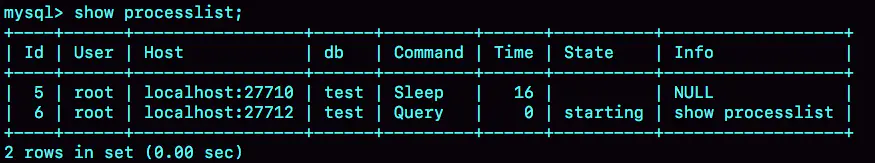

## MySQL的基础架构
* 我们通过一条查询语句来看看MySQL是如何执行的，同时通过这条语句的执行，了解MySQL的整体架构体系。
```
mysql> select * from T where ID=1；
```

这是一条非常简单的语句，我们知道输入一条语句，返回一个结果，却不知道这条语句在MySQL内部的执行过程。

下图是MySQL的基本架构图：（大体来说，MySQL可以分为Server层和存储引擎层两部分。）


架构示意图，可以理解出SQL语句在MySQL的各个功能模块中的执行过程。

### Server层：

  包括连接器、查询缓存、分析器、优化器、执行器等，涵盖MySQL的大多数核心服务功能，
  以及所有的内置函数（如日期、时间、数学和加密函数等），所有跨存储引擎的功能都在这一层实现，
  比如存储过程、触发器、视图等（不同的存储引擎共用一个Server层）。
  
### 存储引擎层：

 * 1.负责数据的存储和提取。其架构模式是插件式的，支持InnoDB、MyISAM、Memory等多个存储引擎。现在最常用的存储引擎是InnoDB，它从MySQL 5.5.5版本开始成为了默认存储引擎。

 * 2.执行create table建表的时候，如果不指定引擎类型，默认使用的就是InnoDB)。

 * 3.在create table语句中使用engine=memory, 来指定使用内存引擎创建表。不同存储引擎的表数据存取方式不同，支持的功能也不同。

### 一 连接器

连接器负责跟客户端建立连接、获取权限、维持和管理连接。操作数据库第一步需要连接到目标数据库上，所以首先和你打交道的就是连接器。
连接命令一般如下（输入完命令后，提示输入密码。虽然密码也可以直接跟在-p后面写在命令行中，但这样可能会导致你的密码泄露。）：
```
mysql -h$ip -P$port -u$user -p
```

* 1.如果用户名或密码不对，你就会收到一个"Access denied for user"的错误，然后客户端程序结束执行。

* 2.如果用户名密码认证通过，连接器会到权限表里面查出你拥有的权限。之后，这个连接里面的权限判断逻辑，都将依赖于此时读到的权限。（用户成功建立连接后，即使你用管理员账号对这个用户的权限做了修改，也不会影响已经存在连接的权限。修改完成后，只有再新建的连接才会使用新的权限设置）**

* 3 连接完成后，可以在show processlist命令中看到它。

 

* 4.客户端如果太长时间没动静，连接器就会自动将它断开。这个时间是由参数wait_timeout控制的，默认值是8小时。
   如果在连接被断开之后，客户端再次发送请求的话，就会收到一个错误提醒： Lost connection to MySQL server during query。
   这时候如果你要继续，就需要重连，然后再执行请求了。
   
* 5.数据库里面，长连接是指连接成功后，如果客户端持续有请求，则一直使用同一个连接。短连接则是指每次执行完很少的几次查询就断开连接，下次查询再重新建立一个。
   建立连接的过程通常是比较复杂的，所以我建议你在使用中要尽量减少建立连接的动作，也就是尽量使用长连接。
   
#### 问题1：

全部使用长连接后，有些时候MySQL占用内存涨得特别快，这是因为MySQL在执行过程中临时使用的内存是管理在连接对象里面的。这些资源会在连接断开的时候才释放。所以如果长连接累积下来，可能导致内存占用太大，被系统强行杀掉（OOM），从现象看就是MySQL异常重启了
#### 解决办法：
* 1.定期断开长连接。使用一段时间，或者程序里面判断执行过一个占用内存的大查询后，断开连接，之后要查询再重连。

* 2.如果你用的是MySQL 5.7或更新版本，可以在每次执行一个比较大的操作后，通过执行 mysql_reset_connection来重新初始化连接资源。这个过程不需要重连和重新做权限验证，但是会将连接恢复到刚刚创建完时的状态。

### 二 查询缓存

* 1.OK!,建立连接完后，第二部就是开始执行语句了。所以执行逻辑的第二部就会来到查询缓存

* 2.MySQL拿到一个查询请求后，会先到查询缓存看看，之前是不是执行过这条语句。之前执行过的语句及其结果可能会以key-value对的形式，被直接缓存在内存中。key是查询的语句，value是查询的结果。如果你的查询能够直接在这个缓存中找到key，那么这个value就会被直接返回给客户端。

* 3.如果语句不在查询缓存中，就会继续后面的执行阶段。执行完成后，执行结果会被存入查询缓存中。你可以看到，如果查询命中缓存，MySQL不需要执行后面的复杂操作，就可以直接返回结果，这个效率会很高。

**注意，大多数情况下我会建议你不要使用查询缓存，为什么呢？因为查询缓存往往弊大于利。(MySQL 8.0版本不在提供查询缓存这个功能)**

查询缓存的失效非常频繁，只要有对一个表的更新，这个表上所有的查询缓存都会被清空。对于更新压力大的数据库来说，查询缓存的命中率会非常低。除非你的业务就是有一张静态表，很长时间才会更新一次。比如，一个系统配置表，那这张表上的查询才适合使用查询缓存。

* 4.MySQL提供了这种“按需使用”的方式。可以将参数query_cache_type设置成DEMAND，这样对于默认的SQL语句都不使用查询缓存。而对于你确定要使用查询缓存的语句，可以用SQL_CACHE显式指定，像下面这个语句一样：
```
mysql> select SQL_CACHE * from T where ID=1；
```

### 三 分析器

* 1.没有命中查询缓存，就要开始真正执行语句了。首先，MySQL需要知道你要做什么，因此需要对SQL语句做解析。

* 2.分析器先会做“词法分析”。输入的是由多个字符串和空格组成的一条SQL语句，MySQL需要识别出里面的字符串分别是什么，代表什么（MySQL从输入的"select"这个关键字识别出来，这是一个查询语句。它也要把字符串“T”识别成“表名T”，把字符串“ID”识别成“列ID”）。

* 3.接着开始做“语法分析”，根据词法分析的结果，语法分析器会根据语法规则，判断你输入的这个SQL语句是否满足MySQL语法。（如果你的语句不对，就会收到“You have an error in your SQL syntax”的错误提醒，比如下面这个语句select少打了开头的字母“s”。）
```
mysql> elect * from t where ID=1;

ERROR 1064 (42000): You have an error in your SQL syntax; check the manual that corresponds to your MySQL server version for the right syntax to use near 'elect * from t where ID=1' at line 1
```
如果表T中没有字段k，而你执行了这个语句 select * from T where k=1, 那肯定是会报“不存在这个列”的错误： “Unknown column ‘k’ in ‘where clause’”。

### 四 优化器

经过了分析器，MySQL就知道你要做什么了。在开始执行之前，还要先经过优化器的处理。

优化器是在表里面有多个索引的时候，决定使用哪个索引；或者在一个语句有多表关联（join）的时候，决定各个表的连接顺序。

* 比如你执行下面这样的语句，这个语句是执行两个表的join：
```
mysql> select * from t1 join t2 using(ID)  where t1.c=10 and t2.d=20;
```
* 既可以先从表t1里面取出c=10的记录的ID值，再根据ID值关联到表t2，再判断t2里面d的值是否等于20。

* 也可以先从表t2里面取出d=20的记录的ID值，再根据ID值关联到t1，再判断t1里面c的值是否等于10。

这两种执行方法的逻辑结果是一样的，但是执行的效率会有不同，而优化器的作用就是决定选择使用哪一个方案。

优化器阶段完成后，这个语句的执行方案就确定下来了，然后进入执行器阶段。

### 五 执行器

MySQL通过分析器知道了你要做什么，通过优化器知道了该怎么做，于是就进入了执行器阶段，开始执行语句。

* 1.开始执行的时候，要先判断一下你对这个表T有没有执行查询的权限，如果没有，就会返回没有权限的错误，
   如下所示(在工程实现上，如果命中查询缓存，会在查询缓存放回结果的时候，做权限验证。查询也会在优化器之前调用precheck验证权限)。
```
mysql> select * from T where ID=10;

ERROR 1142 (42000): SELECT command denied to user 'b'@'localhost' for table 'T'
```

* 2.如果有权限，就打开表继续执行。打开表的时候，执行器就会根据表的引擎定义，去使用这个引擎提供的接口。

* 3.所以该语句的执行流程则是这样：

*调用InnoDB引擎接口取这个表的第一行，判断ID值是不是1，如果不是则跳过，如果是则将这行存在结果集中；*

*调用引擎接口取“下一行”，重复相同的判断逻辑，直到取到这个表的最后一行。*

*执行器将上述遍历过程中所有满足条件的行组成的记录集作为结果集返回给客户端。*

至此，这个语句就执行完成了。

**数据库的慢查询日志中看到一个rows_examined的字段，表示这个语句执行过程中扫描了多少行。这个值就是在执行器每次调用引擎获取数据行的时候累加的。**
