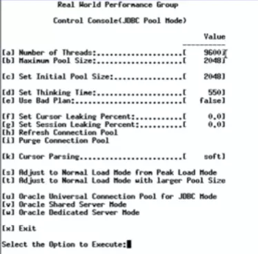
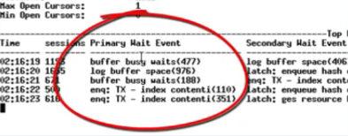

数据库连接池的配置是开发者们常常搞出坑的地方，在配置数据库连接池时，有几个可以说是和直觉背道而驰的原则需要明确。

## 1万并发用户访问

想象你有一个网站，压力虽然还没到Facebook那个级别，但也有个1万上下的并发访问——也就是说差不多2万左右的TPS。那么这个网站的数据库连接池应该设置成多大呢？结果可能会让你惊讶，因为这个问题的正确问法是：

“这个网站的数据库连接池应该设置成多小呢？”
下面这个视频是Oracle Real World Performance Group发布的，请先看完：
http://www.dailymotion.com/video/x2s8uec

（因为这视频是英文解说且没有字幕，我替大家做一下简单的概括：）

视频中对Oracle数据库进行压力测试，9600并发线程进行数据库操作，

每两次访问数据库的操作之间sleep 550ms，一开始设置的中间件线程池大小为2048：

初始的配置

压测跑起来之后是这个样子的：

2048连接时的性能数据

每个请求要在连接池队列里等待33ms，获得连接后执行SQL需要77ms

此时数据库的等待事件是这个熊样的：

各种buffer busy waits

各种buffer busy waits，数据库CPU在95%左右（这张图里没截到CPU）

接下来，把中间件连接池减到1024（并发什么的都不变），性能数据变成了这样：

