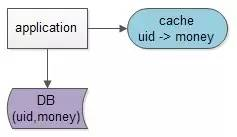

## 缓存架构设计细节二三事
本文主要讨论这么几个问题：

* （1）“缓存与数据库”需求缘起

* （2）“淘汰缓存”还是“更新缓存”

* （3）缓存和数据库的操作时序

* （4）缓存和数据库架构简析

### 一、需求缘起

#### 场景介绍

缓存是一种提高系统读性能的常见技术，对于读多写少的应用场景，我们经常使用缓存来进行优化。

例如对于用户的余额信息表account(uid, money)，业务上的需求是：

（1）查询用户的余额，SELECT money FROM account WHERE uid=XXX，占99%的请求

（2）更改用户余额，UPDATE account SET money=XXX WHERE uid=XXX，占1%的请求

由于大部分的请求是查询，我们在缓存中建立uid到money的键值对，能够极大降低数据库的压力。

#### 读操作流程

有了数据库和缓存两个地方存放数据之后（uid->money），每当需要读取相关数据时（money），操作流程一般是这样的：

* （1）读取缓存中是否有相关数据，uid->money

* （2）如果缓存中有相关数据money，则返回【这就是所谓的**数据命中“hit”**】

* （3）如果缓存中没有相关数据money，则从数据库读取相关数据money【这就是所谓的**数据未命中“miss”**】，放入缓存中uid->money，再返回

缓存的命中率 = 命中缓存请求个数/总缓存访问请求个数 = hit/(hit+miss)

上面举例的余额场景，99%的读，1%的写，这个缓存的命中率是非常高的，会在95%以上。

