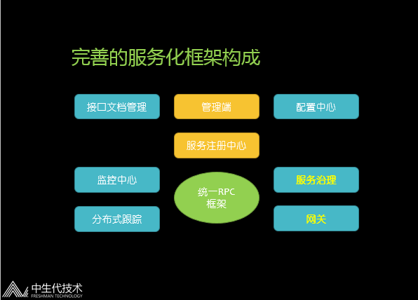

## 前言
首先本文不讨论为什么要服务化，包括服务化的优点缺点。

其次本文也不讨论什么是微服务，也不讨论微服务和SOA的区别。

最后本文也不讨论哪个技术最优。(微笑)

## 服务化框架构成
### 最基本的服务框架
基本的服务化框架包括如下模块：统一的RPC框架，服务注册中心，管理平台。

有了这三个模块，就能实现基本的服务化。下面对三个模块进行具体分析。

#### RPC框架选型
为什么一定要是统一的RPC框架，而不是随便啥框架，这里主要是为了技术对齐，减少开发人员的学习成本，减少团队间沟通成本。

好，那么选择一个RPC框架，我们都需要考量什么东西呢？

这里我总结下：

代码规范：例如是对已有代码透明，还是代码生成。
* 通讯协议：例如是TCP还是HTTP
* 序列化协议：例如是二进制还是文本，是否需要跨语言，性能
* IO模型：异步/同步，阻塞/非阻塞
* 负载均衡：客户端软负载，代理模式，服务端负载
* 另外如果是从开源里面选择，那么我们还需要考量：

成熟度：包括学习成本，社区热度，文档数，是否有团队维护，稳定性（盲目追求的不一定是最适合）
* 可扩展性：是否有SPI支持扩展，是否支持上下兼容
* 跨语言：是否支持跨语言
* 性能：要想作为RPC框架，性能一般都不会太差 [滑稽脸]
下面是常见的一些开源框架的比较，大家可以看一下。

  | thrift | RESTful|  dubbo| gRPC
 ---- | ----- | ------ 
代码规范| 基于Thrift的IDL生成代码| 基于JAX-RS规范| 无代码入侵| 基于.Proto生成代码

通讯协议| TCP| HTTP| TCP| HTTP/2

序列化协议| thrift| JSON| 多协议支持，默认hessian| protobuf

IO框架| Thrift自带| Servlet容器| Netty3| Netty4

负载均衡| 无| 无| 客户端软负载| 无

跨语言| 多种语言| 多种语言| Java| 多种语言|

可扩展性| 一般| 好| 好| 差

Ps：SOAP，RMI，Hessian，ICE就不列举了。

### 选型小结：

* 如果需要与前端交互的，适合短链接、跨语言的RPC框架，例如RESTful、gRPC等
* 如果纯粹后台交互的，适合长链接、序列化为二进制的RPC框架，例如thrift、dubbo等更高效
* 如果是小公司，新公司从头开始推广服务化框架的，可以选择规范化的RPC框架，例如thrift、RESTful、gRPC
* 如果是已有大量业务代码的再推广服务框架的，那么最好选择无代码入侵的RPC框架，例如dubbo、RESTful
### 注册中心选型
注册中心相当于是服务提供者和服务调用者之间的引路人，在服务治理中的作用极为重要。

选择注册中心基本要考量：

* 服务注册：接收注册信息的方式
* 服务订阅：返回订阅信息的方式，推还是拉
* 状态检测：检测服务端存活状态
重点提一下这个状态检测，因为这个要是检测不准确会误判，导致严重后果，
例如Zookeeper根据服务端注册的临时节点进行状态检测，如果服务端和Zookeeper之间的网络闪断，导致Zookeeper认为服务端已经死了，从而摘掉这个节点。
但是其实客户端和服务端直接的网络是好的，这样就有可能把节点全部摘掉，导致无可用节点。

如果是从开源里面选择，那么还需要考量：

* 成熟度：包括学习成本，社区热度，文档数（盲目追求的不一定是最适合）
* 维护成本：注册中心维护
* 数据解构：是否能快速定位结果，是否能遍历
* 性能和稳定性：
* CAP原则：CP（关注一致性）还是AP（关注可用性）
下面是常见的一些使用开源项目做注册中心的比较，大家可以看一下。

 
  | ZooKeeper | etcd | Consul | Eureka

一致性 | 强一致性paxos | 强一致性Raft | 强一致性Raft | 弱一致性

数据结构 | Tree | K/V | K/V | K/V

通讯协议 | TCP | HTTP、gRPC | HTTP、DNS | HTTP

客户端 | ZKClient | / | / | Eureka-client

CAP原则 | CP | CP | CP | AP

Ps：Redis和MySQL没有列举。

选型小结：

* 规模小选择CP，RPC框架可以直接接入数据源
* 规模大选择AP， RPC框架不可以直接接入数据源
* 存在跨机房，跨地域的尽量不要选有强一致性协议的注册中心
* RPC框架必须要有注册中心不可用的容灾策略
* 服务状态检测十分重要

### 简易管理端
管理端没啥特殊要求，最起码能看到服务提供者和调用者即可。

 

### 完善的服务化框架
如果需要一个完善的服务化框架，那么必须增加外部模块，常见的模块如下图：

### 接口文档管理
提供一个接口文档管理以及接口查询的入口，可以是一个公共的WIKI，也可以是独立的系统，等等。

这里可以定义接口的文档，包括接口描述，方法定义，字段定义

可以定义接口的SLA，包括支持的并发数，tp99多少，建议配置是什么

还有就是接口的负责人等一些查询的入口。

### 配置中心
提供一个配置管理的地方，这里说的配置主要指的是服务相关的一些配置。

配置包括分组配置、路由策略、黑白名单、降级开关、限流信息、超时时间、重试次数等等，任何可以动态变更的所有数据。

这样服务提供者和服务调用者可以不需要重启自己的应用，直接进行配置的变更。

配置中心可以独立于注册中心，也可以和注册中心合并。

### 监控中心
监控服务关注接口维度，实例（例如所在JVM实例）维度的数据。

RPC框架可以定时上报调用次数，耗时，异常等信息。

监控中心可以统计出服务质量信息，也可以进行监控报警。

### 分布式跟踪
区别于监控中心，以调用链的模式对服务进行。

RPC框架作为分布式跟踪系统的一个天然埋点，可以很好的进行一个数据输出。

### 服务治理（重点）
我这边列了常见的服务治理功能，例如：

* 服务路由：
权重：例如机器配置高的权重高，机器配置低的权重低
IP路由：例如某几台机器只能调某几台机器
分组路由：例如自动根据配置调某个分组
参数路由：例如根据方法名进行读写分类，或者根据参数走不同的节点
机房路由：例如只走同机房，或者同机房优先
* 调用授权：
应用授权：只有授权后的应用才能调这组服务
token：只有token对的调这组服务
黑白名单：只有名单允许的才能调这组服务
* 动态分组：
服务端切分组：可以根据分组的情况，对服务提供者进行一个动态的分组调度
客户端切分组：可以对调用者进行一个分组调度
* 调用限流：
服务端限流：服务端基于令牌桶或者漏桶模型进行限流
客户端限流：根据客户端的标识，进行调用次数限流
* 灰度部署：
灰度上线：先启动，验证后在提供服务
预发标识：表示该服务为预发布服务
接口测试：方便的提供接口自动化功能测试功能
* 配置下发：
服务配置
全局配置
* 服务降级：
Mock：出现异常或者测试情况下，返回Mock数据
熔断：客户端超时或者服务端超时
拒绝服务：服务端压力大时，自动拒绝服务，保护自己
网关
RPC框架大部分场景都是自己调用的，什么时候会需要一个网关呢？

网关可以提供如下功能：

统一的鉴权服务
限流服务
协议转换：外部协议转统一内部协议
Mock：服务测试，降级等
其它一些统一处理逻辑（例如请求解析，响应包装）
服务注册中心Plus
需要逻辑处理能力，例如对数据进行筛选过滤整合，计算服务路由等功能

同时还需要有与RPC框架交互的功能。

管理端Plus
管理端除了之前的简单服务管理功能外，还需要提供配置信息展示，监控信息展示，各种维度的数据展示。

也就是下面提到的服务治理功能，都可以在管理端进行管理。

另外，常见的服务治理功能，我们都可以作为开放服务供开发人员进行一个调用。

京东实践
第一代SAF背景
2012年初，京东从.NET转Java。各个部门，各个业务线都没有一个统一的服务化框架，有的是dubbo，有的是WebService，有的是Hessian等等。

同时各个业务系统自己有非常多的业务代码。通过统计接口规模在1K左右，服务节点在50K左右，机器规模在8K左右，机房比较少拓扑简单。

所以当时的愿景和目标比较明确：

京东系统服务化、API化的从无到有
统一京东的RPC调用框架
稳定可靠
提供简单的服务治理功能
第一代SAF选择
OK，结合我们的情况和上面的一些选型小结，我们当时的选择如下：

RPC框架：基于dubbo2.3.2做配置扩展，以及功能扩展包括rest（resteasy）、webservice（cxf）、kryo/thrift序列化、调用压缩等
注册中心：Zookeeper，RPC框架直接接入数据源
监控中心：监控服务+HBase
管理平台：读取Zookeeper做管理平台，提供基本的上下线、黑白名单等功能
于2012年4月上线，最大规模时，接口数3K，接入最大IP数20K。

第二代JSF背景
随着京东业务的不断快速增长，接口、机器数也呈数量级增长。

同时京东成立子公司，在全国各地新建机房，部署结构也变得比较复杂。

加上SAF遗留的一些问题，大概面临如下几点：

RPC框架较重，性能有提高的空间
注册中心无业务逻辑，直接对外暴露
京东复杂的部署架构需要更强大灵活的服务治理功能
监控数据不完整，维度不够
无应用依赖关系
跨语言调用需求
第二代JSF选择
所以在2014年初，我们进行了第二代JSF的一个全部自研过程。

我们主要做了如下技术选型：（全部自研）

RPC框架：轻量级，更佳的性能，兼容旧版本协议
注册中心：基于DB作为数据源，前置Index服务；支持十倍接入量；部分逻辑放在注册中心减少客户端负担
监控中心：监控Proxy服务+InfluxDB（2015后改为ElasticSearch）
管理端：基于DB，功能更强大，提供完善的服务治理管理功能；打通京东应用管理平台，提供应用依赖关系梳理；
HTTP网关：基于Netty，支持跨语言调用
开发周期：7人/年(2014.1-2015.1)。包括开发、测试、预发、上线、推广。

JSF架构简图

JSF注册中心
京东的注册中心是自研的，基于DB做的数据最终一致，也就是上面说的AP系统。

注册中心主要实现的就是服务列表的注册订阅推送，服务配置的获取下发，服务状态的实时查看等功能。

注册中心节点是无状态的，可水平扩展的。整个注册中心集群下的所有注册中心几点都是等价的。

每个机房部署多个注册中心节点。同机房的RPC框架会优先连本机房的注册中心节点。

主要亮点如下：

引入Index服务概念
该服务就是一个最简单HTTP的服务，用于找注册中心节点（同机房或者压力最小或者其它特定场景），可以认为是不会挂的服务，
RPC框架会优先连该服务拿注册中心地址，这样子的好处是注册中心地址变化后，RPC框架不用修改任何设置。
注册中心内存有服务列表全量缓存，连不上数据库也保证可读
数据库的数据结构更适合各种维度展示、过滤、分析等
例如根据分组，IP，应用，机房等不同维度
注册中心就是个JSF服务，监控到压力大即可进行动态水平扩展
dogfooding，注册中心其实是第一个JSF接口
服务列表推送逻辑改进
例如原来100个Provider，现在加1个节点，之前的SAF是需要下发101个节点，自己判断加了哪个节点，进行长链接建立；
现在的改进是：修改为下发一个add事件，告知RPC框架加了1个节点，RPC框架进行长链接建立；
这样做大大减少了推送的数据量。
注册中心与RPC框架可各种交互
注册中心和RPC框架是长链接，而且JSF是支持Callback的，注册中心可以调用RPC框架进行服务列表变化之外的操作；
例如查看状态，查看配置，配置下发等
JSF RPC框架

RPC框架作为服务化里面的最基本的组件，其实都大同小异，因为RPC调用都绕不开代理、网络、序列化这些操作。

JSF的RPC框架也类似，主要分为图中的几个模块，

下面大概列下一些功能特性：

Config：Spring/API/Annotation
Proxy: Javassist/JDK
Invoker/Filter：内置+自定义，Filter可扩展
Client：Failover（默认）/FailFast/TransportPinpoint/MultiClientProxy
调用方式：同步（默认）/异步并行/异步回调/Callback/泛化
Loadbalance：Random（默认）/Roundrobin/ConsistentHash/ LocalPreference/LeastActiveCall
路由：参数路由，分组路由，（IP级别路由逻辑在注册中心做）
长连接维护：可用/死亡/亚健康
协议：JSF（默认）/SAF(dubbo)/HTTP/Telnet/HTTP2
第三方：REST/Webservice
序列化：MsgPack（默认）/Hessian/Json/Java/protobuf(c++)
压缩：Snappy/LZMA
网络：基于Netty4.0，长连接复用
线程模型：BOSS+WORKER+BIZ
容灾：本地文件
请求上下文：IP，参数，隐式传参
事件监听：响应事件，连接事件，状态事件
分布式跟踪支持：进行数据埋点
JSF管理平台
提供强大管理功能，包括服务管理，监控管理，注册中心管理等功能。

我们针对服务治理的功能，提供了很多API，可以授权给开发人员或者外部系统使用。

例如单元测试调用，限流配置/开关，动态分组，上下线等都提供了开放API。

JSF HTTP网关
网关是为了方便跨语言通过HTTP+JSON调用JSF服务，而不需要使用JSF的RPC框架。

特性如下：

基于Netty4.0实现HTTP网关，没有使用Servlet容器，轻量高效。
支持服务自动发现
一般的HTTP服务，外面为了解决单点问题，都会用域名+VIP等实现高可用，故障转移等；
现在网关同时原生接入了JSF的注册中心，知道了服务的提供者信息（JSF协议支持HTTP调用）。
服务提供者也不用关系扩容缩容导致服务的IP端口发生变化，网关会自动维护服务列表。
服务限流
针对方法级+应用进行授权，固定时间只能调用指定次数。
同一个方法也只能占用网关内的部分线程
结果统一包装
对异常等响应进行包装
JSF遇到京东弹性云
京东的JSF服务开发在京东弹性云的研发推广之前完成，自从京东弹性云落地以来，也遇到不少问题。

例如：

硬件指标：例如使用JDK获取的Docker的指标有些是物理机的，我们需要特殊处理
网络：结合京东的“胖”容器，每个容器其实有实际IP，对外提供服务
轻量：提高启动速度
开放服务：在容器销毁或者非优雅停机的情况下，提供API进行服务治理
JSF规模
接口数：万级
服务节点数：百万级
接入实例数：十万级
框架调用量：每天千亿级别
监控数据：每天120亿条数据， 1.2T数据量
HTTP网关：每天百亿级别
总结
没有最好，只有最适合！
意思就是不要人云亦云，盲目看大公司用什么，现在什么最新，或者什么性能最好。
因为架构不是让你一下子设计出来使用一辈子，好的架构都是慢慢演化而来的。
不同的架构会做出不同的技术选型。所以无论什么时候都要结合自己的现状以及未来几年的规划，来进行技术选型。
It’s just the beginning！
服务化框架的选择只是开始，真正的变革是选择后，公司整体业务和开发的变革。
这个大家有空可以看看康威定律。