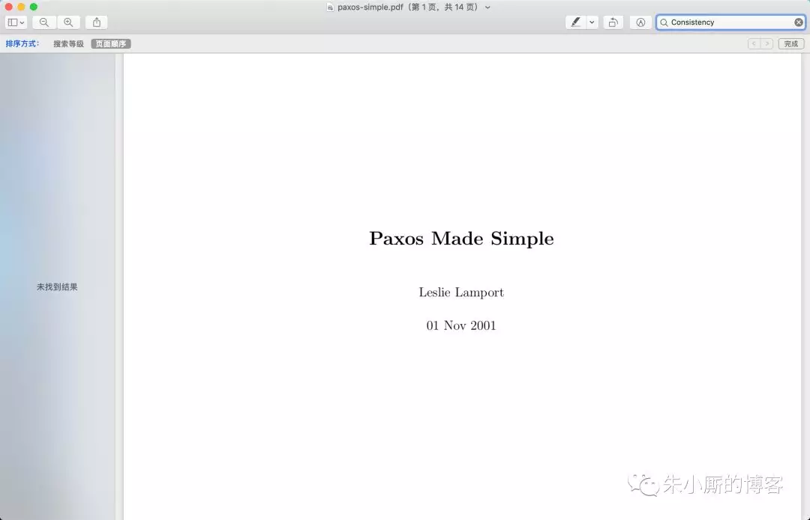
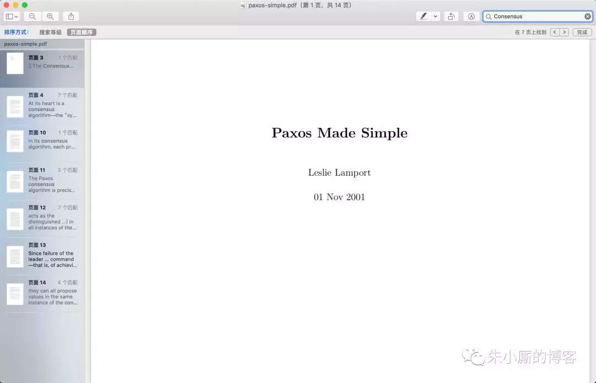

作为互联网中的一员，我们时常沉浸在“分布式”的氛围当中——**高可用、高可靠、高性能**等等词汇随处可见，

**CAP、BASE、2PC、Paxos、Raft**等等名词也能信手捏来。

不过，有些词在我们“并不严谨”的传播中逐渐被误用了，或者说含糊不清了。今天，我们来简单聊聊“Consistency”这个词，即一致性。

Paxos、Raft等通常被误称为“一致性算法”。

**但是“一致性（Consistency）”和“共识（Consensus）”并不是同一个概念。**

**Paxos、Raft等其实都是共识（Consensus）算法。**

Leslie Lamport于1998年在ACM Transactions on Computer Systems上发表了一篇《The Part-Time Parliament》[1]的文章，这是Paxos算法第一次公开发表。

但是发表之后，很多人还是觉得原来那篇太难理解了，之后Lamport又写了一篇《Paxos Made Simple》[2]，当我们想要学习一下Paxos的时候，可以直接看看这篇。

回到正题，我们在《Paxos Made Simple》中搜索“Consistency”一词，如下图所示，其实是毫无匹配结果的。

反观，我们搜索“Consensus”一词的时候，却出现了很多匹配项。

也就是说，Paxos论文通篇提都没提Consistency一词，何来的“Paxos is a consistency algorithm”的说法。

与此类似的是，在Raft论文《In Search of an Understandable Consensus Algorithm (Extended Version)》[3]中开头就对Raft给出了明确的定义：Raft is a consensus algorithm....，注意这里是consensus，而不是consistency。

