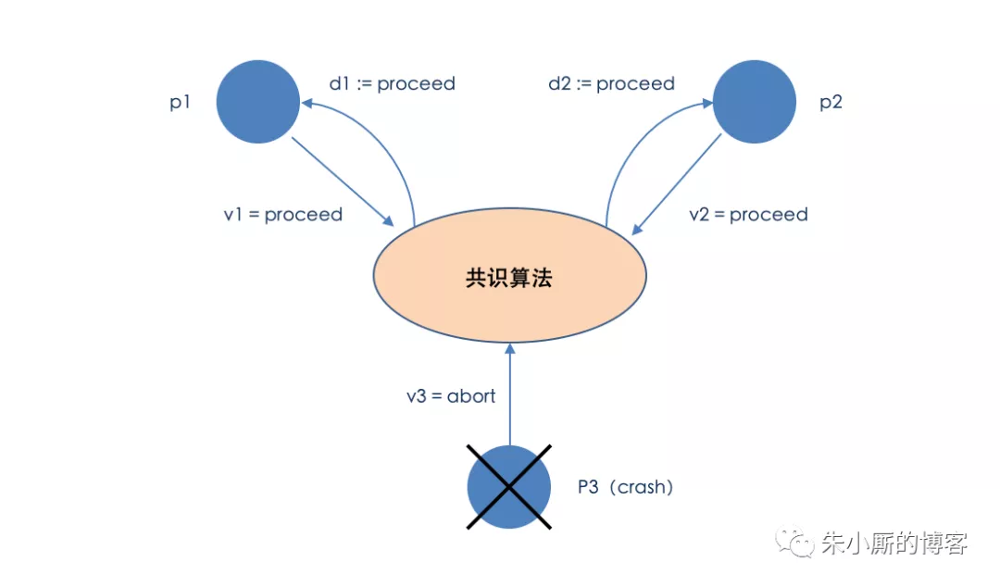

作为互联网中的一员，我们时常沉浸在“分布式”的氛围当中——**高可用、高可靠、高性能**等等词汇随处可见，

**CAP、BASE、2PC、Paxos、Raft**等等名词也能信手捏来。

不过，有些词在我们“并不严谨”的传播中逐渐被误用了，或者说含糊不清了。今天，我们来简单聊聊“Consistency”这个词，即一致性。

Paxos、Raft等通常被误称为“一致性算法”。

**但是“一致性（Consistency）”和“共识（Consensus）”并不是同一个概念。**

**Paxos、Raft等其实都是共识（Consensus）算法。**

Leslie Lamport于1998年在ACM Transactions on Computer Systems上发表了一篇《The Part-Time Parliament》[1]的文章，这是Paxos算法第一次公开发表。

但是发表之后，很多人还是觉得原来那篇太难理解了，之后Lamport又写了一篇《Paxos Made Simple》[2]，当我们想要学习一下Paxos的时候，可以直接看看这篇。

回到正题，我们在《Paxos Made Simple》中搜索“Consistency”一词，如下图所示，其实是毫无匹配结果的。

反观，我们搜索“Consensus”一词的时候，却出现了很多匹配项。

也就是说，Paxos论文通篇提都没提Consistency一词，何来的“Paxos is a consistency algorithm”的说法。

与此类似的是，在Raft论文《In Search of an Understandable Consensus Algorithm (Extended Version)》[3]中开头就对Raft给出了明确的定义：Raft is a consensus algorithm....，注意这里是consensus，而不是consistency。

从专业的角度来讲，我们通常所说的

* 一致性（Consistency）在分布式系统中指的是对于同一个数据的多个副本，其对外表现的数据一致性，如强一致性、顺序一致性、最终一致性等，都是用来描述副本问题中的一致性的。

* 而共识（Consensus）则不同，简单来说，共识问题是要经过某种算法使多个节点达成相同状态的一个过程。一致性强调结果，共识强调过程。

《分布式系统概念与设计》一书中对共识问题进行了如下定义：

为达到共识，每个进程 pi 最初处于未决（undecided）状态，并且提议集合D中的一个值 vi 。进程之间互相通信，交换值。然后，每个进程设置一个决定变量（decision variable）di 的值。在这种情况下，它进入决定（decided）状态。在此状态下，他不再改变di。

下图中给出了参与一个共识算法的3个进程。两个进程提议“继续”， 第三个进程提议“放弃”但随后崩溃。保持正确的两个进程都决定“继续”。（其中i = 1, 2, ……, N; j = 1, 2, ……, N。）

共识算法的要求是在每次执行中满足以下条件：

* 终止性：每个正确进程最终设置它的决定变量。
* 协定性：所有正确进程的决定值都相同，即如果 pi 和 pj 是正确的并且已进入决定状态，那么 di = dj。
* 完整性：如果正确的进程都提议同一个值，那么处于决定状态的任何正确进程已选择了该值。

共识问题中所有的节点要最终达成共识，由于最终目标是所有节点都要达成一致，所以根本不存在一致性强弱之分。

所以，以后我们看到“Paxos是一个强一致性算法”、“Raft是一个强一致性协议”等类似说法的时候，我们更要以一种“审视”的眼光去看待后面的内容。

在我们大多数人的大多数工作内容中，一致性（Consistency）与共识（Consensus）的差别其实无关痛痒。但是如果我们想抬高一个维度，深入的去研究一下分布式领域的内容，那么这些最基础的概念如果区分不清楚的话，会对后面的学习过程产生很大的阻碍。

越是相近的词汇，越要清楚的区分。就算是同一个单词，也会有不同的含义解析，比如CAP和ACID中的C都是Consistency的缩写，但这两者在各自场景下的含义也并不相同。

* ACID的C指的是事务中的一致性，在一系列对数据修改的操作中，保证数据的正确性。即数据在事务期间的多个操作中，数据不会凭空的消失或增加，数据的每一个增删改操作都是有因果关系的。比如用户A向用户B转了200块钱，不会出现用户A扣了款，而用户B没有收到的情况。

* 在分布式环境中，多服务之间的复制是异步，需要一定耗时，不会瞬间完成。在某个服务节点的数据修改之后，到同步到其它服务节点之间存在一定的时间间隔，如果在这个间隔内有并发读请求过来，而这些请求又负载均衡到多个节点，可能会出现从多个节点数据不一致的情况，

  因为请求有可能会落到还没完成数据同步的节点上。CAP中的C就是为了做到在分布式环境中读取的数据是一致的。
  
## 总的来说
 * ACID的C着重强调单数据库事务操作时，要保证数据的完整和正确性，
 
 * 而CAP理论中的C强调的是对一个数据多个备份的读写一致性。  
  