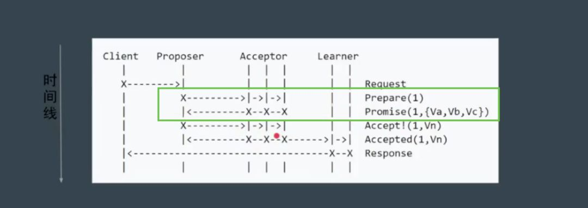
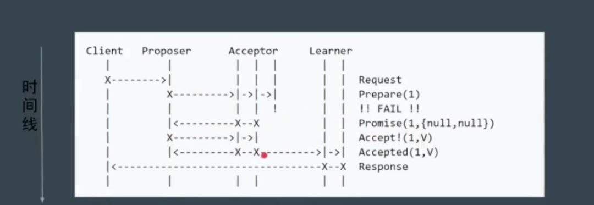
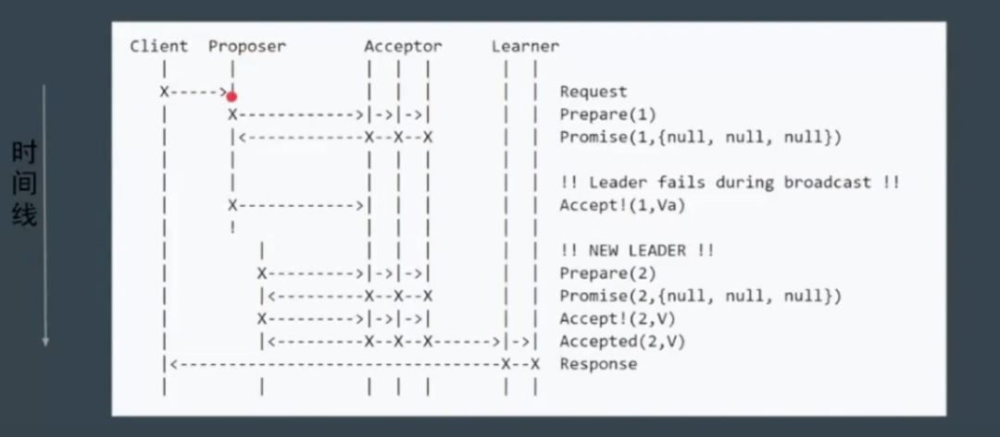
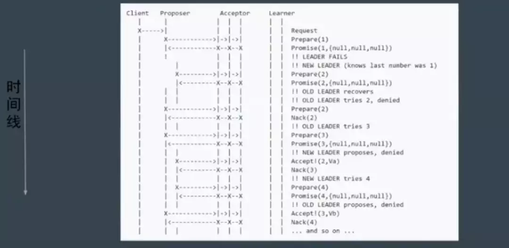
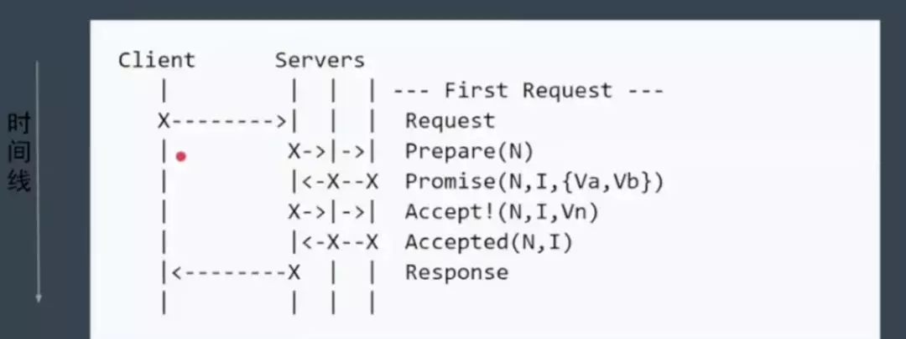

### 什么是 CAP

关于 CAP 理论的背景介绍已经很多，这里不过多介绍，我们谈谈如何理解它的问题。

### 用通俗易懂的话解释三个名词：

* 一致性

  如果刚刚向一个节点写入，那么之后，从另外一个节点读取的必须是刚刚写入的数据，不能是更老的数据。

* 可用性

  如果请求一个节点，这个节点必须能够给予回复，如果节点挂掉了，那就谈不上可用性了。

* 分区容忍性

  是否容忍网络分区，即可以允许节点和其它节点无法通信。

**CAP 的意思就是说我们最多只能保证其中两个条件同时成立。**

下面我们来看看为什么。

如图所示，假如我们满足了分区容忍性，即虚线处表示两个节点发生了分区。

* 1.假如要满足一致性，
    那么，我们只能让请求另一个节点的操作暂时 hang 住，返回 client 失败或者超时的结果，这种情况多发生在银行柜台等对数据一致性要求很高的情境下，因为比起保证用户资金数目的正确性比暂时让用户无法操作要更重要一些。

* 2.假如要满足可用性，
    因为网络已经隔离，也就没办法达到一致性，这种情况多发生在互联网行业中，比如新闻等对数据一致性要求不高但对可用性要求高的情况下，毕竟，用户压根看不了新闻比看不到及时新闻要重要的多。

大家可以自己自由组合，最终会证明，三种条件不可能同时满足，其实大部分情况下，我们都是在一致性和可用性之间取舍而已。

**Consistency = Consensus?**

Consistency 几乎被业界用烂，以至于当我们在讨论一致性的时候，其实我们都无法确定对方所说的一致性是不是和自己的那个一致。

**Consistency：一致性，Consensus：协同，这两个概念极容易混淆。**

* 我们常说的一致性（Consistency）在分布式系统中指的是对于同一个数据的多个副本，其对外表现的数据一致性，如线性一致性、因果一致性、最终一致性等，都是用来描述副本问题中的一致性的。

* 而共识（Consensus）则不同，简单来说，共识问题是要经过某种算法使多个节点达成相同状态的一个过程。在我看来，一致性强调结果，共识强调过程。

**共识？状态机？**

共识有个更高逼格的称呼：

基于状态机复制的共识算法

那么，状态机是什么？

状态机是有限状态自动机的简称，是现实事物运行规则抽象而成的一个数学模型。

看下图，门，有两种状态，开着的和关着的。因此，在我看来状态是一种静态的场景，而转换赋予了其动态的变化。

以此类比一下，如果一个节点当前的数据是 X，现在有了 add+1 的操作日志来了，那么现在的状态就是 X+1，好了，状态（X）有了，变化（操作日志）有了，这就是状态机。

**分布式共识，简单来说，就是在一个或多个节点提议了一个状态应当是什么后，系统中所有节点对这个状态达成一致意见的整个过程。**

**共识是过程，一致是结果。**

## 共识模型

### 主从同步：

我们都知道 MySQL 等业界常见数据库的主从同步（Master-Slave Replication)，主从同步分三个阶段：

* Master 接受写请求

* Master 复制日志至 Slave

* Master 等待，直到所有从库返回。

可见，主从同步模型存在致命问题：只要一个节点失败，则 Master 就会阻塞，导致整个集群不可用，保证了一致性，可用性缺大大降低了。

### 多数派：

每次写入大于 N/2 个节点，每次读也保证从 N/2 个节点中读。多数派的模型看似完美解决了多节点的一致性问题，不就是性能差点嘛，可是在并发的情况下就不一定了，如下图：

在并发环境下，因为每个节点的操作日志写入顺序无法保证一致，也就无法保证最终的一致性。如图，都是向三个节点

inc5、set0 两个操作，但因为顺序不一样，最终状态两个是 0，一个是 5。因此我们需要引入一种机制，给每个操作日志编上号，这个号从小到大生成，这样，每个节点就不会弄错。

（是否想到了网络中的分包与重组？）那么，现在关键问题又来了，怎么协同这个编号？貌似这是鸡生蛋、蛋生鸡的问题。

### Paxos

Paxos 模型试图探讨分布式共识问题的一个更一般的形式。

Lesile Lamport，Latex 的发明者，提出了 Paxos 算法。他虚拟了一个叫做 Paxos 的希腊城邦，这个岛按照议会民主制的政治模式制定法律，但是没有人愿意将自己的全部时间和精力放在这件事上。

所以无论是议员、议长或者传递纸条的服务员都不能承诺别人需要时一定会出现，也无法承诺批准决议后者传递消息的时间。由于 Paxos 让人太难以理解，Lamport 觉得同行不能理解他的幽默感，

于是后来又重新发表了朴实的算法描述版本《Paxos Made Simple》。

该共识算法就整体来说，存在两个阶段，如图，第一个阶段是提议，第二个阶段是决定。

分布式系统要做到 fault tolorence，就需要共识模型，而节点达成共识，不仅需要节点之间的算法，还会取决于 client 的行为。比如即使副本系统使用 multi-paxos 在所有副本服务器上同步了日志序号，但如果 Client 被允许从非 Leader 节点写入数据，则整个副本系统仍然不是强一致的。

下面，重头戏来了，详细介绍 Paxos。

#### 角色介绍：

* Client：系统外部角色，请求发起者。如民众。

* Proposer:  接受 Client 请求，向集群提出提议（propose）。并在冲突发生时，起到冲突调节的作用。如议员，替民众提出议案。

* Accpetor:  提议投票和接收者，只有在形成法定人数（Quorum，即 Majority 多数派）时，提议才会最终被接受。如国会。

* Learner:  提议接受者，backup，备份，对集群的一致性没影响。如记录员。

**步骤、阶段：**

* 1.Phase1a: Prepare

proposer 提出一个议案，编号为 N，N 一定大于这个 proposer 之前提出的提案编号，请求 acceptor 的 quorum（大多数） 接受。

* 2.Phase1b: Promise

如果 N 大于此 acceptor 之前接受的任何提案编号则接受，否则拒绝。

* 3.Phase2a: Accept

如果达到了多数派，proposer 会发出 accept 请求，此请求包含上一步的提案编号和提案内容。

* 4.Phase2b: Accepted

如果此 acceptor 在此期间没有收到任何大于 N 的提案，则接受此提案内容，否则忽略。

还记得上文中我们提到过，同步编号是非常重要的问题，绿色框出来的实际上就是同步编号的过程。通过这个编号，就知道每条操作日志的先后顺序。简单说来，第一阶段，获取编号，第二阶段，写入日志。可以看出来，Paxos 通过两轮交互，牺牲时间和性能来达到弥补一致性的问题。

现在我们考虑部分节点 down 掉的情景。

由于是多数派 accptor 达成了一致，第一阶段仍然成功获得了编号，所有最终还是成功的。

考虑 proposer down 掉的情景。

没关系，虽然第一个 proposer 失败，但下一个 proposer 用更大的提案编号，所以下一次 proposer 最终还是成功了，仍然保证了可用性和一致性。

#### 潜在问题：活锁

Paxos 存在活锁问题。

如图，当 第一个 proposer 在第一阶段发出请求，还没来得及后续的第二阶段请求，紧接着第二个 proposer 在第一阶段也发出请求，

如果这样无穷无尽，acceptor 始终停留在决定顺序号的过程上，那大家谁也成功不了，

遇到这样的问题，其实很好解决，如果发现顺序号被新的 proposer 更新了，则引入一个随机的等待的超时时间，这样就避免了多个 proposer 发生冲突的问题。

#### Multi Paxos

由于 Paxos 存在的问题：难实现、效率低（2 轮 rpc）、活锁。

因此又引入了 Multi Paxos，Multi Paxos 引入 Leader，也就是唯一的 proposer，所有的请求都需经过此 Leader。

因为只有一个节点维护提案编号，这样，就省略了第一轮讨论提议编号的过程。

然后进一步简化角色。

Servers 中第左边的就是 Proposer，另外两个和自身充当 acceptor，这样就更像我们真实的系统了。

Raft 和 ZAB 协议其实基本上和这个一致，两者的差别很小，就是心跳的方向不一样。

**Raft 和 ZAB**

Raft 和 ZAB 协议将 Multi Paxos 划分了三个子问题：

* Leader Election

* Log Replication

* Safety

在 leader 选举的过程中，也重定义角色：

* Leader

* Follower

* Candidate

这个动画网站生动展示了 leader 选举和日志复制的过程。在这里就不多讲了。

另外，raft 官方网站可以自己操作模拟选举的过程。

### 总结

今天，我们从 CAP 谈到 Raft 和 ZAB，中间穿插了各种名词，模型无论怎么变化，我们始终只有一个目的，

那就是在一个fault torlerance 的分布式架构下，如何尽量保证其整个系统的可用性和一致性。

最理想的模型当然是 Paxos，然而理论到落地还是有差距的，所以诞生了 Raft 和 ZAB，虽然只有一个 leader，

但我们允许 leader 挂掉可以重新选举 leader，这样，中心式和分布式达到了一个妥协。