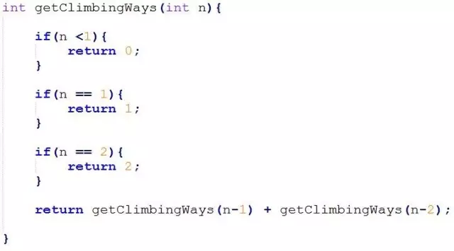
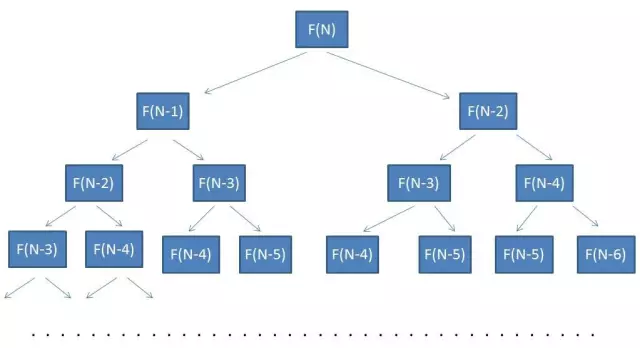
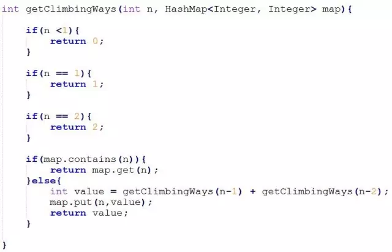
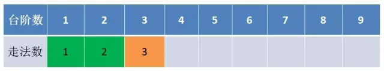
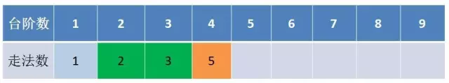
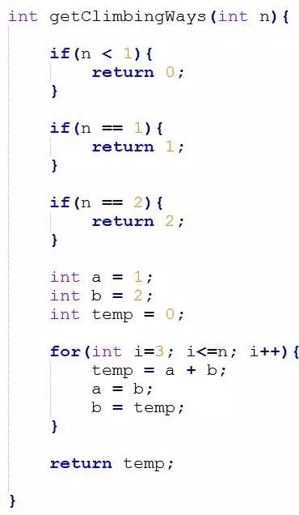

动态规划三个重要概念
* 最优子结构
* 边界条件
* 状态转移公式

## 题目：
有一座高度是10级台阶的楼梯，从下往上走，每跨一步只能向上1级或者2级台阶。要求用程序来求出一共有多少种走法。

比如，每次走1级台阶，一共走10步，这是其中一种走法。我们可以简写成 1,1,1,1,1,1,1,1,1,1。

再比如，每次走2级台阶，一共走5步，这是另一种走法。我们可以简写成 2,2,2,2,2。

## 解题思路

### 假设你只差最后一步就走到第10级台阶，会有几种情况

* 第一种从9级走到10级
* 第二种从8级走到十级

【从0到10级台阶得走法数量】=【0到9级得走法数量】+【0到8级得走法数量】

 F(10)= F(9)+F(8)
 #### 以此类推：
 
 * F(9)= F(8)+F(7)
 * F(9)= F(8)+F(7)
 * ...
 * F(3)= F(2)+F(1)
 * F(2)= 2
 * F(1)= 1
 
 #### 公式：
  F(n)= F(n-1)+F(n-2)
  
  ####  结论：
  
  F(10)= F(9)+F(8)
  
  * F(9)和 F(8) 是 F(10) 得【最优子结构】
  * F(1)= 1 和  F(2)= 2 是问题得边界，如果问题没有【边界】，则永远无法得到有限得结果
  * F(n)= F(n-1)+F(n-2) 是阶段之间得【状态转移公式】
  
## 求解问题

### 方法一：递归求解
  
  
 
  参考Dynamic类
  
  
  **时间复杂度： O(2 ~ N)**
  
### 方法二：备忘录算法  
  
  
  在以上代码中，集合map是一个备忘录。当每次需要计算F(N)的时候，会首先从map中寻找匹配元素。如果map中存在，就直接返回结果，如果map中不存在，就计算出结果，存入备忘录中。
  
  **时间复杂度： O(N)**
  **空间复杂度： O(N)**
### 方法三： 动态规划
  
   换个思路，我们可以自底向上，用递代得方式推导结果
   
   
   
   表格得第一行代表了楼梯台阶得数目，第二行代表了若干级台阶对应得走法树。
   
   第一次递代。台阶数等于3时，走法数量是3,是f(1)+f(2)。所以f(3)只依赖与f(1)和f(2)
   
   
   
   第二次递代。台阶数等于4时，走法数量是5,是f(3)+f(2)。所以f(4)只依赖与f(3)和f(2)
   
   由此可见，每一次迭代，只需要保存之前得两种状态，就可以推导出新得状态，而不需要备忘录算法那样保留所有得子状态。
   
   
   
   **时间复杂度： O(N)**
   **空间复杂度： O(1)**