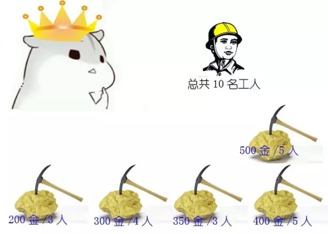

动态规划三个重要概念
* 最优子结构
* 边界条件
* 状态转移公式

## 题目：

有一个国家发现了5座金矿，每座金矿的黄金储量不同，需要参与挖掘的工人数也不同。

参与挖矿工人的总数是10人。每座金矿要么全挖，要么不挖，不能派出一半人挖取一半金矿。要求用程序求解出，要想得到尽可能多的黄金，应该选择挖取哪几座金矿？

### 方法一：排列组合

每一座金矿都有挖与不挖两种选择，如果有N座金矿，排列组合起来就有2^N种选择。对所有可能性做遍历，

排除那些使用工人数超过10的选择，在剩下的选择里找出获得金币数最多的选择。

代码比较简单就不展示了，

**时间复杂度也很明显，就是O(2^N)。**

## 动态规划求解

### 分析最优子结构

10个工人5个金矿，最优子结构有两个
* 4个金矿10个工人得最优选择（第五个金矿不挖）
* 4个金矿10-n个工人得最优选择（n为第五个金矿需要得工人数）

### 状态转移公式

5个金矿得最优选择，就是【前4座金矿10工人的挖金数量】和【前4座金矿，10-n个工人的挖金数量+第五座金矿的挖金数量】的最大值

为了方便描述，我们把金矿数量设置为N，工人数设为W，金矿的黄金设为数组G[],金矿的用工量设为数组P[].

最优选择之间的关系为：

F(5,10) = Max(F(4,10),F(4,10-P[4])+G[4])

### 边界

只有一座金矿，n=1时，只能挖这座唯一的金矿，
 * w>= p[0] 得到的黄金数量就是G[0]
 * w<  p[0] 得到的黄金数量就是0
 公式表达： 
 n=1,w>= p[0],则F(n,w)=G[0]
 n=1,w<  p[0],则F(n,w)=0
 
 ### 公式整理
 
 F(n,w) = 0    (n==1, w<p[0]);
 
 F(n,w) = g[0]     (n==1, w>=p[0]);
 
 F(n,w) = F(n-1,w)    (n>1, w<p[n-1])  
 
 F(n,w) = max(F(n-1,w),  F(n-1,w-p[n-1])+g[n-1])    (n>1, w>=p[n-1])
 
 