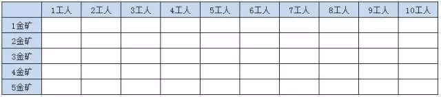
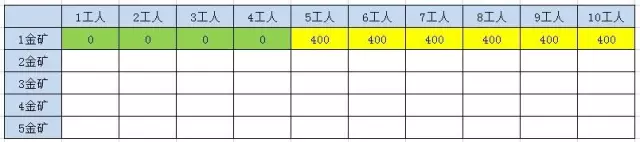
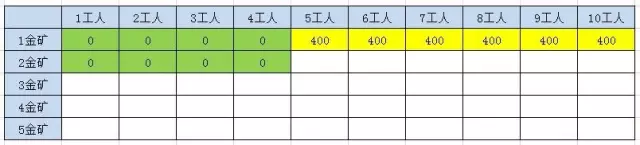
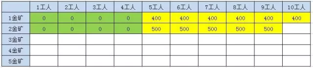
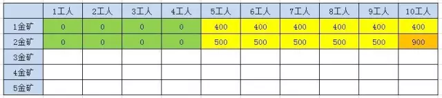
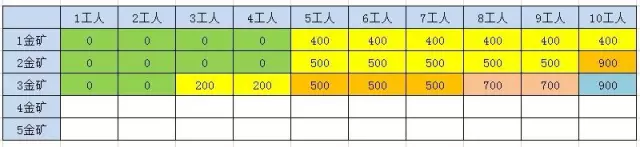
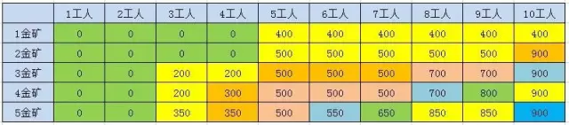

动态规划三个重要概念
* 最优子结构
* 边界条件
* 状态转移公式

## 题目：

有一个国家发现了5座金矿，每座金矿的黄金储量不同，需要参与挖掘的工人数也不同。

参与挖矿工人的总数是10人。每座金矿要么全挖，要么不挖，不能派出一半人挖取一半金矿。要求用程序求解出，要想得到尽可能多的黄金，应该选择挖取哪几座金矿？


### 方法一：排列组合

每一座金矿都有挖与不挖两种选择，如果有N座金矿，排列组合起来就有2^N种选择。对所有可能性做遍历，

排除那些使用工人数超过10的选择，在剩下的选择里找出获得金币数最多的选择。

代码比较简单就不展示了，

**时间复杂度也很明显，就是O(2^N)。**

## 动态规划求解

### 分析最优子结构

10个工人5个金矿，最优子结构有两个
* 4个金矿10个工人得最优选择（第五个金矿不挖）
* 4个金矿10-n个工人得最优选择（n为第五个金矿需要得工人数）

### 状态转移公式

5个金矿得最优选择，就是【前4座金矿10工人的挖金数量】和【前4座金矿，10-n个工人的挖金数量+第五座金矿的挖金数量】的最大值

为了方便描述，我们把金矿数量设置为N，工人数设为W，金矿的黄金设为数组G[],金矿的用工量设为数组P[].

最优选择之间的关系为：

F(5,10) = Max(F(4,10),F(4,10-P[4])+G[4])

### 边界

只有一座金矿，n=1时，只能挖这座唯一的金矿，
 * w>= p[0] 得到的黄金数量就是G[0]
 * w<  p[0] 得到的黄金数量就是0
 公式表达： 
 n=1,w>= p[0],则F(n,w)=G[0]
 n=1,w<  p[0],则F(n,w)=0
 
 ### 公式整理
 
 F(n,w) = 0    (n==1, w<p[0]);
 
 F(n,w) = g[0]     (n==1, w>=p[0]);
 
 F(n,w) = F(n-1,w)    (n>1, w<p[n-1])  
 
 F(n,w) = max(F(n-1,w),  F(n-1,w-p[n-1])+g[n-1])    (n>1, w>=p[n-1])
 
 ### 方法二：简单递归
 
 把状态转移方程式翻译成递归程序，递归的结束的条件就是方程式当中的边界。因为每个状态有两个最优子结构，所以递归的执行流程类似于一颗高度为N的二叉树。
 
 **方法的时间复杂度是O(2^N)。**
 ```
   public static int recursion(int n, int w, int[] g, int[] p) {
  
          if (n < 1) {
              return 0;
          }
          if (w <= 0) {
              return 0;
          }
  
          if (n == 1) {
              if (w < p[1]) {
                  return 0;
              } else {
                  return g[1];
              }
          }
  
          /**
           *  F(n,w) = 0    (n==1, w<p[0]);
           *
           *  F(n,w) = g[0]     (n==1, w>=p[0]);
           *
           *  F(n,w) = F(n-1,w)    (n>1, w<p[n-1])
           *
           *  F(n,w) = max(F(n-1,w),  F(n-1,w-p[n-1])+g[n-1])    (n>1, w>=p[n-1])
           */
  
          // 工人总数少于当前金矿所需工人，所以无法开采
          if (w < p[n]) {
              return recursion(n - 1, w, g, p);
          } else {
              int a = recursion(n - 1, w, g, p);
              int b = recursion(n - 1, w - p[n], g, p) + g[n];
              int num = a > b ? a : b;
              //System.out.println("n:"+n+"----w:" + w+"----num:" + num);
              return num;
          }
      }
``` 

### 方法三：备忘录算法

在简单递归的基础上增加一个HashMap备忘录，用来存储中间结果。HashMap的Key是一个包含金矿数N和工人数W的对象，Value是最优选择获得的黄金数。

方法的时间复杂度和空间复杂度相同，都等同于备忘录中不同Key的数量。
``` 
 public static int memorandum(int n, int w, int[] g, int[] p, HashMap<String, Integer> map) {
        if (n < 1) {
            return 0;
        }
        if (w <= 0) {
            return 0;
        }
        if (n == 1) {
            if (w < p[1]) {
                return 0;
            } else {
                return g[1];
            }
        }

        String key = n + "_" + w;
        if (map.containsKey(key)) {
            return map.get(key);
        } else {
            int num = 0;
            if (w < p[n]) {
                num = memorandum(n - 1, w, g, p, map);
            } else {
                int a = memorandum(n - 1, w, g, p, map);
                int b = memorandum(n - 1, w - p[n], g, p, map) + g[n];
                num = a > b ? a : b;
            }
            map.put(key, num);
            //System.out.println("key:"+key+"----num:" + num);
            return num;
        }

    }
    
``` 
### 方法四：动态归纳法



表格的第一列代表给定前1-5座金矿的情况，也就是N的取值，表格的第一行代表给定的工人数，也就是w的取值

表格中的其余空白表格，代表给定N和W值对应的黄金获得数，也就是F(N,W)。

* 只挖一个金矿，400金，5个工人，所以前四个格子都是0，因为人数不够，后面格子都是400，因为只有一座金矿



* 第二座金矿有500黄金，需要五个工人，则第二行前四个格子都是0，因为W<5,F(N,W)=F(N-1，W)=0



第二行后六个格子，因为W>5,根据F(n,w) = max(F(n-1,w),  F(n-1,w-p[n-1])+g[n-1]) 。第5-9个各组的值是500



需要主意的是第2行第10个格子，也就是N=2,W=10的时候，F(N-1,W)=400, F(N-1,W-5)=400，Max(400,400+500)=900



第3座金矿有200黄金，需要3个工人，计算方法如出一辙。



第4座金矿有300黄金，需要4个工人

第5座金矿有350黄金，需要3个工人，计算方法同上



除了第一行以外，每个格子都是前一行的一个或两个格子推导而来。

我们程序实现的时候，也可以这样从左至右，从上到下一格一格推导出最终结果。而且我们只需要存储前一行的结果，就可以推导出新得一行。

```
 public static int dynamic(int n, int w, int[] g, int[] p) {
        int[] preResults = new int[w + 1];
        int[] results = new int[w + 1];

        /**
         *   F(n,w) = 0    (n==1, w<p[0]);
         *
         *   F(n,w) = g[0]     (n==1, w>=p[0]);
         *
         *  F(n,w) = F(n-1,w)    (n>1, w<p[n-1])
         *
         *  F(n,w) = max(F(n-1,w),  F(n-1,w-p[n-1])+g[n-1])    (n>1, w>=p[n-1])
         */
        // 初始化边界条件，n=1的情况
        // n==1
        for (int j = 1; j <= w; j++) {
            // 当前工人数小于金矿所需功能
            if (j < p[1]) {
                preResults[j] = 0;
            } else {
                preResults[j] = g[1];
            }
        }

        System.out.println("init preResults:" + JSON.toJSONString(preResults));
        for (int i = 2; i <= n; i++) {
            for (int j = 1; j <= w; j++) {
                // 当前工人数小于金矿所需功能
                // i==5,p[5]=3,g[5]=350,j=6
                if (j < p[i]) {
                    results[j] = preResults[j];
                } else {
                    int num = j - p[i];
                    results[j] = Math.max(preResults[j], preResults[num] + g[i]);
                }
            }
            System.arraycopy(results, 0, preResults, 0, results.length);
            //System.out.println("preResults:" + JSON.toJSONString(preResults));
        }

        return results[w];
    }
```

方法利用两层迭代，来逐步推导出最终结果。在外层的每一次迭代，也就是对表格每一行的迭代过程中，都会保留上一行的结果数组 preResults，并循环计算当前行的结果数组results。

**时间复杂度是 O(n * w)**

**空间复杂度是O(w)**

**需要注意的是，当金矿只有5座的时候，动态规划的性能优势还没有体现出来。当金矿有10座，甚至更多的时候，动态规划就明显具备了优势。**


## 思考

如果总工人数是1000呢，每个金矿的用工数也增加，这个时候如何实现最优解

* 动态规划时间复杂度是O(n * w)，空间复杂度O(w)。在n=5,w=1000的时候，显然要计算5000次，开辟1000单位的空间。
* 简单递归的时间复杂度O(2~n),则需要计算32次。开辟5单位（递归深度）的空间。

动态规划方法的时间和空间都和W成正比，而简单递归却和W无关，所以当工人人数很多的时候，动态规划反而不如递归


