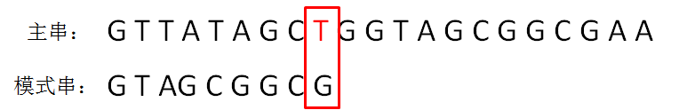
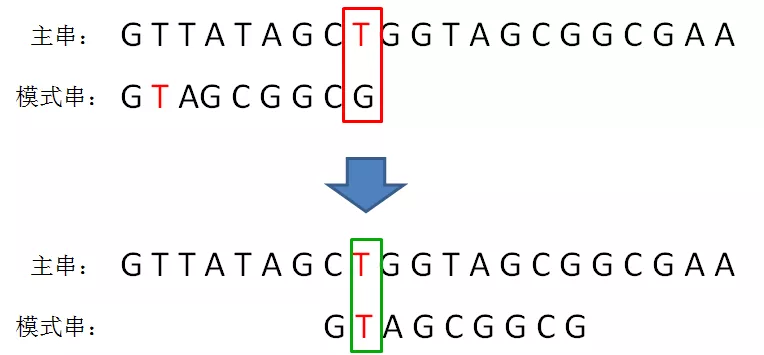
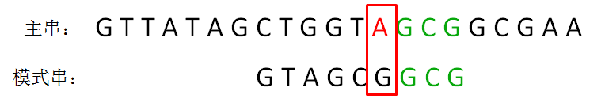
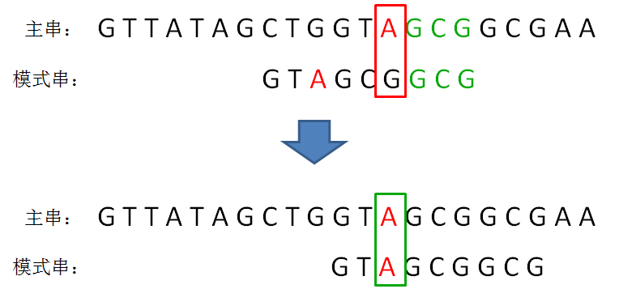
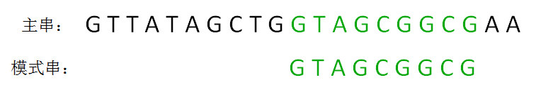
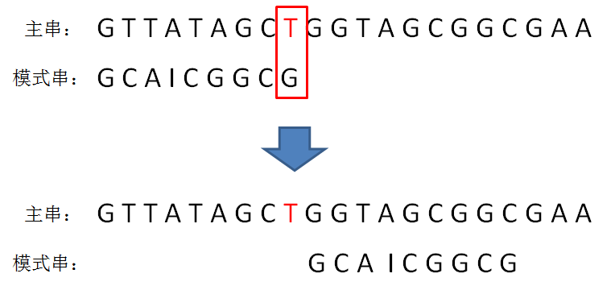

## 采用字符比较的思路，并且尽量减少无谓的比较，这就是BM算法
### 为了能减少比较，BM算法制定了两条规则
* 坏字符规则
* 好后缀规则
### 坏字符规则

“坏字符” 是什么意思？就是指模式串和子串当中不匹配的字符。

还以上面的字符串为例，当模式串和主串的第一个等长子串比较时，子串的最后一个字符T就是坏字符：

当检测到第一个坏字符之后，我们有必要让模式串一位一位向后挪动和比较吗？并不需要。

因为只有模式串与坏字符T对齐的位置也是字符T的情况下，两者才有匹配的可能。

不难发现，模式串的第1位字符也是T，这样一来我们就可以对模式串做一次“乾坤大挪移”，直接把模式串当中的字符T和主串的坏字符对齐，进行下一轮的比较：

坏字符的位置越靠右，下一轮模式串的挪动跨度就可能越长，节省的比较次数也就越多。这就是BM算法从右向左检测的好处。

接下来，我们继续逐个字符比较，发现右侧的G、C、G都是一致的，但主串当中的字符A，是又一个坏字符：

我们按照刚才的方式，找到模式串的第2位字符也是A，于是我们把模式串的字符A和主串中的坏字符对齐，进行下一轮比较：

接下来，我们继续逐个字符比较，这次发现全部字符都是匹配的，比较公正完成：

**如果坏字符再模式串中不存在，则直接把模式串挪到主串坏字符的下一位**

### 好后缀规则