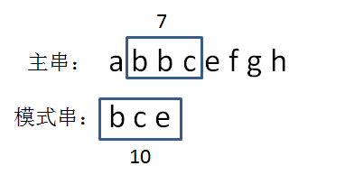

## BF算法只是简单粗暴地对两个字符串的所有字符依次比较
## PK算法比较的是两个字符串的【哈希值】

给定主串和模式串如下（假定字符串只包含26个小写字母）：

主串： a b b c e f g h 

模式串: b c e 

### 第一步，我们需要生成模式串的hashcode。

生成hashcode的算法多种多样，比如：

* 按位相加

这是最简单的方法，我们可以把a当做1，b当做2，c当做3......然后把字符串的所有字符相加，相加结果就是它的hashcode。

bce =  2 + 3 + 5 = 10

但是，这个算法虽然简单，却很可能产生hash冲突，比如bce、bec、cbe的hashcode是一样的。

* 转换成26进制数

既然字符串只包含26个小写字母，那么我们可以把每一个字符串当成一个26进制数来计算。

bce = 2*(26^2) + 3*26 + 5 = 1435

这样做的好处是大幅减少了hash冲突，缺点是计算量较大，而且有可能出现超出整型范围的情况，需要对计算结果进行取模。

为了方便演示，后续我们采用的是按位相加的hash算法，所以bce的hashcode是10：

### 第二步，生成主串当中第一个等长子串的hashcode。

由于主串通常要长于模式串，把整个主串转化成hashcode是没有意义的，只有比较主串当中和模式串等长的子串才有意义。

因此，我们首先生成主串中第一个和模式串等长的子串hashcode，

即abb = 1 + 2 + 2 = 5：

### 第三步，比较两个hashcode。

显然，5！=10，说明模式串和第一个子串不匹配，我们继续下一轮比较。

### 第四步，生成主串当中第二个等长子串的hashcode。

bbc = 2 + 2 + 3 = 7：

### 第五步，比较两个hashcode。

显然，7！=10，说明模式串和第二个子串不匹配，我们继续下一轮比较。

### 第六步，生成主串当中第三个等长子串的hashcode。

bce= 2 + 3 + 5 = 10：

### 第七步，比较两个hashcode。

显然，10 ==10，两个hash值相等！这是否说明两个字符串也相等呢？

别高兴的太早，由于存在hash冲突的可能，我们还需要进一步验证。

### 第八步，逐个字符比较两字符串。

hashcode的比较只是初步验证，之后我们还需要像BF算法那样，对两个字符串逐个字符比较，最终判断出两个字符串匹配。

### 最后得出结论，模式串bce是主串abbcefgh的子串，第一次出现的下标是2。

## hash 时间复杂度

我们没有必要把子串的字符重新进行累加运算，而是可以采用一个更简单的方法。由于新子串的前面少了一个a，后面多了一个d，所以：

新hashcode = 旧hashcode - 1 + 4 = 26-1+4 = 29 

再下一个子串bcefgde的计算也是同理：

新hashcode = 旧hashcode - 2 + 5 = 29-2+5 = 32

