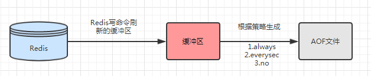

一、Redis两种持久化方式
对Redis而言，其数据是保存在内存中的，一旦机器宕机，内存中的数据会丢失，因此需要将数据异步持久化到硬盘中保存。这样，即使机器宕机，数据能从硬盘中恢复。

常见的数据持久化方式：

1.快照：类似拍照记录时光，快照是某时某刻将数据库的数据做拍照记录下其数据信息。如MYSQL的Dump，Redis的RDB模式

2.写日志方式：是将数据的操作全部写到日志当中，需要恢复的时候，按照日志记录的操作记录重新再执行一遍。例如MYSQL的Binlog，Redis的AOF模式、

二、RDB
说明：
redis默认开启，将redis在内存中保存的数据，以快照的方式持久化到硬盘中保存。

触发机制：
1.save命令：阻塞方式，需要等redis执行完save后，才能执行其他get、set等操作。同步方式

2.bgsave命令：非阻塞，其原理是调用linux 的  fork()函数，创建redis的子进程，子进程进行创建  rdb 文件的操作。异步方式，

3.自动方式：在redis.conf文件中配置，如下  save  <指定时间间隔>  <执行指定次数更新操作>  ，save  60  10000 表示 60秒年内有10000次操作会自动生成rdb文件。

```
# Save the DB on disk:
#
#   save <seconds> <changes>
#
#   Will save the DB if both the given number of seconds and the given
#   number of write operations against the DB occurred.
#
#   In the example below the behaviour will be to save:
#   after 900 sec (15 min) if at least 1 key changed
#   after 300 sec (5 min) if at least 10 keys changed
#   after 60 sec if at least 10000 keys changed
#
#   Note: you can disable saving at all commenting all the "save" lines.
#
#   It is also possible to remove all the previously configured save
#   points by adding a save directive with a single empty string argument
#   like in the following example:
#
#   save ""

save 900 1
save 300 10
save 60 10000
```
4.其他方式

4.1  执行flushall命令，清空数据，几乎不用
4.2  执行shutdown命令，安全关闭redis不丢失数据，几乎用不到。
4.3  主从复制，在主从复制的时候，rdb文件作为媒介来关联主节点和从节点的数据一致。
最佳配置参考：
vim redis.conf
```
# 1. 将自动生成rdb文件注释掉
# save 900 1
# save 300 10
# save 60 10000

# The filename where to dump the DB
# 2. rdb的文件名，改为dump+ 端口.rbd
dbfilename dump-${port}.rdb


# Note that you must specify a directory here, not a file name.
# 3. 文件持久化目录，日志目录，改到分布式存储中或者放到较大的硬盘目录中。
dir /yourbigdata/

# 4. 在bgsave发生错误时停止写入
stop-writes-on-bgsave-error yes

# 5.采用压缩方式，不然生成的rdb文件可能巨大无比。压缩后主从复制拷贝文件小，速度也快。
rdbcompression yes

# 6.采用校验和
rdbchecksum yes
```
RDB优缺点
优点：
1 适合大规模的数据恢复。
2 如果业务对数据完整性和一致性要求不高，RDB是很好的选择。

缺点：
1 不可控，容易丢失数据：数据的完整性和一致性不高，因为RDB可能在最后一次备份时宕机了。
2 耗时耗性能：备份时占用内存，因为Redis 在备份时会独立创建一个子进程，将数据写入到一个临时文件（此时内存中的数据是原来的两倍哦），最后再将临时文件替换之前的备份文件。
所以Redis 的持久化和数据的恢复要选择在夜深人静的时候执行是比较合理的。

三、AOF
说明：
 redis默认不开启，采用日志的形式来记录每个写操作，并追加到 .aof 文件中。Redis 重启的会根据日志文件的内容将写指令从前到后执行一次以完成数据的恢复工作

生成AOF的三种策略：



1. always : 每条命令都会刷新到缓冲区，把缓冲区fsync到硬盘，对硬盘IO压力大，一般sata盘只有几百TPS，如果redis的写入量非常大，那对硬盘的压力也横刀。

2. everysec:  每秒把缓冲区fsync 到硬盘，如果出现故障，会丢失1s（默认配置是1秒）的数据。一般使用这种。

3. no : 由操作系统来定什么时候fsync到硬盘中。 缺点：不可控

AOF重写：
把过期的，没有用的，重复的，可优化的命令简化为很小的aof文件。实际上是redis内存中的数据回溯成aof文件。

如下图所示：


作用：

1.减少硬盘占用量

2.加快恢复速度

 

AOF重写的实现方式
1.bgrewriteaof   命令 ： 从redis的主进程fork一个子进程生成包含当前redis内存数据的最小命令集、

2.AOF重写配置：

# 1. aof文件增长率
auto-aof-rewrite-percentage 100

# 2. aof文件重写需要的尺寸
auto-aof-rewrite-min-size 64mb
自动触发时机：（需要同时满足）

当前的aof文件大小   >   aof文件重写需要的尺寸        
（aof当前文件大小 -  上次aof的文件大小）/  上次aof文件大小  >  aof文件增长率 
最佳配置参考：
vim redis.conf
```
# 1. 打开aof功能
appendonly yes

# 2. 重命名aof文件名,以端口号区分
appendfilename "appendonly-${port}.aof"

# 3. 使用everysec策略
appendfsync everysec
# 4. 文件持久化目录，日志目录，改到分布式存储中或者放到较大的硬盘目录中。
dir /yourbigdata/
# 5. 在aof重写的时候，不做aof的append（追加）操作，这里出于性能考虑
no-appendfsync-on-rewrite yes
复制代码
```
优点：

1.数据的完整性和一致性更高

缺点：

1.因为AOF记录的内容多，文件会越来越大，数据恢复也会越来越慢。

2. AOF每秒fsync一次指令硬盘，如果硬盘IO慢，会阻塞父进程；风险是会丢失1秒多的数据；在Rewrite过程中，主进程把指令存到mem-buffer中，最后写盘时会阻塞主进程。

四、关于Redis持久化方式RDB和AOF的缺点
原因是redis持久化方式的痛点，缺点比较明显。

1、RDB需要定时持久化，风险是可能会丢两次持久之间的数据，量可能很大。

2、AOF每秒fsync一次指令硬盘，如果硬盘IO慢，会阻塞父进程；风险是会丢失1秒多的数据；在Rewrite过程中，主进程把指令存到mem-buffer中，最后写盘时会阻塞主进程。

3、这两个缺点是个很大的痛点。为了解决这些痛点，GitHub的两位工程师 Bryana Knight 和 Miguel Fernández 日前写了一篇 文章 ，讲述了将持久数据从Redis迁出的经验：

 http://www.open-open.com/lib/view/open1487736984424.html

五、如何选择RDB和AOF
建议全都要。

1、对于我们应该选择RDB还是AOF，官方的建议是两个同时使用。这样可以提供更可靠的持久化方案。

在redis 4.0 之后，官方提供了混合持久化模式，具体如下

持久化文件结构

上半段RDB格式，后半段是AOF模式。

如何配置
vim redis.conf

aof-use-rdb-preamble yes   
之后重启redis，运行bgrewriteaof命令，重写appendonly.aof，之后在Redis数据同步的时候，可以先加载rdb的内容，然后再执行aof指令部分使Redis数据同步

数据恢复过程
加载AOF文件的入口为loadAppendOnlyFile，代码如下

```
int loadAppendOnlyFile(char *filename) {
    ...
    /* Check if this AOF file has an RDB preamble. In that case we need to
     * load the RDB file and later continue loading the AOF tail. */
    char sig[5]; /* "REDIS" */
    if (fread(sig,1,5,fp) != 5 || memcmp(sig,"REDIS",5) != 0) {
        /* No RDB preamble, seek back at 0 offset. */
        if (fseek(fp,0,SEEK_SET) == -1) goto readerr;
    } else {
        /* RDB preamble. Pass loading the RDB functions. */
        rio rdb;

        serverLog(LL_NOTICE,"Reading RDB preamble from AOF file...");
        if (fseek(fp,0,SEEK_SET) == -1) goto readerr;
        rioInitWithFile(&rdb,fp);
        if (rdbLoadRio(&rdb,NULL) != C_OK) {
            serverLog(LL_WARNING,"Error reading the RDB preamble of the AOF file, AOF loading aborted");
            goto readerr;
        } else {
            serverLog(LL_NOTICE,"Reading the remaining AOF tail...");
        }
    }
    ...
}
```
1.打开AOF文件之后首先读取5个字符如果是"REDIS" ，那么就说明这是一个混合持久化的AOF文件，执行rdbLoadRio() 函数，解析RDB格式，解析文件内容直至遇到RDB_OPCODE_EOF结束。

2. 执行 loadAppendOnlyFile()  函数，解析 AOF格式，直到结束整个加载过程完成。

说明：正确的RDB格式一定是以"REDIS"开头而纯AOF格式则一定以"*"开头此时就会进入rdbLoadRio函数来加载数据。

这样就实现了混合持久化，加载aof文件时候，实现了数据文件不太大，而且能保证数据不丢失，加载效率比纯aof文件高。