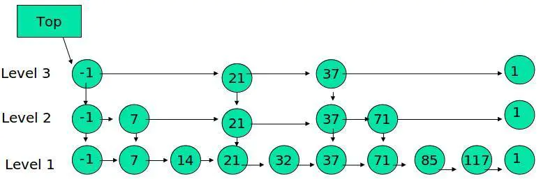

# 一、String
## 1.1.数据结构
```
struct sdshdr{

int len;//字符串长度

int free;//空闲字符串长度

char buf[];//字符串数组

}
```
注：数组大小=len+free+1（字符的‘\0’休止符）

## 1.2.空间分配策略
修改字符串引起内存重分配，消耗资源，所以引入优化策略：空间预分配、惰性空间释放。

1）空间预分配

如果len<1MB，分配空间=len*2+1,即free=len;

如果len>=1MB，分配空间=len + 1MB +1,即free=1MB.

惰性空间释放
释放不回收，减少内存重分配。需要的时候可以调用api真正回收。

## 1.3.SDS、C字符串对比
### 1.3.1.SDS好处
* 获取字符串长度时间复杂度
SDS获取字符串长度时间复杂度为O(1)；c字符串为O(n)。
* 字符串扩容安全
SDS动态扩容，不会发生缓冲区溢出；c字符串执行strcat(s,"test");时，如果忘记给s分配足够的空间，会导致溢出。
* 二进制安全（数据写入的格式和读取的格式一致）
# 二、链表->双向链表
## 2.1.数据结构
### 2.1.1 节点结构
```
struct listNode{

struct listNode *prev;

struct listNode *next;

void *value;

}listNode;
```
### 2.1.2 数据结构
```
struct list{

listNode *head;

listNode *tail;

unsigned long len;//链表长度

void *(*dup)(void *ptr);//节点值复制函数

void *(*free)(void *ptr);//节点值释放函数

int *(*match)(void *ptr,void *key);//节点值对比函数

}list;
```
## 2.2.特性
* 双端
* 无环
* 带表头指针和表尾指针
* 有链表长度
* 多态
* 链表节点使用*void指针来保存节点值，可以通过list结构的dup、free、match三个属性为节点值设置类型特定函数，所以链表可以用于保存各种不同类型的值。
# 三、字典——哈希
## 3.1.数据结构
### 3.1.1. 哈希表
```
struct dictht{

dictEntry **table;//哈希表数组

unsigned long size;//哈希表大小

//哈希表大小掩码，用于计算索引值

//总是等于size-1

unsigned long sizemask;

unsigned long used;//该哈希表已有节点数

}dictht;
```
### 3.1.2.哈希表节点
```
struct dictEntry{

void * key;//键

//值

union{

void *val;

uint64_t u64;

int64_t s64;

}v;

//指向下一个哈希表节点，形成链表

struct dictEntry *next;

}dictEntry;
```
### 3.1.3. 字典
```
struct dict{

dicType *type;//类型特定函数

void *privdata;//私有数据

dictht ht[2];//哈希表

//rehash索引

//当rehash不复制拷贝时，值为-1

int rehashidx;

}dict;
```
## 3.2.哈希算法（Murmurhash算法）
redis计算哈希值和索引值的方法如下：

* 使用字典设置的哈希函数，计算键key的哈希值
hash = dict->type->hashFunction(key);
* 使用哈希表的sizemark属性和哈希值，计算出索引值，依据情况不同，ht[x]可以是ht[0]或者ht[1]
index = hash & dict->ht[x].sizemask;（sizemask为size-1）。
## 3.3.解决冲突
链地址法来解决冲突。
## 3.4.rehash扩容／收缩
### 3.4.1.rehash步骤
* 为字典ht[1]分配空间。
空间分配：
a.扩容时，ht[1]的大小为第一个大于等于ht[0].used*2的2的n次方。
b.收缩时，ht[1]的大小为第一个大于等于ht[0].used的2的n次方（2为负值）。

* rehashidxs设置成0，将ht[0]的值往ht[1]复制。每个节点复制完成后置为NULL。

* 迁移完成后，释放ht[0]，将ht[1]设置成ht[0]，并创建新的ht[1]。
```
注：rehash过程中，如果发生插入操作，则直接插入ht[1]；
如果发生查找和更新操作，查ht[0]和ht[1]。
```
## 3.4.扩容的条件(为了节约内存)
* 没有执行BGSAVE或者BGREWRITEAOF命令，并且哈希表负载因子大于等于1

* 执行BGSAVE或者BGREWRITEAOF命令，并且哈希表负载因子大于等于5

负载因子 = ht[0].used / ht[0].size

# 四、跳跃表
## 4.1.算法
采用抛硬币的方式决定数字在第几层出现。



跳表具有如下性质：

* 由很多层结构组成

* 每一层都是一个有序的链表

* 最底层(Level 1)的链表包含所有元素

* 如果一个元素出现在 Level i 的链表中，则它在 Level i 之下的链表也都会出现。

* 每个节点包含两个指针，一个指向同一链表中的下一个元素，一个指向下面一层的元素。

* 层高都是1至32之间的随机数；

* 排序都是以score排序，如果score相等，以对象sds *obj的ASCII码从小到大排列；

* 分值可以相同，对象不能相同。

## 4.2.数据结构
### 4.2.1.跳跃表节点
```
/** * ZSETs use a specialized version of Skiplists * 跳跃表中的数据节点 */ 
typedef struct zskiplistNode {
//对象 
sds *obj;

//分值 
double score; 
// 后退指针 
struct zskiplistNode *backward; 
// 层 
struct zskiplistLevel { 
// 前进指针 
struct zskiplistNode *forward; 
/** * 跨度实际上是用来计算元素排名(rank)的， * 在查找某个节点的过程中，将沿途访过的所有层的跨度累积起来， * 得到的结果就是目标节点在跳跃表中的排位 */ 
unsigned long span; 
} level[]; 
} zskiplistNode;
```
### 4.2.2.跳跃表
```
/** * 跳跃表结构体 */ 
typedef struct zskiplist { 
struct zskiplistNode *header, *tail;

//表中节点数量 
unsigned long length;

//表中层数最大的节点层数 
int level; 
} zskiplist;
```
# 五、整数集合
## 5.1.数据结构
```
struct intset{

//编码方式

uint32_t encoding;

//集合包含的元素数量

uint32_t length;

//保存元素的数组

uint8_t contents[];

}intset;
```
注：contents元素类型 依靠encoding决定；

## 5.2.升级
### 5.2.1.升级场景
往uint32_t contents[]数组插入uint64_t的元素时，数组所有元素升级到uint64_t。

升级时，插入的元素必然大于所有元素或者小于所有元素。

注：不支持降级。

### 5.2.2.升级的好处
* 提高灵活性，contents[]可以有uint32_t、uint64_t多种类型

* 节约内存

# 六、压缩列表
## 6.1.数据结构
压缩列表
zlbytes记录整个压缩列表占用的内存字节数,在对压缩列表进行内存重分配或计算zlend的位置时使用。zltail记录压缩列表尾节点距离压缩列表的起始地址有多少字节,通过这个偏移量,可以直接确定尾节点的位置。zllen记录压缩列表包含的节点数量,entryX表示各种节点,数量和长度不一定。zlend用于标记压缩列表的末端。
如图,如果有一个指针p指向该压缩列表,则尾巴节点的长度就是指针加上偏移量179(十六进制0xb3=16*11+3=179),列表的长度zllen为5,表示压缩列表包含5个节点。zlbytes为0xd2表示压缩列表的总长为210字节。

压缩列表的计算
由上可知,每个压缩列表的节点可以保存一个字节数组或者一个整数值,那么每个节点肯定也有自己的结构。

6.2.压缩列表节点的构成
每个压缩列表节点可以保存一个字节数组或者一个整数值，其中字节数组可以是以下三种长度的其中一种

长度小于等于63（2的6次方-1）字节的字节数组

长度小于等于16383（2的14次方-1）字节的字节数组

长度小于等于4294967295（2的32次方-1）字节的字节数组

数值则可以是以下六种长度的其中一种

4位长介于0至12之间的无符号整数

1字节长的有符号整数

3字节长的有符号整数

int16类型整数

int32类型整数

int64类型整数

6.3.压缩列表节点的数据结构
压缩列表节点
6.3.1.previous_entry_length 属性
previous_entry_length 属性以字节为单位,记录了压缩列表中前一个节点的长度,previous_entry_length属性的长度可以是1字节或者5字节。

如果前一节点的长度小于254字节那么previous_entry_length属性的长度为1字节
如果前一节点的长度大于等于254字节previous_entry_length属性的长度为5字节
根据当前节点的地址和previous_entry_length的值来计算出前一个节点的地址

压缩列表的从表尾向表头遍历操作就是使用这一原理实现的，只要我们拥有了一个指向某个节点起始地址的指针，那么通过这个指针以及这个节点的previous_entry_length属性

程序就可以一直向前一个节点回溯，最终到达压缩列表的表头节点。

6.3.2.节点encoding编码
节点encoding属性记录了节点的content属性所保存数据的类型以及长度。

一字节、两字节或者五字节长，值的最高位为00 、01、或者10的是字节数组编码。
这种编码表示节点的content属性保存着字节数组，数组的长度有编码除去最高两位之后的其他位记录。

一字节长 值的最高位以11开头的是整数编码。
这种编码表示节点的content属性保存着整数值，整数值的类型和长度有编码除去最高两位之后的其他位记录。

6.3.3 节点的content属性
节点的content属性负责保存节点的值，节点值可以是一个字节数组或者整数。值的类型和长度由encoding决定。

6.4. 连锁更新
每个节点的previous_entry_length都记录了前一个节点的长度。

如果前一个字节的长度小于254，那么previous_entry_length需要用1字节来保存这个长度值。
如果前一个字节的长度大于等于254，那么previous_entry_length需要用5字节来保存这个长度值。
现在假设这种情况:压缩列表有多个连续的长度介于250-253之间的节点e1-eN。因为每个节点的长度都小于254字节，所以这些节点的previous_entry_length属性都是1字节长度。此时如果将一个长度大于254的新节点设置为压缩列表的头节点，那么这个新节点成为头节点，也就是e1节点的前置节点。此时将e1的previous_entry_length扩展为5字节长度,此时e1又超过了254，于是e2的previous_entry_length也超过了254··· .此时这些节点就会连锁式的更新，并重新分配空间。

除了新增加的节点会引发连锁更新之外，删除也会。假设中间有一个小于250的删除了，也会连锁更新。同上面所说的类似。

连锁更新在最坏的情况下需要对压缩列表执行N次空间重分配操作。每次空间重分配的最坏复杂度为O(N),所以连锁更新的最坏复杂度为O(N^2)。

虽然这很耗费时间，但是实际情况下这种发生的概率非常低的。对很少一部分节点进行连锁更新绝对不会影响性能的。

七、quicklist
压缩列表是redis3.2之前为了节约内存开发的顺序性数据结构，它被用作列表键和哈希键的底层实现之一，压缩列表可以包含多个节点，每个节点保存一个字节数组或者整数值，在添加和删除的时候，可能会引发连锁更新操作，但是这种操作出现的频率不高。

7.1 简介
如果使用的redis3.2版本以上的,那么就会发现在程序中quicklist基本取代了ziplist。既然取代肯定意味着有功能上有优化并且对程序更加友好。其实Redis对外暴露的list的数据结构的底层实现就是quicklist。先回忆下list这种数据结构的特点:

list两端的增加和删除很方便,时间复杂度为O(1)
list是一个双向链表
list可以在中间的任意位置插入,时间复杂度为O(N)
list可以被用来作为队列,因为它上面的特性
而quicklist是一个ziplist的双向链表(双向链表是由多个节点Node组成的,这里上面有介绍)。也就是说quicklist的每个节点都是一个ziplist。ziplist本身也记录了数据节点的顺序，而且在内存中的位置是相邻的。

7.1.1 quicklist与ziplist对比
ziplist特点：

压缩列表ziplist结构本身就是一个连续的内存块，由表头、若干个entry节点和压缩列表尾部标识符zlend组成，通过一系列编码规则，提高内存的利用率，使用于存储整数和短字符串。
压缩列表ziplist结构的缺点是：每次插入或删除一个元素时，都需要进行频繁的调用realloc()函数进行内存的扩展或减小，然后进行数据”搬移”，甚至可能引发连锁更新，造成严重效率的损失。
quicklist的特点：

quicklist宏观上是一个双向链表，因此，它具有一个双向链表的有点，进行插入或删除操作时非常方便，虽然复杂度为O(n)，但是不需要内存的复制，提高了效率，而且访问两端元素复杂度为O(1)。
quicklist微观上是一片片entry节点，每一片entry节点内存连续且顺序存储，可以通过二分查找以 log2(n)的复杂度进行定位。
7.1.2 ziplist 与linkedlist缺陷
linkedlist便于在表的两端进行push和pop操作，但是它的内存开销较大。

首先，它的每个节点除了要保存数据之外还要额外保存两个指针；

其次，双向链表的各个节点是单独的内存块，地址不连续，容易产生内存碎片，还容易造成抖动。

ziplist由于是一整块连续的内存，存储效率很高，但不利于添加和删除操作，每次都会重新realloc，尤其是当ziplist很长的时候，一次realloc造成的开销特别的大，查询的开销也特别的大。

在redis 3.2之前 一般的链表采用LINKEDLIST编码。

在redis 3.2版本开始，所有的链表都采用QUICKLIST编码。

两者都是使用基本的双端链表数据结构，
区别是QUICKLIST每个结点的值都是使用ZIPLIST进行存储的。
7.2 quicklist的结构
上面提到过,quicklist是由ziplist组成的双向链表,链表中的每个节点都以压缩列表ziplist的结构保存着数据,而ziplist有多个entry节点保存多个数据。相当于在一个quicklist节点中保存的是一整片数据,而不是一个单独的数据。

//真正表示quicklist的数据结构
typedef struct quicklist {
    // 指向头节点的指针（最左边）
    quicklistNode *head;
    // 指向尾节点的指针(最右边)
    quicklistNode *tail;
    // 所有ziplist数据项的个数总和
    unsigned long count;       
    // quicklist节点的个数
    unsigned int len;           
    // ziplist大小设置
    int fill : 16;              
    // 节点压缩深度设置
    unsigned int compress : 16;
} quicklist;

typedef struct quicklistNode {
    //前驱节点
    struct quicklistNode *prev;
    //后继节点
    struct quicklistNode *next;
    //数据指针,如果当前节点的数据没有压缩,它就指向一个ziplist结构,否则指向quicklistLZF结构
    unsigned char *zl;
    // 表示zl指向的ziplist的总大小,如果ziplist被压缩了,它的值仍然是压缩前的大小
    unsigned int sz;            
    // 表示ziplist里面包含的数据项个数,这个字段16bit
    unsigned int count : 16;    
    // 表示ziplist是否压缩了,1代表没有压缩  2代表使用LZF压缩
    unsigned int encoding : 2;  
    // 预留字段,固定值2,表示使用ziplist作为数据容器
    unsigned int container : 2; 
    // 此节点之前是否已经压缩过
    unsigned int recompress : 1; 
    // 测试用的,暂时用不上
    unsigned int attempted_compress : 1; 
    // 扩展字段,暂时无用
    unsigned int extra : 10;
} quicklistNode;

// 此结构表示一个被压缩过的ziplist
typedef struct quicklistLZF {
    // 压缩后的ziplist大小
    unsigned int sz;
    // 存放压缩后的ziplist字节数组
    char compressed[];
} quicklistLZF;

源码看了一遍,参照上面的表述,基本可得图下图的quicklist的数据结构.

quicklist
7.2 创建quicklist及其节点
quicklist *quicklistCreate(void) {
    struct quicklist *quicklist;  
    // 为quicklist分配内存
    quicklist = zmalloc(sizeof(*quicklist)); 
    // 初始条件下,头和尾都是null
    quicklist->head = quicklist->tail = NULL;
    // quicklist初始长度0
    quicklist->len = 0;  // 设定长度
    // 数据项的总和,初始也是0
    quicklist->count = 0;
    // 压缩深度
    quicklist->compress = 0;
    // 设定ziplist大小限定
    quicklist->fill = -2;  
    return quicklist;
}

7.3 quicklist查找迭代器实现
现在基本已经知道了quicklist的基本结构,Redis为这个结构特意实现了一个迭代器,看下源码.

//quicklist的迭代器
typedef struct quicklistIter {
    //指向所属的quicklist的指针
    const quicklist *quicklist;
    // 当前quicklistNode节点
    quicklistNode *current;
    // 当前quicklist节点中的ziplist
    unsigned char *zi;
    // 当前ziplist结构中的偏移量,这个用处前面有介绍过,通过这个值和zllen可以得出ziplist的尾节点
    long offset;  
    // 迭代的方向标识前序还是后序,因为是双向列表
    int direction;           
} quicklistIter;

7.4 PUSH操作
push一个entry到quicklist的头节点或尾节点中的ziplist的头部或尾部。底层调用了ziplistPush操作。具体push过程如下代码:

//返回0可能插在尾节点或者中间的某个位置
//返回1代表节点插入在头部,插入的节点就是头节点
int quicklistPushHead(quicklist *quicklist, void *value, size_t sz) {
    //暂存头结点的地址
    quicklistNode *orig_head = quicklist->head; 
    //判断ziplist允许插入entry节点
    if (likely(
            _quicklistNodeAllowInsert(quicklist->head, quicklist->fill, sz))) {
        quicklist->head->zl =
            ziplistPush(quicklist->head->zl, value, sz, ZIPLIST_HEAD);  
        //将节点push到头部并更新quicklistNode记录ziplist大小的属性sz
        quicklistNodeUpdateSz(quicklist->head); 
    } else {        
        //如果不允许插入entry节点到ziplist就新创建一个节点
        quicklistNode *node = quicklistCreateNode(); 
        //将entry节点push到新创建的quicklistNode节点中
        node->zl = ziplistPush(ziplistNew(), value, sz, ZIPLIST_HEAD);
        //更新sz并把新穿件的节点插入到头节点的位置
        quicklistNodeUpdateSz(node);    
        _quicklistInsertNodeBefore(quicklist, quicklist->head, node);   
    }
    quicklist->count++;                     
    quicklist->head->count++;  
    // 判断整个更新过程中头节点是否变化,没有变化返回0,变化返回1
    return (orig_head != quicklist->head);  
}

/* Add new entry to tail node of quicklist.
 * push到尾节点,返回0表示尾节点指针没有改变,返回1表示改变了
 * Returns 0 if used existing tail.
 * Returns 1 if new tail created. 
 */
int quicklistPushTail(quicklist *quicklist, void *value, size_t sz) {
    quicklistNode *orig_tail = quicklist->tail;
    if (likely(
            _quicklistNodeAllowInsert(quicklist->tail, quicklist->fill, sz))) {
        quicklist->tail->zl =
            ziplistPush(quicklist->tail->zl, value, sz, ZIPLIST_TAIL);  
        //push到尾部,更新sz
        quicklistNodeUpdateSz(quicklist->tail); 
    } else {
        quicklistNode *node = quicklistCreateNode();
        //新建一个quicklistNode,将entry节点push到新创建的quicklistNode节点中
        node->zl = ziplistPush(ziplistNew(), value, sz, ZIPLIST_TAIL);
        quicklistNodeUpdateSz(node);
        //将刚刚新创建的节点插入到尾节点后
        _quicklistInsertNodeAfter(quicklist, quicklist->tail, node);
    }
    quicklist->count++;
    quicklist->tail->count++;
    return (orig_tail != quicklist->tail); 
}

7.5 POP
从quicklist的头节点或尾节点的ziplist中pop出一个entry，分2种情况,主要看entry保存的是字符串还是整数。如果字符串的话，需要传入一个函数指针，这个函数叫_quicklistSaver()，真正的pop操作还是在这两个函数基础上在封装了一次，来操作拷贝字符串的操作。如下：

//从quicklist的头节点或尾节点pop弹出出一个entry，并将value保存在传入传出参数
//返回0表示没有可pop出的entry
//返回1表示pop出了entry，存在data或sval中
int quicklistPopCustom(quicklist *quicklist, int where, unsigned char **data,
                       unsigned int *sz, long long *sval,
                       void *(*saver)(unsigned char *data, unsigned int sz)) {
    unsigned char *p;
    unsigned char *vstr;
    unsigned int vlen;
    long long vlong;
    int pos = (where == QUICKLIST_HEAD) ? 0 : -1;   //位置下标

    if (quicklist->count == 0)  //entry数量为0，弹出失败
        return 0;

    //初始化
    if (data)
        *data = NULL;
    if (sz)
        *sz = 0;
    if (sval)
        *sval = -123456789;

    quicklistNode *node;
    //记录quicklist的头quicklistNode节点或尾quicklistNode节点
    if (where == QUICKLIST_HEAD && quicklist->head) {
        node = quicklist->head;
    } else if (where == QUICKLIST_TAIL && quicklist->tail) {
        node = quicklist->tail;
    } else {
        return 0;           //只能从头或尾弹出
    }

    p = ziplistIndex(node->zl, pos);    //获得当前pos的entry地址
    if (ziplistGet(p, &vstr, &vlen, &vlong)) {  //将entry信息读入到参数中
        if (vstr) {     //entry中是字符串值
            if (data)
                *data = saver(vstr, vlen);  //调用特定的函数将字符串值保存到*data
            if (sz)
                *sz = vlen;                 //保存字符串长度
        } else {        //整数值
            if (data)
                *data = NULL;
            if (sval)
                *sval = vlong;  //将整数值保存在*sval中
        }
        quicklistDelIndex(quicklist, node, &p); //将该entry从ziplist中删除
        return 1;
    }
    return 0;
}

/* Return a malloc'd copy of data passed in */
//将data内容拷贝一份并返回地址
REDIS_STATIC void *_quicklistSaver(unsigned char *data, unsigned int sz) {
    unsigned char *vstr;
    if (data) {
        vstr = zmalloc(sz);     //分配空间
        memcpy(vstr, data, sz); //拷贝
        return vstr;
    }
    return NULL;
}