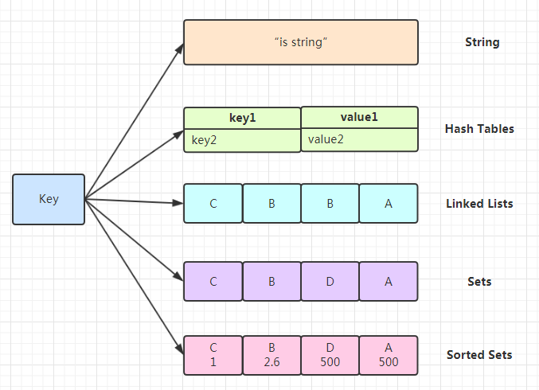
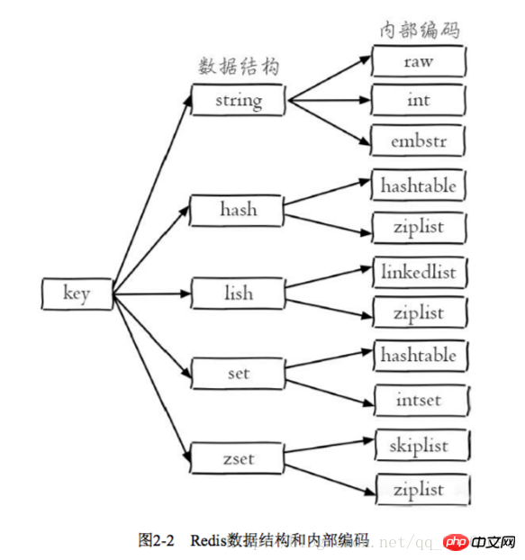
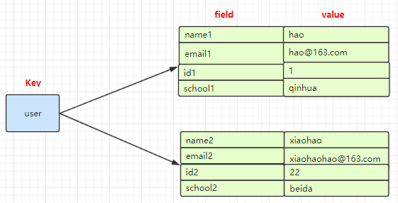
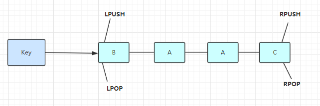
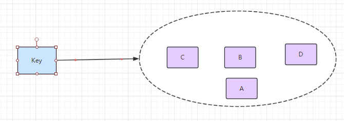
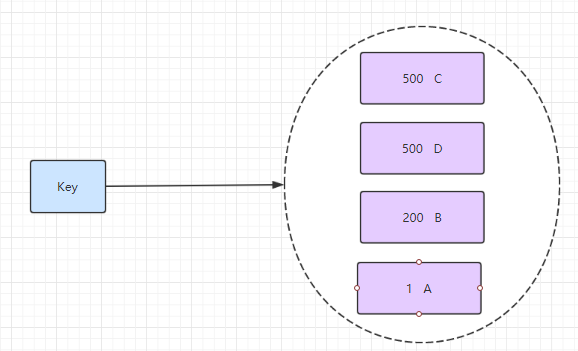

# Redis五种数据结构如下：





对redis来说，所有的key（键）都是字符串。

## 1.String 字符串类型
### 1.1.数据结构
```
struct sdshdr{

int len;//字符串长度

int free;//空闲字符串长度

char buf[];//字符串数组

}
```
注：数组大小=len+free+1（字符的‘\0’休止符）

### 1.2.空间分配策略

修改字符串引起内存重分配，消耗资源，所以引入优化策略：空间预分配、惰性空间释放。

* 1.空间预分配

如果len<1MB，分配空间=len*2+1,即free=len;

如果len>=1MB，分配空间=len + 1MB +1,即free=1MB.

* 2.惰性空间释放

释放不回收，减少内存重分配。需要的时候可以调用api真正回收。

### 1.3.SDS、C字符串对比

* 获取字符串长度时间复杂度
   SDS获取字符串长度时间复杂度为O(1)；c字符串为O(n)。
* 字符串扩容安全
SDS动态扩容，不会发生缓冲区溢出；c字符串执行strcat(s,"test");时，如果忘记给s分配足够的空间，会导致溢出。
* 二进制安全（数据写入的格式和读取的格式一致）

是redis中最基本的数据类型，一个key对应一个value。

String类型是二进制安全的，意思是 redis 的 string 可以包含任何数据。如数字，字符串，jpg图片或者序列化的对象。

使用：get 、 set 、 del 、 incr、 decr 等

```
127.0.0.1:6379> set hello world
OK
127.0.0.1:6379> get hello
"world"
127.0.0.1:6379> del hello
(integer) 1
127.0.0.1:6379> get hello
(nil)
127.0.0.1:6379> get counter
"2"
127.0.0.1:6379> incr counter
(integer) 3
127.0.0.1:6379> get counter
"3"
127.0.0.1:6379> incrby counter 100
(integer) 103
127.0.0.1:6379> get counter
"103"
127.0.0.1:6379> decr counter
(integer) 102
127.0.0.1:6379> get counter
"102"
```
实战场景：

1.缓存： 经典使用场景，把常用信息，字符串，图片或者视频等信息放到redis中，redis作为缓存层，mysql做持久化层，降低mysql的读写压力。

2.计数器：redis是单线程模型，一个命令执行完才会执行下一个，同时数据可以一步落地到其他的数据源。

3.session：常见方案spring session + redis实现session共享，

## 2.Hash （哈希）

### 2.1.数据结构
#### 2.1.1. 哈希表
```
struct dictht{

dictEntry **table;//哈希表数组

unsigned long size;//哈希表大小

//哈希表大小掩码，用于计算索引值

//总是等于size-1

unsigned long sizemask;

unsigned long used;//该哈希表已有节点数

}dictht;
```

#### 2.1.2.哈希表节点
```
struct dictEntry{

void * key;//键

//值

union{

void *val;

uint64_t u64;

int64_t s64;

}v;

//指向下一个哈希表节点，形成链表

struct dictEntry *next;

}dictEntry;
```
#### 2.1.3.字典
```
struct dict{

dicType *type;//类型特定函数

void *privdata;//私有数据

dictht ht[2];//哈希表

//rehash索引

//当rehash不复制拷贝时，值为-1

int rehashidx;

}dict;
```
### 2.2.哈希算法（Murmurhash算法）
redis计算哈希值和索引值的方法如下：

* 使用字典设置的哈希函数，计算键key的哈希值
hash = dict->type->hashFunction(key);
*  使用哈希表的sizemark属性和哈希值，计算出索引值，依据情况不同，ht[x]可以是ht[0]或者ht[1]
index = hash & dict->ht[x].sizemask;（sizemask为size-1）。

### 2.3.解决冲突
链地址法来解决冲突。

###  2.4.rehash扩容／收缩
####  3.4.1.rehash步骤
* 为字典ht[1]分配空间。
空间分配：
a.扩容时，ht[1]的大小为第一个大于等于ht[0].used*2的2的n次方。
b.收缩时，ht[1]的大小为第一个大于等于ht[0].used的2的n次方（2为负值）。

* rehashidxs设置成0，将ht[0]的值往ht[1]复制。每个节点复制完成后置为NULL。

* 迁移完成后，释放ht[0]，将ht[1]设置成ht[0]，并创建新的ht[1]。

注：rehash过程中，如果发生插入操作，则直接插入ht[1]；
如果发生查找和更新操作，查ht[0]和ht[1]。
### 2.4.扩容的条件(为了节约内存)
1）没有执行BGSAVE或者BGREWRITEAOF命令，并且哈希表负载因子大于等于1

2）执行BGSAVE或者BGREWRITEAOF命令，并且哈希表负载因子大于等于5

负载因子 = ht[0].used / ht[0].size

是一个Mapmap，指值本身又是一种键值对结构，如 value={{field1,value1},......fieldN,valueN}}



使用：所有hash的命令都是  h   开头的     hget  、hset 、  hdel 等

```
127.0.0.1:6379> hset user name1 hao
(integer) 1
127.0.0.1:6379> hset user email1 hao@163.com
(integer) 1
127.0.0.1:6379> hgetall user
1) "name1"
2) "hao"
3) "email1"
4) "hao@163.com"
127.0.0.1:6379> hget user user
(nil)
127.0.0.1:6379> hget user name1
"hao"
127.0.0.1:6379> hset user name2 xiaohao
(integer) 1
127.0.0.1:6379> hset user email2 xiaohao@163.com
(integer) 1
127.0.0.1:6379> hgetall user
1) "name1"
2) "hao"
3) "email1"
4) "hao@163.com"
5) "name2"
6) "xiaohao"
7) "email2"
8) "xiaohao@163.com"
```
实战场景：

1.缓存： 能直观，相比string更节省空间，的维护缓存信息，如用户信息，视频信息等。

 ## 3.链表 ->双向链表
 
 ### 3.1.数据结构
 
 #### 3.1.1 节点结构
 ```
 struct listNode{
 
 struct listNode *prev;
 
 struct listNode *next;
 
 void *value;
 
 }listNode;
 ```
#### 3.1.2 数据结构
```
struct list{

listNode *head;

listNode *tail;

unsigned long len;//链表长度

void *(*dup)(void *ptr);//节点值复制函数

void *(*free)(void *ptr);//节点值释放函数

int *(*match)(void *ptr,void *key);//节点值对比函数

}list;
  ```
  
 ## 3.2.特性
 
 * 双端
 * 无环
 * 带表头指针和表尾指针
 * 有链表长度
 * 多态
 * 链表节点使用*void指针来保存节点值，可以通过list结构的dup、free、match三个属性为节点值设置类型特定函数，所以链表可以用于保存各种不同类型的值。
 
List 说白了就是链表（redis 使用双端链表实现的 List），是有序的，value可以重复，可以通过下标取出对应的value值，左右两边都能进行插入和删除数据。



使用列表的技巧
LTRIM key start stop
对一个列表进行修剪(trim)，就是说，让列表只保留指定区间内的元素，不在指定区间之内的元素都将被删除。
BRPOP key1 [key2 ] timeout
移出并获取列表的最后一个元素， 如果列表没有元素会阻塞列表直到等待超时或发现可弹出元素为止。

lpush+lpop=Stack(栈)
lpush+rpop=Queue（队列）
lpush+ltrim=Capped Collection（有限集合）
lpush+brpop=Message Queue（消息队列）
 
使用：

```
127.0.0.1:6379> lpush mylist 1 2 ll ls mem
(integer) 5
127.0.0.1:6379> lrange mylist 0 -1
1) "mem"
2) "ls"
3) "ll"
4) "2"
5) "1"
127.0.0.1:6379>
```
实战场景：

1.timeline：例如微博的时间轴，有人发布微博，用lpush加入时间轴，展示新的列表信息。

## 4.Set   集合
集合类型也是用来保存多个字符串的元素，但和列表不同的是集合中  1. 不允许有重复的元素，2.集合中的元素是无序的，不能通过索引下标获取元素，3.支持集合间的操作，可以取多个集合取交集、并集、差集。



使用：命令都是以s开头的  sset 、srem、scard、smembers、sismember

```
127.0.0.1:6379> sadd myset hao hao1 xiaohao hao
(integer) 3
127.0.0.1:6379> SMEMBERS myset
1) "xiaohao"
2) "hao1"
3) "hao"
127.0.0.1:6379> SISMEMBER myset hao
(integer) 1
```

实战场景;

1.标签（tag）,给用户添加标签，或者用户给消息添加标签，这样有同一标签或者类似标签的可以给推荐关注的事或者关注的人。

2.点赞，或点踩，收藏等，可以放到set中实现

 

## 5.zset  有序集合
有序集合和集合有着必然的联系，保留了集合不能有重复成员的特性，区别是，有序集合中的元素是可以排序的，它给每个元素设置一个分数，作为排序的依据。

（有序集合中的元素不可以重复，但是score 分数 可以重复，就和一个班里的同学学号不能重复，但考试成绩可以相同）。



使用： 有序集合的命令都是 以  z  开头    zadd 、 zrange、 zscore

```
127.0.0.1:6379> zadd myscoreset 100 hao 90 xiaohao
(integer) 2
127.0.0.1:6379> ZRANGE myscoreset 0 -1
1) "xiaohao"
2) "hao"
127.0.0.1:6379> ZSCORE myscoreset hao
"100"
```
实战场景：

1.排行榜：有序集合经典使用场景。例如小说视频等网站需要对用户上传的小说视频做排行榜，榜单可以按照用户关注数，更新时间，字数等打分，做排行。