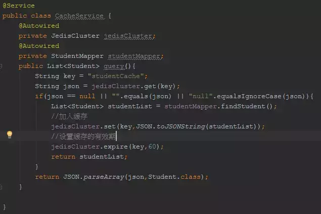

## 前言
缓存（内存 or Memcached or Redis…..）在互联网项目中广泛应用，本篇博客将讨论下缓存击穿这一个话题，

涵盖缓存击穿的现象、解决的思路、以及通过代码抽象方式来处理缓存击穿。

### 什么是缓存击穿？



上面的代码，是一个典型的写法：当查询的时候，先从Redis集群中取，如果没有，那么再从DB中查询并设置到Redis集群中。

注意，在实际开发中，我们一般在缓存中，存储的数据结构是JSON。（JDK提供的序列化方式效率稍微比JSON序列化低一些；而且JDK序列化非常严格，字段的增减，就很可能导致反序列失败，而JSON这方面兼容性较好）

假设从DB中查询需要2S，那么显然这段时间内过来的请求，在上述的代码下，会全部走DB查询，

相当于缓存被直接穿透，这样的现象就称之为“缓存击穿”！

## 避免缓存击穿的思路分析

### 加synchronized？


如果synchronized加在方法上，使得查询请求都得排队，本来我们的本意是让并发查询走缓存。也就是现在synchronized的粒度太大了。

### 缩小synchronized的粒度？


上面代码，在缓存有数据时，让查询缓存的请求不必排队，减小了同步的粒度。但是，仍然没有解决缓存击穿的问题。

虽然，多个查询DB的请求进行排队，但是即便一个DB查询请求完成并设置到缓存中，其他查询DB的请求依然会继续查询DB！

### synchronized+双重检查机制


通过synchronized+双重检查机制：

在同步块中，继续判断检查，保证不存在，才去查DB。

## 代码抽象

发现没有，其实我们处理缓存的代码，除了具体的查询DB逻辑外，其他都是模板化的。下面我们就来抽象下！

一个查询DB的接口：


既然查询具体的DB是由业务来决定的，那么暴露这个接口让业务去实现它。
一个模板：


Spring不是有很多Template类么？我们也可以通过这种思想对代码进行一个抽象，

让外界来决定具体的业务实现，而把模板步骤写好。（有点类似AOP的概念）

## 改进后的代码：


从这里可以看出，我们并不关心缓存的数据从哪里加载，而是交给具体的使用方，而且使用方在使用时再也不必关注缓存击穿的问题，因为我们都给抽象了。


```
public T get(Map param) {
        String redisKey= SystemConstants.TABLE_CONF_CACHE_PREFIX + param[0];
        String json = cacheBaseService.get(redisKey);
        if (StringUtils.isEmpty(json)) {
            synchronized (this) {
                json = cacheBaseService.get(redisKey);
                if (StringUtils.isNotEmpty(json)) {
                    return parseJson(json);
                }
                T t = loadFromDB();
                cacheBaseService.set(redisKey, JSON.toJSONString(t));
                return t;
            }
        }
        return parseJson(json);
    }
```