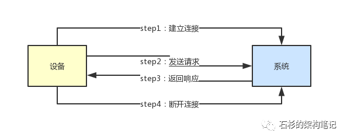
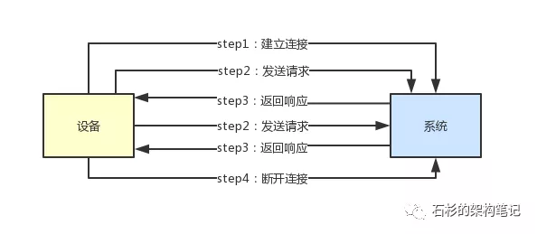
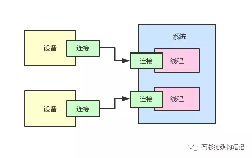
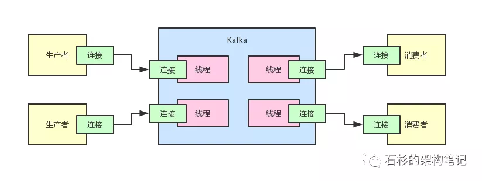
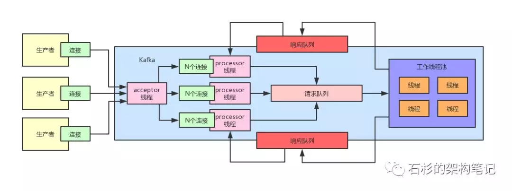

这篇文章，给大家聊聊：如果你设计一个系统需要支撑百万用户连接，应该如何来设计其高并发请求处理架构？

##（1）到底什么是连接？

假如说现在你有一个系统，他需要连接很多很多的硬件设备，这些硬件设备都要跟你的系统来通信。
那么，怎么跟你的系统通信呢？
首先，他一定会跟你的系统建立连接，然后会基于那个连接发送请求给你的系统。
接着你的系统会返回响应给那个系统，最后是大家一起把连接给断开，释放掉网络资源。
所以我们来看一下下面的那个图，感受一下这个所谓的连接到底是个什么概念。

##（2）为什么每次发送请求都要建立连接？

但是大家看着上面的那个图，是不是感觉有一个很大的问题。
什么问题呢？那就是为啥每次发送请求，都必须要建立一个连接，然后再断开一个连接？
要知道，网络连接的建立和连接涉及到多次网络通信，本质是一个比较耗费资源的过程。
所以说咱们完全没必要每次发送请求都要建立一次连接，断开一次连接。
我们完全可以建立好一个连接，然后设备就不停的发送请求过来，系统就通过那个连接返回响应。
大家完全可以多次通过一个连接发送请求和返回响应，这就是所谓的长连接。
也就是说，如果你一个连接建立之后，然后发送请求，接着就断开，那这个连接维持的时间是很短的，这个就是所谓的短连接。
那如果一个设备跟你的系统建立好一个连接，然后接着就不停的通过这个连接发送请求接收响应，就可以避免不停的创建连接和断开连接的开销了。
大家看下面的图，体验一下这个过程。在图里面，两次连接之间，有很多次发送请求和接收响应的过程，这样就可以利用一个连接但是进行多次通信了。

##（3）长连接模式下需要耗费大量线程资源

但是现在问题又来了，长连接的模式确实是不错的，但是如果说每个设备都要跟系统长期维持一个连接，那么对于系统来说就需要搞一个线程，这个线程需要去维护一个设备的长连接，然后通过这个连接跟一个设备不停的通信，接收人家发送过来的请求，返回响应给人家。

大家看下面的图，每个设备都要跟系统维持一个连接，那么对于每个设备的连接，系统都会有一个独立的线程来维护这个连接。
因为你必须要有一个线程不停的尝试从网络连接中读取请求，接着要处理请求，最后还要返回响应给设备。

那么这种模式有什么缺点呢？

缺点是很显而易见的，假如说此时你有上百万个设备要跟你的系统进行连接，假设你的系统做了集群部署一共有100个服务实例，难道每个服务实例要维持1万个连接支撑跟1万个设备的通信？

如果这样的话，每个服务实例不就是要维持1万个线程来维持1万个连接了吗？大家觉得这个事儿靠谱吗？

根据线上的生产经验，一般4核8G的标准服务用的虚拟机，自己开辟的工作线程在一两百个就会让CPU负载很高了，最佳的建议就是在几十个工作线程就差不多。

所以要是期望每个服务实例来维持上万个线程，那几乎是不可能的，所以这种模式最大的问题就在于这里，没法支撑大量连接。

##（4）Kafka遇到的问题：应对大量客户端连接

实际上，对于大名鼎鼎的消息系统Kafka来说，他也是会面对同样的问题，因为他需要应对大量的客户端连接。

有很多生产者和消费者都要跟Kafka建立类似上面的长连接，然后基于一个连接，一直不停的通信。

举个例子，比如生产者需要通过一个连接，不停的发送数据给Kafka。然后Kafka也要通过这个连接不停的返回响应给生产者。

消费者也需要通过一个连接不停的从Kafka获取数据，Kafka需要通过这个连接不停的返回数据给消费者。

大家看下面的图，感受一下Kafka的生产现场。

那假如Kafka就简单的按照这个架构来处理，如果你的公司里有几万几十万个的生产者或者消费者的服务实例，难道Kafka集群就要为了几万几十万个连接来维护这么多的线程吗？

同样，这是不现实的，因为线程是昂贵的资源，不可能在集群里使用那么多的线程。

##（5）Kafka的架构实践：Reactor多路复用

针对这个问题，大名鼎鼎的Kafka采用的架构策略是Reactor多路复用模型。

简单来说，就是搞一个acceptor线程，基于底层操作系统的支持，实现连接请求监听。

如果有某个设备发送了建立连接的请求过来，那么那个线程就把这个建立好的连接交给processor线程。

每个processor线程会被分配N多个连接，一个线程就可以负责维持N多个连接，他同样会基于底层操作系统的支持监听N多连接的请求。

如果某个连接发送了请求过来，那么这个processor线程就会把请求放到一个请求队列里去。

接着后台有一个线程池，这个线程池里有工作线程，会从请求队列里获取请求，处理请求，接着将请求对应的响应放到每个processor线程对应的一个响应队列里去。

最后，processor线程会把自己的响应队列里的响应发送回给客户端。

说了这么多，还是来一张图，大家看下面的图，就可以理解上述整个过程了。

##（6）优化后的架构是如何支撑大量连接的？

那么上面优化后的那套架构，是如何支撑大量连接的呢？

其实很简单。这里最关键的一个因素，就是processor线程是一个人维持N个线程，基于底层操作系统的特殊机制的支持，一个人可以监听N个连接的请求。

这是极为关键的一个步骤，就仅此一个步骤就可以让一个线程支持多个连接了，不需要一个连接一个线程来支持。

而且那个processor线程仅仅是接收请求和发送响应，所有的请求都会入队列排队，交给后台线程池来处理。

比如说按照100万连接来计算，如果有100台机器来处理，按照老的模式，每台机器需要维持1万个线程来处理1万个连接。

但是如果按照这种多路复用的模式，可能就比如10个processor + 40个线程的线程池，一共50个线程就可以上万连接。

在这种模式下，每台机器有限的线程数量可以抗住大量的连接。

因此实际上我们在设计这种支撑大量连接的系统的时候，完全可以参考这种架构，设计成多路复用的模式，用几十个线程处理成千上万个连接，最终实现百万连接的处理架构。