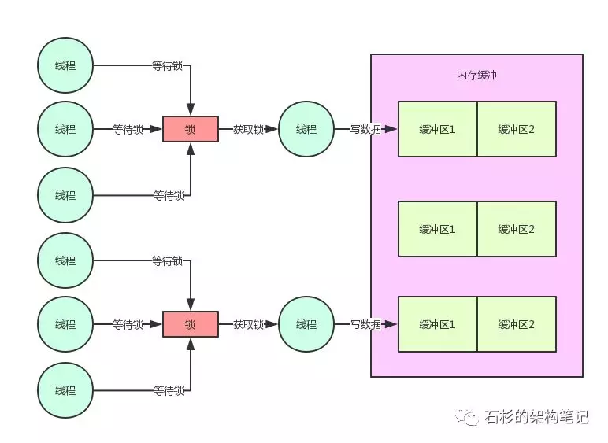

（1）大部分人对Java并发仍停留在理论阶段

（2）中间件系统的内核机制：双缓冲机制

（3）百万并发的技术挑战

（4）内存数据写入的锁机制以及串行化问题

（5）内存缓冲分片机制 + 分段加锁机制

（6）缓冲区写满时的双缓冲交换

（7）且慢！刷写磁盘不是会导致锁持有时间过长吗？

（8）内存 + 磁盘并行写机制

（9）为什么必须要用双缓冲机制？

（10）总结

“ 这篇文章，给大家聊聊一个百万级并发的中间件系统的内核代码里的锁性能优化。

很多同学都对Java并发编程很感兴趣，学习了很多相关的技术和知识。比如volatile、Atomic、synchronized底层、读写锁、AQS、并发包下的集合类、线程池，等等。

1、大部分人对Java并发仍停留在理论阶段

很多同学对Java并发编程的知识，可能看了很多的书，也通过不少视频课程进行了学习。

但是，大部分人可能还是停留在理论的底层，主要是了解理论，基本对并发相关的技术很少实践和使用，更很少做过复杂的中间件系统。

实际上，真正把这些技术落地到中间件系统开发中去实践的时候，是会遇到大量的问题，需要对并发相关技术的底层有深入的理解和掌握。

然后，结合自己实际的业务场景来进行对应的技术优化、机制优化，才能实现最好的效果。

因此，本文将从笔者曾经带过的一个高并发中间件项目的内核机制出发，来看看一个实际的场景中遇到的并发相关的问题。

同时，我们也将一步步通过对应的伪代码演进，来分析其背后涉及到的并发的性能优化思想和实践，最后来看看优化之后的效果。

2、中间件系统的内核机制：双缓冲机制

这个中间件项目整体就不做阐述了，因为涉及核心项目问题。我们仅仅拿其中涉及到的一个内核机制以及对应的场景来给大家做一下说明。

其实这个例子是大量的开源中间件系统、大数据系统中都有涉及到的一个场景，就是：核心数据写磁盘文件。

比如，大数据领域里的hadoop、hbase、elasitcsearch，Java中间件领域里的redis、mq，这些都会涉及到核心数据写磁盘文件的问题。

而很多大型互联网公司自研的中年间系统，同样也会有这个场景。只不过不同的中间件系统，他的作用和目标是不一样的，所以在核心数据写磁盘文件的机制设计上，是有一些区别的。

那么我们公司自研的中间件项目，简单来说，需要实现的一个效果是：开辟两块内存空间，也就是经典的内存双缓冲机制。

然后核心数据进来全部写第一块缓冲区，写满了之后，由一个线程进行那块缓冲区的数据批量刷到磁盘文件的工作，其他线程同时可以继续写另外一块缓冲区。

我们想要实现的就是这样的一个效果。这样的话，一块缓冲区刷磁盘的同时，另外一块缓冲区可以接受其他线程的写入，两不耽误。核心数据写入是不会断的，可以持续不断的写入这个中间件系统中。

我们来看看下面的那张图，也来了解一下这个场景。

如上图，首先是很多线程需要写缓冲区1，然后是缓冲区1写满之后，就会由写满的那个线程把缓冲区1的数据刷入磁盘文件，其他线程继续写缓冲区2。

这样，数据批量刷磁盘和持续写内存缓冲，两个事儿就不会耽误了，这是中间件系统设计中极为常用的一个机制，大家看下面的图。

3、百万并发的技术挑战

先给大家说一下这个中间件系统的背景：这是一个服务某个特殊场景下的中间件系统，整体是集群部署。

然后每个实例部署的都是高配置机器，定位是单机承载并发达到万级甚至十万级，整体集群足以支撑百万级并发，因此对单机的写入性能和吞吐要求极为高。

在超高并发的要求之下，上图中的那个内核机制的设计就显得尤为重要了。弄的不好，就容易导致写入并发性能过差，达不到上述的要求。

此外在这里多提一句，类似的这种机制在很多其他的系统里都有涉及。比如之前一篇文章：【高并发优化实践】10倍请求压力来袭，你的系统会被击垮吗？，那里面讲的一个系统也有类似机制。

只不过不同的是，那篇文章是用这个机制来做MQ集群整体故障时的容灾降级机制，跟本文的高并发中间件系统还有点不太一样，所以在设计上考虑的一些细节也是不同的。

而且，之前那篇文章的主题是讲这种内存双缓冲机制的一个线上问题：瞬时超高并发下的系统卡死问题。

4、内存数据写入的锁机制以及串行化问题

首先我们先考虑第一个问题，你多个线程会并发写同一块内存缓冲，这个肯定有问题啊！

因为内存共享数据并发写入的时候，必须是要加锁的，否则必然会有并发安全问题，导致内存数据错乱。

所以在这里，我们写了下面的伪代码，先考虑一下线程如何写入内存缓冲。

好了，这行代码弄好之后，对应着下面的这幅图，大家看一下。

看到这里，就遇到了Java并发的第一个性能问题了，你要知道高并发场景下，大量线程会并发写内存的，你要是直接这样加一个锁，必然会导致所有线程都是串行化。

即一个线程加锁，写数据，然后释放锁。接着下一个线程干同样的事情。这种串行化必然导致系统整体的并发性能和吞吐量会大幅度降低的。

5、内存缓冲分片机制+分段枷锁机制

因此在这里必须要对内存双缓冲机制引入分段加锁机制，也就是将内存缓冲切分为多个分片，每个内存缓冲分片就对应一个锁。

这样的话，你完全可以根据自己的系统压测结果，调整内存分片数量，提升锁的数量，进而允许大量线程高并发写入内存。

我们看下面的伪代码，对这块就实现了内存缓冲分片机制：

好！我们再来看看，目前为止的图是什么样子的：

这里因为每个线程仅仅就是加锁，写内存，然后释放锁。

所以，每个线程持有锁的时间是很短很短的，单个内存分片的并发写入经过压测，达到每秒几百甚至上千是没问题的，因此线上系统我们是单机开辟几十个到上百个内存缓冲分片的。

经过压测，这足以支撑每秒数万的并发写入，如果将机器资源使用的极限，每秒十万并发也是可以支持的。

6、缓冲区写满时的双缓冲交换

那么当一块缓冲区写满的时候，是不是就必须要交换两块缓冲区？接着需要有一个线程来将写满的缓冲区数据刷写到磁盘文件中？

此时的伪代码，大家考虑一下，是不是如下所示：

同样，我们通过下面的图来看看这个机制的实现：

7、且慢！刷写磁盘不是会导致锁持有时间过长吗？

且慢，各位同学，如果按照上面的伪代码思路，一定会有一个问题：要是一个线程，他获取了锁，开始写内存数据。

然后，发现内存满了，接着直接在持有锁的过程中，还去执行数据刷磁盘的操作，这样是有问题的。

要知道，数据刷磁盘是很慢的，根据数据的多少，搞不好要几十毫秒，甚至几百毫秒。
这样的话，岂不是一个线程会持有锁长达几十毫秒，甚至几百毫秒？

这当然不行了，后面的线程此时都在等待获取锁然后写缓冲区2，你怎么能一直占有锁呢？

一旦你按照这个思路来写代码，必然导致高并发场景下，一个线程持有锁上百毫秒。刷数据到磁盘的时候，后续上百个工作线程全部卡在等待锁的那个环节，啥都干不了，严重的情况下，甚至又会导致系统整体呈现卡死的状态。

8、内存 + 磁盘并行写机制

所以此时正确的并发优化代码，应该是发现内存缓冲区1满了，然后就交换两个缓冲区。

接着直接就释放锁，释放锁了之后再由这个线程将数据刷入磁盘中，刷磁盘的过程是不会占用锁的，然后后续的线程都可以继续获取锁，快速写入内存，接着释放锁。

大家先看看下面的伪代码的优化：

按照上面的伪代码的优化，此时磁盘的刷写和内存的写入，完全可以并行同时进行。
因为这里核心的要点就在于大幅度降低了锁占用的时间，这是java并发锁优化的一个非常核心的思路。
大家看下面的图，一起来感受一下：

9、为什么必须要用双缓冲机制？

其实看到这里，大家可能或多或少都体会到了一些双缓冲机制的设计思想了，如果只用单块内存缓冲的话，那么从里面读数据刷入磁盘的过程，也需要占用锁，而此时想要获取锁写入内存缓冲的线程是获取不到锁的。

所以假如只用单块缓冲，必然导致读内存数据，刷入磁盘的过程，长时间占用锁。进而导致大量线程卡在锁的获取上，无法获取到锁，然后无法将数据写入内存。这就是必须要在这里使用双缓冲机制的核心原因。

10、总结

最后做一下总结，本文从笔者团队自研的百万并发量级中间件系统的内核机制出发，给大家展示了Java并发中加锁的时候：

如何利用双缓冲机制

内存缓冲分片机制

分段加锁机制

磁盘 + 内存并行写入机制

高并发场景下大幅度优化多线程对锁的串行化争用问题

长时间占用锁的问题

其实在很多开源的优秀中间件系统中，都有很多类似的Java并发优化的机制，主要就是应对高并发的场景下大幅度的提升系统的并发性能以及吞吐量。大家如果感兴趣，也可以去了解阅读一下相关的底层源码。